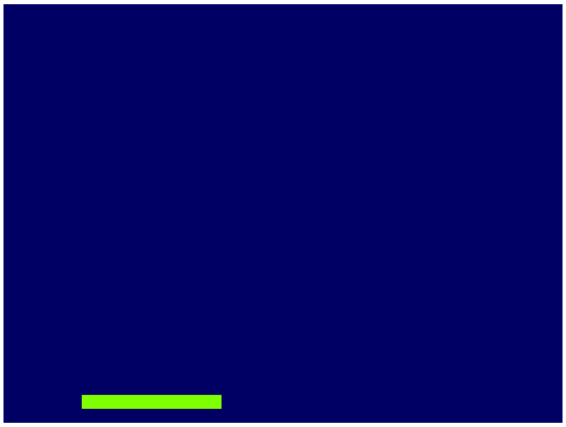
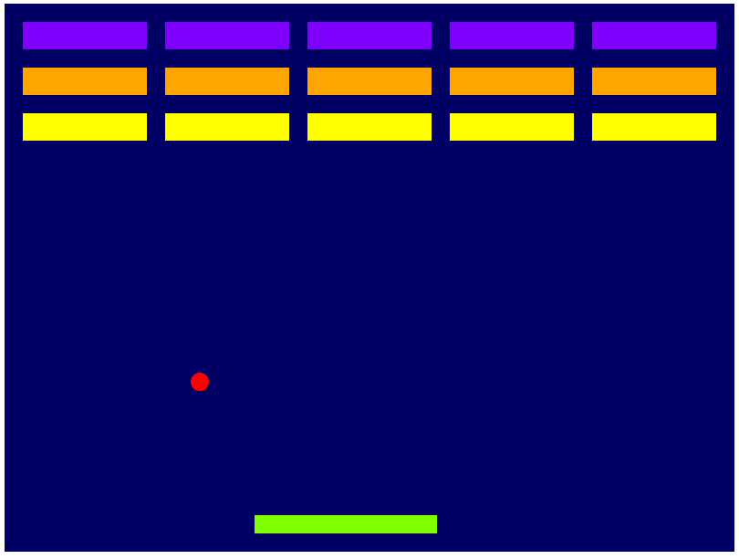

Getting Started
===============

Download and Install Excalibur
------------------------------

Review the :doc:`installation` for instructions.

Build Your Game Script
----------------------

Create a script in your project, here I've named it ``game.js``.
Excalibur games are built off of the ``ex.Engine`` container. It is
important to start the engine once you are done building your game.

.. note:: ProTip™ Call ``game.start()`` right away so you don't forget

.. code-block:: javascript

    // game.js

    // Create an instance of the engine.
    // I'm specifying that the game be 800 pixels wide by 600 pixels tall.
    // If no dimensions are specified the game will be fullscreen.
    var game = new ex.Engine({
        width: 800, 
        height: 600
    });
    // todo build awesome game here

    // Start the engine to begin the game.
    game.start();

Include your game script after the excalibur script.

.. code-block:: html

    <html>
    <head>
    </head>
    <body>    
        <!-- Include your script at the end of the body tag -->
        
        
    </body>
    </html>
    ...

Open a browser and view the blank blue screen of goodness.

Hello Excalibur: Building Breakout!
-----------------------------------

That's cool, but let's make something more interesting on the screen.

To do this Excalibur uses a primitive called an ``Actor``, and places
actors into a ``Scene``. Think of actors like you would the actors in a
play. Actors are the primary way to draw things to the screen.

.. note:: ProTip™ Actors must be added to a scene to be drawn or updated!
          ``game.add(actor)`` Will add an actor to the current scene.

.. note:: Important! Actors have a default anchor of (0.5, 0.5) which means
          their position is centered (not top-left) by default.

.. code-block:: javascript

    // game.js

    // Create an instance of the engine.
    var game = new ex.Engine({
        width: 800, 
        height: 600
    });

    // Create an actor with x position of 150px,
    // y position of 40px from the bottom of the screen,
    // width of 200px, height and a height of 20px
    var paddle = new ex.Actor(150, game.drawHeight - 40, 200, 20);

    // Let's give it some color with one of the predefined
    // color constants
    paddle.color = ex.Color.Chartreuse;

    // Make sure the paddle can partipate in collisions, by default excalibur actors do not collide
    paddle.collisionType = ex.CollisionType.Fixed;

    // `game.add` is the same as calling
    // `game.currentScene.add`
    game.add(paddle);

    // Start the engine to begin the game.
    game.start();

Open up your favorite browser and you should see something like this:
|Hello World Excalibur|

That's neat, but this game is way more fun if things move around. Let's
make the paddle follow the mouse around in the x direction.

.. code-block:: javascript

    // Add a mouse move listener
    game.input.pointers.primary.on('move', function (evt) {
        paddle.pos.x = evt.x;
    });

What's breakout without the ball? To make the ball bounce, Excalibur
comes prebuilt with an "elastic" collision type that does naive elastic
collisions, which is sufficient for breakout.

.. code-block:: javascript

    // Create a ball
    var ball = new ex.Actor(100, 300, 20, 20);

    // Set the color
    ball.color = ex.Color.Red;

    // Set the velocity in pixels per second
    ball.vel.setTo(100, 100);

   // Set the collision Type to passive
   // This means "tell me when I collide with an emitted event, but don't let excalibur do anything automatically"
   ball.collisionType = ex.CollisionType.Passive;
   // Other possible collision types:
   // "ex.CollisionType.PreventCollision - this means do not participate in any collision notification at all"
   // "ex.CollisionType.Active - this means participate and let excalibur resolve the positions/velocities of actors after collision"
   // "ex.CollisionType.Fixed - this means participate, but this object is unmovable"

    // On collision bounce the ball
    ball.on('precollision', function (ev) {
        // reverse course after any collision
        // intersections are the direction body A has to move to not be clipping body B
        // `ev.intersection` is a vector `normalize()` will make the length of it 1
        // `negate()` flips the direction of the vector
        var intersection = ev.intersection.normalize();

        // The largest component of intersection is our axis to flip
        if (Math.abs(intersection.x) > Math.abs(intersection.y)) {
            ball.vel.x *= -1;
        } else {
            ball.vel.y *= -1;
        }
    });

    // Add the ball to the current scene
    game.add(ball);

The ball will now bounce off of the paddle, but does not bounce with the
side of the screen. To fix that, let's take advantage of the ``postupdate``
event.

.. code-block:: javascript

    // Wire up to the postupdate event
    ball.on('postupdate', function () {
        // If the ball collides with the left side
        // of the screen reverse the x velocity
        if (this.pos.x < (this.getWidth() / 2)) {
            this.vel.x *= -1;
        }

        // If the ball collides with the right side
        // of the screen reverse the x velocity
        if (this.pos.x + (this.getWidth() / 2) > game.drawWidth) {
            this.vel.x *= -1;
        }

        // If the ball collides with the top
        // of the screen reverse the y velocity
        if (this.pos.y < (this.getHeight() / 2)) {
            this.vel.y *= -1;
        }
    });

Don't like square balls? Neither do we. You can create your own custom
drawing function like so:

.. code-block:: javascript

    // Draw is passed a rendering context and a delta in milliseconds since the last frame
    ball.draw = function (ctx, delta) {
        // Optionally call original 'base' method
        // ex.Actor.prototype.draw.call(this, ctx, delta)

        // Custom draw code
        ctx.fillStyle = this.color.toString();
        ctx.beginPath();
        ctx.arc(this.pos.x, this.pos.y, 10, 0, Math.PI * 2);
        ctx.closePath();
        ctx.fill();
    }

.. note:: ProTip™ Overriding a method like this will remove any built-in
          Excalibur functionality. If you would like to call the original draw
          for example ``ex.Actor.prototype.draw.call(this, ctx, delta)``

Breakout needs some bricks to break. To do this we calculate our brick
layout and add them to the current scene.

.. code-block:: javascript

    // Build Bricks

    // Padding between bricks
    var padding = 20; // px
    var xoffset = 65; // x-offset
    var yoffset = 20; // y-offset
    var columns = 5;
    var rows = 3;

    var brickColor = [ex.Color.Violet, ex.Color.Orange, ex.Color.Yellow];

    // Individual brick width with padding factored in
    var brickWidth = game.drawWidth / columns - padding - padding/columns; // px
    var brickHeight = 30; // px
    var bricks = [];
    for (var j = 0; j < rows; j++) {
        for (var i = 0; i < columns; i++) {
            bricks.push(new ex.Actor(xoffset + i * (brickWidth + padding) + padding, yoffset + j * (brickHeight + padding) + padding, brickWidth, brickHeight, brickColor[j % brickColor.length]));
        }
    }

    bricks.forEach(function (brick) {
        // Make sure that bricks can participate in collisions
        brick.collisionType = ex.CollisionType.Active;
        
        // Add the brick to the current scene to be drawn
        game.add(brick);
    });

When the ball collides with bricks, we want to remove them from the
scene. Update the 'precollision' handler we previously added:

.. code-block:: javascript

    // On collision remove the brick, bounce the ball
    ball.on('precollision', function (ev) {
        if (bricks.indexOf(ev.other) > -1) {
            // kill removes an actor from the current scene
            // therefore it will no longer be drawn or updated
            ev.other.kill();
        }
  
        // reverse course after any collision
        // intersections are the direction body A has to move to not be clipping body B
        // `ev.intersection` is a vector `normalize()` will make the length of it 1
        // `negate()` flips the direction of the vector
        var intersection = ev.intersection.normalize();

        // The largest component of intersection is our axis to flip
        if (Math.abs(intersection.x) > Math.abs(intersection.y)) {
            ball.vel.x *= -1;
        } else {
            ball.vel.y *= -1;
        }
    });

Finally, if the ball leaves the screen, the player loses!

.. code-block:: javascript

    ball.on('exitviewport', function(){
        alert('You lose!');
    });

|Breakout Example Excalibur| Congratulations! You have just created your
first game in Excalibur! Please review the documentation for more
examples and an `API Reference <http://excaliburjs.com/docs>`__.

.. raw:: html

   <iframe width="100%" height="800" src="//jsfiddle.net/excaliburjs/s33mLjn3/embedded/js,result/" allowfullscreen="allowfullscreen" frameborder="0"></iframe>

