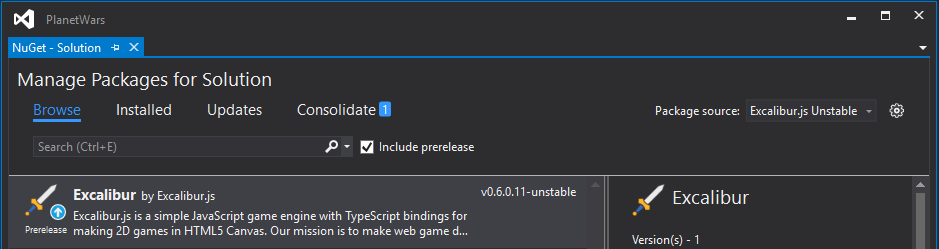

Unstable Builds
===============

There are 4 easy ways to reference the latest unstable version of Excalibur depending on your tech stack of choice:

npm
---

Each Excalibur build is published to the public NPM registry. 

You can install the latest alpha version using the tag ``next``: 

.. code-block:: bash

   npm install excalibur@next

Or reference the `excalibur-dist repository <https://github.com/excaliburjs/excalibur-dist>`_: 

.. code-block:: bash

   npm install excaliburjs/excalibur-dist

Either way will work.

bower
-----

For bower projects, just reference the `excalibur-dist repository <https://github.com/excaliburjs/excalibur-dist>`_:

.. code-block:: bash

   bower install excaliburjs/excalibur-dist

Nuget Feed
----------

For a Windows project or Visual Studio Solution, you can add the Appveyor Nuget feed for Excalibur to your project:

   https://ci.appveyor.com/nuget/excalibur/

If it doesn't already exist, create a ``Nuget.config`` Nuget configuration file in your Visual Studio solution folder 
(or the same folder where your Nuget.exe resides). For more information, 
see `Chaining Nuget.config files <https://docs.nuget.org/consume/nuget-config-file#chaining-multiple-configuration-files>`_.

Then, add the Appveyor feed as a package source like so:

.. code-block:: xml
   
   <?xml version="1.0" encoding="utf-8"?>
   <configuration>
      <config>
         <packageSources>
            <add key="Excalibur.js Unstable" value="https://ci.appveyor.com/nuget/excalibur/" />
         </packageSources>
      </config>
   </configuration>

This will add the Excalibur package feed into your list of package sources. Then you can add packages using Visual Studio or
the command line.

Git Submodule
-------------

Sometimes it's easier to just include Excalibur directly into your Git source control repository. In that case,
you can run the following commands:

.. code-block:: bash

   git submodule add https://github.com/excaliburjs/excalibur-dist excalibur
   git submodule init

This adds a Git submodule reference to the `excalibur-dist repository <https://github.com/excaliburjs/excalibur-dist>`_.

From there, you can specifically checkout a versioned release tag (or don't and live on the edge):

.. code-block:: bash

   cd excalibur
   git checkout v0.7.0
   cd ..
   git commit -am "Reference excalibur 0.7.0 release"

For more information on working with Git submodules, see the `Git SCM guide on submodules <https://git-scm.com/book/en/v2/Git-Tools-Submodules>`_