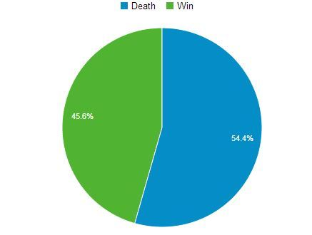
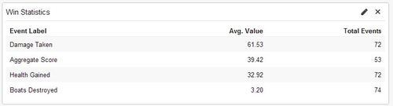
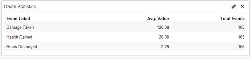

It’s taken a while to get around to composing this from the notes we scribbled down after the jam, but here we go!

## What went well

### Teamwork

Overall, our team worked really well together, given that this was our first “high-stakes” deadlined project. Being able to work in the same physical space was a big part of our productivity over the weekend, and we were able to help each other with problems or changes quickly and effectively.

### Planning

We felt it was important to spend an appropriate amount of time discussing ideas before we settled on making anything. This turned out to be several hours. We took a walk around the neighborhood and brainstormed ideas that would fit within the theme, eventually settling on a much more elaborate version of what would become our game.

### Sleeping & eating

While Ludum Dare takes place within a limited time frame, we had no intention of staying awake for the entire duration. Overwork and sleep deprivation leads to inefficiency. We also made sure that we remembered to eat food at regular, human intervals. This helped maintain a positive mood and keep us from consuming each other and/or the neighbors.

### Map editor

We decided to use [Tiled](http://www.mapeditor.org/) to create our map. We spent a bit of time getting it to integrate with Excalibur, but being able to graphically edit everything in the level on the fly was definitely worth it.

### Art & effects

Overall, our art process went better than expected. We leveraged an [existing tileset](https://www.oryxdesignlab.com/sprites/) for our geography and map background. We put together the ship and kraken sprites ourselves with Photoshop and Paint.net, and they turned out well with relatively few frames of animation. We used color blending to darken up the map, which really helped set the mood of the game. The ship spotlights were created using a radial gradient effect, which was pretty simple to do and looked great. Additionally, we added a little bit of camera shake into the game when the kraken attacks ships. This was easily the best payoff for the least amount of code.

### Stats

The end-game score screen was a last-minute alternative to a boss fight that we cut from our scope. It ended up adding a good deal of replay value to the game, and encouraged players to come back and try to beat their previous score. We also hooked the game up to Google Analytics, which we think everyone should look into doing if they can. It helped give some insight into how people were playing the game, as well as give us an idea of how difficult the level was.

### TypeScript

If you’re developing a game using JavaScript, we recommend giving [Typescript](https://www.typescriptlang.org/) a try. Static typing really helped us during the rapid game-building process of Ludum Dare.

### Testing Excalibur

One of the main goals we had in mind for this jam was to put our game engine through its paces. We were able to push the limits of Excalibur and find a number of opportunities for improvement. The more we do game jams like this, the more filled-out the engine should become.

## What didn't go so well

### Also testing Excalibur

On the same hand, we encountered several critical issues that halted game development for several hours each. Excalibur, still in early alpha, didn’t fully support a lot of the features we tried to use it for. While this was expected, we spent a lot of time fixing bugs and adding features to the engine instead of working on the game. Next time, we plan on prioritizing quick workarounds when we’re in a time crunch.

### Deadlines

We often didn't stick to our self-imposed deadlines. For example, we had planned on halting development several hours before the submission time, but we ended up working until fifteen minutes prior to the end of the jam. In the future, we definitely need to timebox better and set more realistic goals around task completion.

### Playtesting

As a result of ignoring all of our deadlines, we hardly did any playtesting of the full level. While this luckily wasn’t a huge issue in the end, it had the potential to be absolutely disastrous.

### Game controls

The game ended up with slightly unintuitive player controls. The kraken followed the player’s mouse pointer, but we required you to press the spacebar to attack; we should have just used mouse clicks for attacking the ships. We also only played the attacking animation when the kraken was within range of a ship; while this contextual logic was a cool idea initially, it ended up being confusing for players. In addition, the kraken would spin wildly on occasion when attacking ships, which we affectionately referred to as “Spinning Squid Syndrome”. While this rotation was somewhat intentional (it was a workaround to avoid doing a lot more sprite animation), it definitely needed some fine tuning.

Another surprise for us was that many of the players we talked to were much more interested in sneaking around the ships than attacking them. We didn’t really reward this in the ending score screen, as we had always assumed everyone would want to attack the ships.

### Tools & process

We encountered a problem with deploying the game to Github Pages. With very little time left until submission, we all vaguely thought we were doomed. Luckily, we were able to deploy straight from Visual Studio with Azure publishing, which allowed us to move forward!

## Improvements for next time

### Know the tools

We had never really used Tiled before, and while it was definitely helpful, it took some getting used to. Next time, we’ll use all of our development tools beforehand to gain some familiarity with them.

### Test the process

In the same vein, we should have tested the entire development process on a small scale, end to end. We could have set up the code repository, ran through a sample game to test the workflow, and deployed it to make sure the entire pipeline worked before the jam started.

### Work around issues with Excalibur

While discovering issues with our game engine is an important goal for us, it shouldn’t get in the way of finishing the game. The next time we encounter a show-stopping engine bug, we’ll consider changing the mechanics or creating a simple workaround rather than dropping everything to fix it. For example, we spent hours smoothing ship rotations, when we could have just had them snap to their new travel direction.

### Define the scope more clearly

While we did a pretty good job of cutting features and scope from the project as we went along, it would have been better to cut those things earlier; there were several things (boss battles, different enemy types, etc.) that we still planned on implementing even when we didn’t really have any time to do so.

### Add more stats

We plan on adding even more stats and analytics from now on. We could have kept track of player pathing information to see if there were any problems with the level design, or gotten more insight into the play style choices that everyone was making.

## Future plans

We have been working a little bit in our free time to clean up the game code and add more features. It would be really cool to add more of our original scope back into the game now that we’re not under any time constraints. You can take a look at the [latest branch of the repository](https://github.com/excaliburjs/Ludum-29/tree/post-dare) to see how we’re doing.

## Conclusions

- Teamwork is key
- Your scope is too damn big
- Prepare your tools
- Have an idea of where you’re going before you start

Overall, Ludum Dare 29 was an amazing experience, and we will definitely be back for another one sometime in the future.
