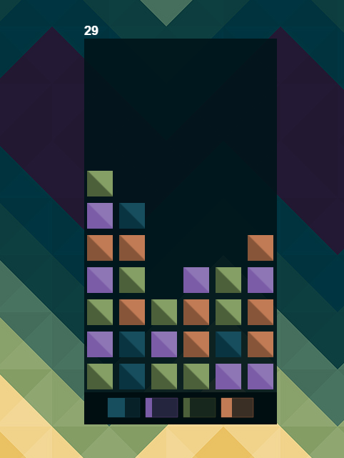
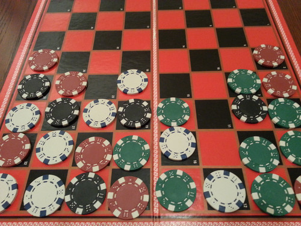
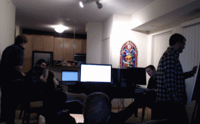
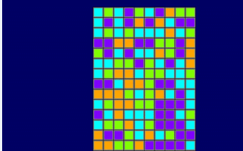

[Play the Ludum Dare version of Sweep Stacks](https://ludumdare.com/compo/ludum-dare-31/?action=preview&uid=38404)

This game jam was the second Ludum Dare we've participated in. Our goal with Sweep Stacks was to build something fun and see how well we could work with a larger team (five people instead of the usual three).

## What went well

### Preparation

Given the problems we had last time with setup, we made sure that everyone prepared their development environments ahead of time, and brought over their computer equipment to set it up the day before. We also configured continuous deployment for our code using TravisCI and GitHub Pages. This ensured that every time we pushed a change to the game, it would update on the website and we could see that the game was working properly.

### Brainstorming

We came up with a number of ideas for this jam, several of which everyone seemed to enjoy. Even after we had those concepts moderately well-formed, we kept trying to come up with more ideas. After we’d exhausted our collective creative capacities, we made sure everyone was on the same page and went forward with the idea we all liked the most. We used Trello for new ideas or issues that we encountered; it was incredibly helpful to organize everything, and we highly recommend it for game jams.

### Scope

We made a concerted effort to keep the scope of this game small. The theme definitely helped with that as well. Once we had the initial mechanics drafted for matching and piece movement, we realized that we could actually do a physical prototype. We pulled out some poker chips and a checkers board, and played the game for a while. This was immensely helpful for quickly visualizing exactly how the game would work, and allowed us to check for potential problems without having to write any code. By keeping the scope small, the game was playable very early on in development, which allowed us a lot of time to tune the gameplay.

### Testing

One of our team members, Sean, offered himself up to be our dedicated game tester for the weekend, and it was absolutely phenomenal how much it helped the development process. Coupling this with our continuous deployment meant that we encountered bugs or potential issues very quickly, and could either remedy or improve upon them easily. We also made a number of features easily configurable so we could test different board sizes, block distributions, and other changes.

### Art & sound

Another team member, Alan, brought over his guitar, so we decided to try and use it for sound effects and music. After about an hour or so, we had the music and notes that you can hear in the game. They turned out great, and really added a lot to the atmosphere we were trying to create.

Earlier on during the weekend, we had tossed around the idea of a fantasy theme for the game. In the end, we decided on a simpler art style, which ended up looking really good, and helped us focus a bit more on the gameplay rather than on designing or incorporating more complicated assets.

### Timelapse

We recorded timelapses on our computers while we worked, and also had a camera running on the room we were all working in. It was fun going back through the pictures and watching the game develop. We’re putting together a video or two of the process, but here’s a short teaser for now:

## What didn't go so well

### Analytics

We used Google Analytics to keep track of scores and a few other stats. However, due to a limit on how many events you can send (one event per second after the first ten events), we can’t properly record all of the events if a user plays more than one game. Next time we’ll try a different analytics provider, or consider our own solution.

### Hosting

Github Pages went down for some unplanned maintenance a few days after Ludum Dare was over. We didn’t have a fallback hosting solution set up, which meant that there was a fair amount of time where people simply couldn’t play the game. We now have an alert set up for our current hosting and a fallback site on Microsoft Azure ready to deploy if anything goes wrong.

### Bugs

Excalibur was much more stable this time around, although we did encounter a few platform-specific issues for iOS and Windows Phone that we could have been aware of sooner if we’d playtested the game on those devices.

### Color palette

Our final color palette ended up being very unfriendly towards color blind players. We’re currently working on different color selections for color blind modes, and we are definitely going to consider accessibility in our initial design decisions from now on.

## Future plans

There has been a fair amount of interest in Sweep Stacks so far, and we've definitely had a lot of fun working on it, so we plan on continuing to develop and improve it further. You can play the most recent stable version of the game at [playsweepstacks.com](http://www.playsweepstacks.com/).

## Conclusions

- Create the smallest game you can make, then build on it from there
- As soon as your game is playable, have someone play it
- Have fun!

Ludum Dare 31 was an absolute delight, and we hope to be back again someday!
