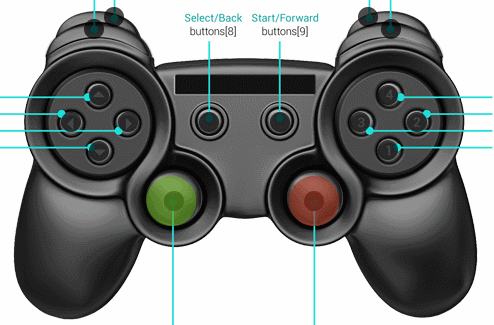

We’ve been steadily working on the newest release of ExcaliburJS, and it’s finally here! Version 0.5.0 brings with it many new features!

## Controller support

Excalibur now supports the [HTML5 Gamepad API](https://www.html5rocks.com/en/tutorials/doodles/gamepad/). Most modern controllers can be used as game input.

## Z-indexing

You can now specify layering for actors in your game. Higher index values draw on top of lower values.

## Faster collision detection

Excalibur now uses an axis aligned bounding box tree for better performance during collision checks.

## New documentation

The [Excalibur docs](https://excaliburjs.com/docs) are now cleaner and easier to navigate. Use the search bar at the top to help you find what you’re looking for.

There are also a number of improvements and bug fixes to make Excalibur faster and easier to use. If you’re so inclined, check out the [full release notes](https://github.com/excaliburjs/Excalibur/releases/tag/v0.5.0).

Releases are also available in Bower and NuGet; please reference the [installation guide](https://excaliburjs.com/docs/install.html) for more information. If you’re brand new, welcome! Check out the [Getting Started guide](https://excaliburjs.com/docs/quickstart.html) to start working with Excalibur.

The [main Excalibur branch](https://github.com/excaliburjs/Excalibur) is constantly being improved by the team. If you crave living on the edge, reference the [edge documentation](https://excaliburjs.com/docs/) to keep up with what we’re working on. It is automatically updated with every commit.

If you’ve used Excalibur for a project, please send it our way so we can consider showcasing it on the website!
