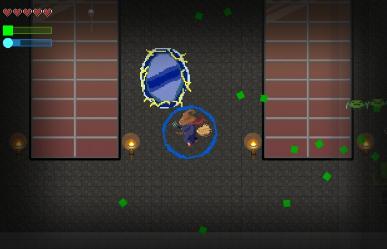
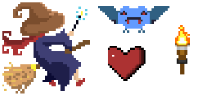
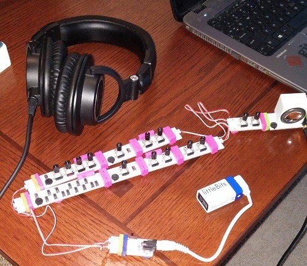
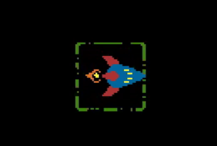
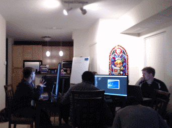

Ludum Dare 35 is the fourth in the series for the Excalibur.js team. We piled five to seven people into one room for four days to make another game.

## What went well

### Workflow and toolset

We’ve continued to refine and improve the way we build games for jams. It’s important that everything “just works” as much as possible. We maintained the same continuous deployment process that we’ve used before to push to a live site, so it could be tested and played within a minute of being checked in. We also used a watch-and-compile task in Visual Studio Code to gain the same benefit while developing locally.

### Art & sound

We had four people putting together art assets on and off throughout the weekend, and it turned out great. We used [bfxr](https://www.bfxr.net/) to create the sound effects, and a set of [littleBits](https://en.wikipedia.org/wiki/LittleBits) components to compose the background music. Once we had settled on the theming for the game, everything fell into place.

### Event scripting

We initially had a grand plan for introducing elements of Hexshaper, and as usual we had to set that aside and come up with a more practical solution that could be completed in the time remaining. We ended up pausing the game and moving the camera over to each portal as it opened and as the player successfully closed it, which ended up providing most of what we wanted.

### Bugs

We only encountered a few bugs in Excalibur this time around, and they were all relatively straightforward to test and fix. It feels better to use the engine each time we do a game jam.

## What didn’t go so well

### Minimum viable game

We didn’t have a very clear vision of what we wanted the game to be this time around. Uncertainty translated into not really having a playable game until Monday. This delay was a stark departure from the last couple of games we’ve made, where we made a point to have something relatively complete by Saturday evening so we could iterate on it through the rest of the weekend.

### Animations

There were a number of things that made interacting with the Excalibur animations API painful. Luckily, we didn’t lose too much time to them, and we now have an opportunity to improve that experience for future users.

## Conclusions

- Build a playable game as soon as possible
- Look for alternative solutions that create most of what you want for much less work

Special thanks to all of the [people](https://excaliburjs.com/ludum-35/credits.html) who worked hard to make this game possible!

