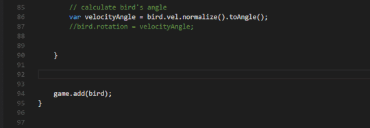

Excalibur [version 0.7.0](https://github.com/excaliburjs/Excalibur/releases/tag/v0.7.0) is now available! This is a very exciting milestone, as we have added a major feature!

## New physics system

We’ve implemented a rigid-body physics system, complete with edges, circles, and convex polygon primitives. This enables you to build fully-featured physics games in Excalibur! Fear not, the old physics system is still around for you to use.

## Generic lerping and easing

Excalibur now has generic functions for lerping and easing!

## Code cleanup

We’ve removed a number of deprecated methods. Check the [changelog](https://github.com/excaliburjs/Excalibur/blob/main/CHANGELOG.md) for a complete list.

## Contributing

We have improved our contributing document to make it easier to jump into Excalibur development. If you’re interested in helping out, read through our [new Contributing documentation](https://github.com/excaliburjs/Excalibur/blob/main/.github/CONTRIBUTING.md)

Overall there were over 27 issues addressed in this release. Check out the full release notes for all of the details, including bug fixes and enhancements.
