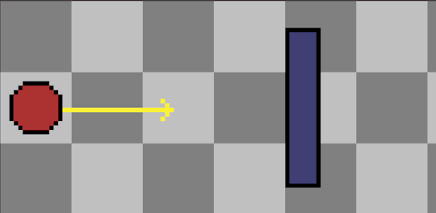
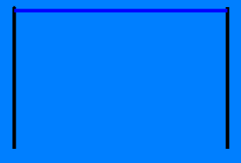

Excalibur [version 0.8.0](https://github.com/excaliburjs/Excalibur/releases/tag/v0.8.0) is now available! We have several new features in this release.

## Fast body collision checking

Actors can now move much faster without fear of unexpectedly passing through other collision bodies.

## New vector and line functionality

We’ve added a few helpful things to Line and Vector, including determining points, calculating distance, and a vector magnitude alias.

## Debug statistics

We now have a utility from which Excalibur will provide useful statistics to help you debug your game. For now the stats are focused on Actors and specific frames; look for more helpful stats in future releases!

PhantomJS testing structure

Behind the scenes, we have new testing tools that will allow us to visually test complicated interactions on the canvas.

There were quite a few commits from the Excalibur community in this release. Thanks to [FerociousQuasar](https://github.com/FerociousQuasar) and [hogart](https://github.com/hogart) for your contributions, and check out the [full release notes](https://github.com/excaliburjs/Excalibur/releases/tag/v0.8.0) for all of the details for this release.
