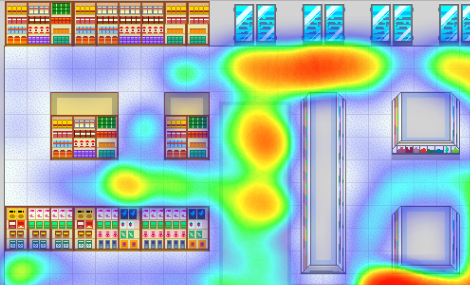

[Play the LD version of ‘I Just Wanted Groceries’](https://excaliburjs.com/ludum-38/)

This is our fifth time back for Ludum Dare. We had a full house again, and the experience was a lot of fun!

## What went well

### Preparation

In the few days before Ludum Dare, we made sure everything was ready. We set up version control, automatic deploys, and scripted tasks to help us build and develop the game. We ran into some problems during this setup, which is exactly why we do this early. These steps have become necessary for us before every game jam.

### Brainstorming

The theme was announced at 8:00 P.M. our time, and we spent the entire rest of the evening brainstorming. We made sure not to settle on anything too quickly, and came up with as many ideas as possible. From those fifty or so possibilities we picked a handful that seemed interesting enough to build. An hour or two later, we’d thrown all but one of those out, and settled on “avoid talking to people someplace – grocery store”.

### Prototyping

We built the first version of the game level on a dry erase board. This let us iterate on how a player would traverse it, as well as devise methods for pathfinding and item generation. Every time we’ve taken the time to do this step, we saved ourselves a load of heartache. Clearing up design issues is much simpler before the code has been written.

### Art

We had three team members working on art at different points in the weekend. We built the level, the characters, and the food items from scratch. It can be difficult to maintain a visual consistency when multiple people are drawing things; we mitigated a portion of this by standardizing on the “x11” palette built in to Aseprite, so at least all of our colors matched.

### Sound

We didn’t make our own music this time, but we did design most of the sound effects using littleBits and a guitar. We feel like we did a good job of unifying the soundscape and setting a cohesive mood with the audio.

### Simple construction

One of the most useful things we do is enforce the restriction of building a “playable” game as soon as possible. It doesn’t need any fancy extras, it just needs to let the player interact with and experience it. We managed to get to that point by Sunday morning, which left us two full days to add all those cool extras. It also allowed us to play the game a lot and polish the rough edges.

### Recycled code

We started our game with a [Yeoman template](https://github.com/excaliburjs/generator-excalibur) we built to structure the basics for us. We also reused a number of code snippets that we had left over from other games, including animation code and player input logic. Every little bit of time we saved helped us build this game better than we could have otherwise.

### Excalibur

We hardly encountered any actual bugs in Excalibur this time around. We did put together a long list of potential improvements, though, and look forward to incorporating those into the engine.

### Using Tiled

If you’re making a tile or grid-based game, Tiled is a great editor to build your levels in. We used it to define zones for our different grocery items to spawn in, as well as waypoints to define the shoppers’ movements.

### Custom analytics

We’ve tracked analytics in our games before, but we wanted a little more granularity this time. We configured [custom analytics](https://erikonarheim.com/posts/custom-analytics-azure-functions/) with Azure functions, and were able to track whatever game properties we wanted.

### Eating and sleeping

We ended each day after about 10:00 P.M. Ending early meant we could start early, and sleep is the best medicine for tired minds. We also cooked several meals instead of just getting fast food all the time. These two things were marked improvements from previous game jams.

### Results

Our results were pretty good! We scored highest in humor and fun, which was what we were aiming for. We’re glad people liked the game.

## What didn’t go so well

### Tiled plugin

We experienced a small complication with our [custom Tiled plugin](https://github.com/excaliburjs/excalibur-tiled), due to a versioning issue with Excalibur. It wasn’t too difficult to fix, but it did slow us down a bit.

### Bugs in Excalibur

While the bug count this jam was low, it still wasn’t zero. One day, perhaps, but not this time. If anything, it’s better we run into these things before other users do, in order to prevent frustration with the development experience.

### Difficulty in pathfinding

It was a bit difficult to get exactly what we were looking for in so short a time span. We managed to achieve most of the desired results, but there are still a few rough edges. We’ll be looking at adding pathfinding support directly into Excalibur in the future.

### Conclusion

Every time we do a restrospective, the “what went well” section takes more and more space away from the “what didn’t go so well” section. It’s really encouraging to see this become a more interesting and rewarding process as we make new games. Ludum Dare was a lot of fun, and we hope to participate again someday.

Thanks for reading!

