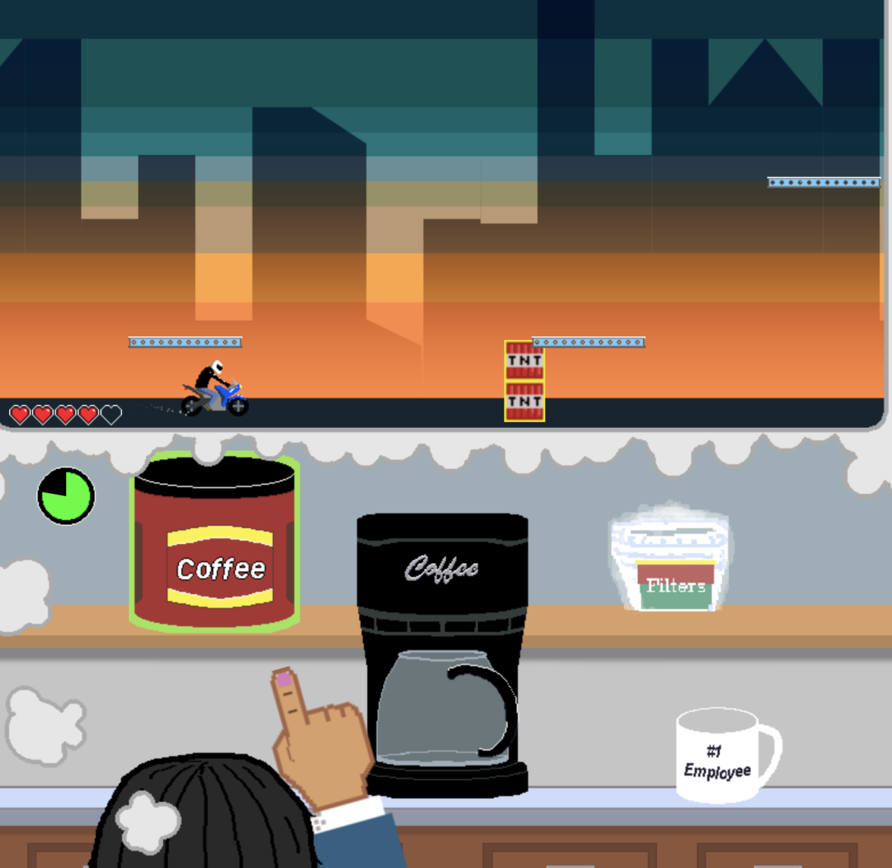
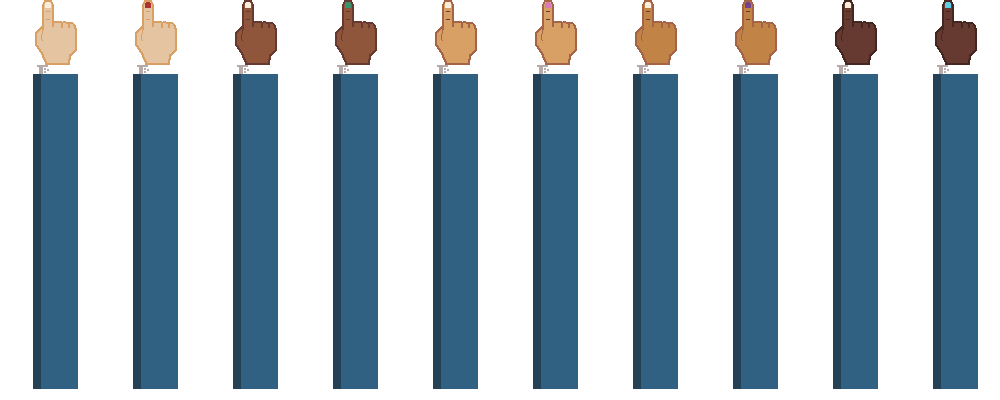
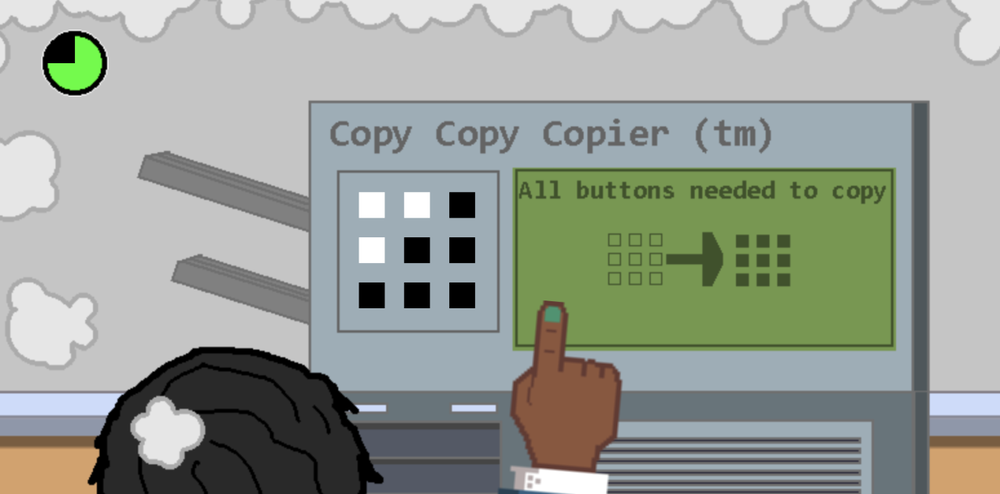
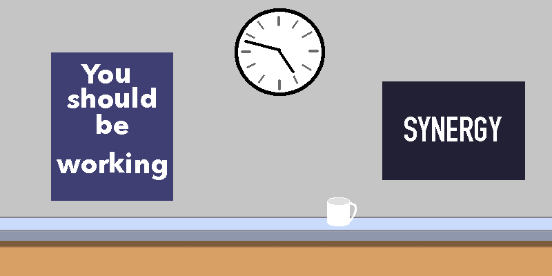
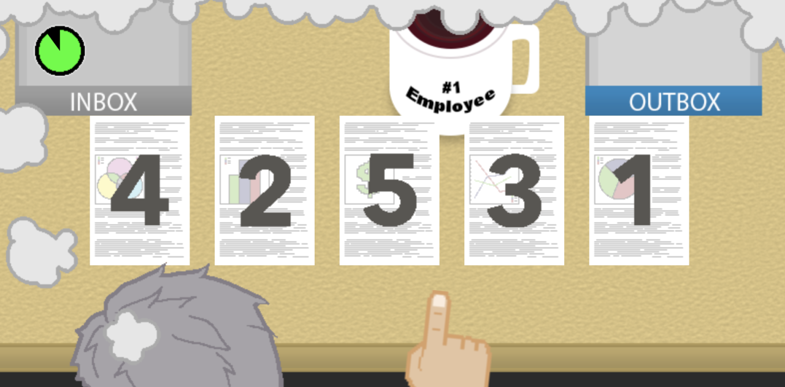
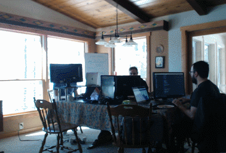

[Play the Ludum Dare version of ‘Office Daydream’](https://excaliburjs.com/ludum-41/)

## What went well

### Shorter workdays

We had the fortunate opportunity to get out of the city for a bit and take a vacation preceding the game jam. We wanted to take advantage of our time away from home, so we instituted regular work days (8 hours), rather than the 10-12 hour days we usually fall into the trap of doing . And surprise, it went great! Everyone was more relaxed, and we delivered a quality game in less time! It was easier for the team to focus on getting stuff done. We also managed to finish early, just ahead of the submission hour.

### Art pipeline

We did most of our work in Aseprite, with a little bit of Photoshop thrown in. A lot of the art in this game is simple shapes, and we recycled many of the backgrounds across the mini-games.

### Brainstorming

The theme was announced at 8:00 pm in our time zone. We spent the evening hours brainstorming, picking a few to develop a little more, and then deciding on our favorite choice.

### Scope pruning

We were ruthless at eliminating extras that tried to sneak in to the game. We had less time than we usually do, so we had to work efficiently. The resulting game is about half of the scope it had the potential to become, and we kept it under control.

## What could have gone better

We had to spend some extra time ahead of the jam updating our game template and tools. We could have done this at any earlier point. It wasn’t too bad, but it did cut a bit into our relaxation time for the days preceding the jam.

We also struggled again with managing state in Excalibur. We’re working on incorporating this into the Excalibur engine to improve the development process.

Overall, this Ludum Dare went great. We look forward to playing all of the cool games that we’ve seen so far for LD41!
