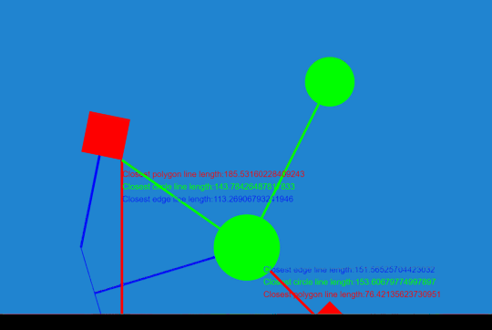
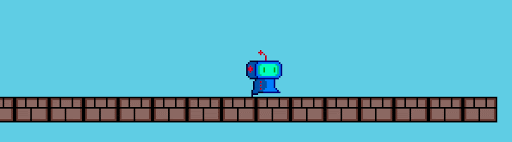

This is a big release for Excalibur on our journey to 1.0.0. If you’d like to follow along, we now have a [tentative roadmap](https://github.com/excaliburjs/Excalibur/issues/1161) available! The goal for this release was to simplify our collision infrastructure and utilities.

Thanks to our community contributors for all of their help! (see the [full release notes](https://github.com/excaliburjs/Excalibur/releases/tag/v0.23.0))

## Notable highlights

- Collision groups have been re-implemented to be more in line with industry practice. They allow you to determine which colliders collide with others.
- Collision behavior and properties are now contained within the new type `ex.Collider`
  - Collision types are now sourced from `ex.Collider`
  - Collision groups now live on `ex.Collider`
  - Collision shapes dictate collision geometry live on `ex.Collider`
  - Collision pixel offset allows shifting of colliders by a pixel amount
  - Properties like mass, torque, friction, inertia, bounciness are now all part of `ex.Collider` instead of `ex.Body`
- Decoupling `Actor` from the collision system
  - `ex.CollisionPair` now works on a pair of Colliders instead of a pair of Actors to represent a potential collision
  - `ex.CollisionContact` now works on a pair of Colliders instead of a pair of Actors to represent an actual collision
- New helpful methods for colliders
  - Find the closest line between 2 colliders or shapes
  - `ex.Actor.within` now works based on the surface of the geometry, not the center of the object

- Actions `moveBy`, `rotateBy`, and `scaleBy` have been changed to move an actor relative to the current position
  - This change makes implementing patrolling behavior moving 400 pixels left and right forever as easy as: `actor.actions.moveBy(-400, 0, 50).moveBy(400, 0, 50).repeatForever();`

- Many name refactorings and deprecations to improve usability (see the [full release notes](https://github.com/excaliburjs/Excalibur/releases/tag/v0.23.0))

## New sample game

We have a [new sample game](https://github.com/excaliburjs/sample-platformer) to illustrate best practices when developing with Excalibur.

Look forward to many more updates in the months ahead!
