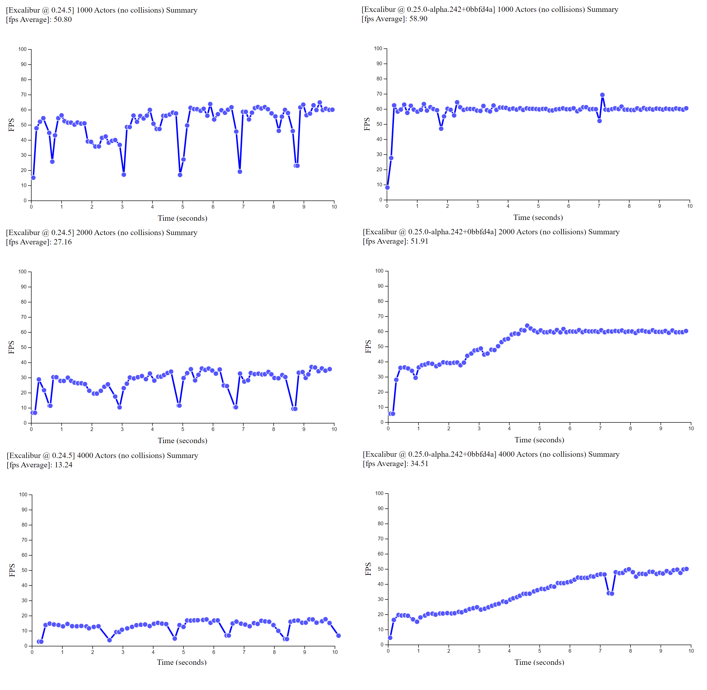
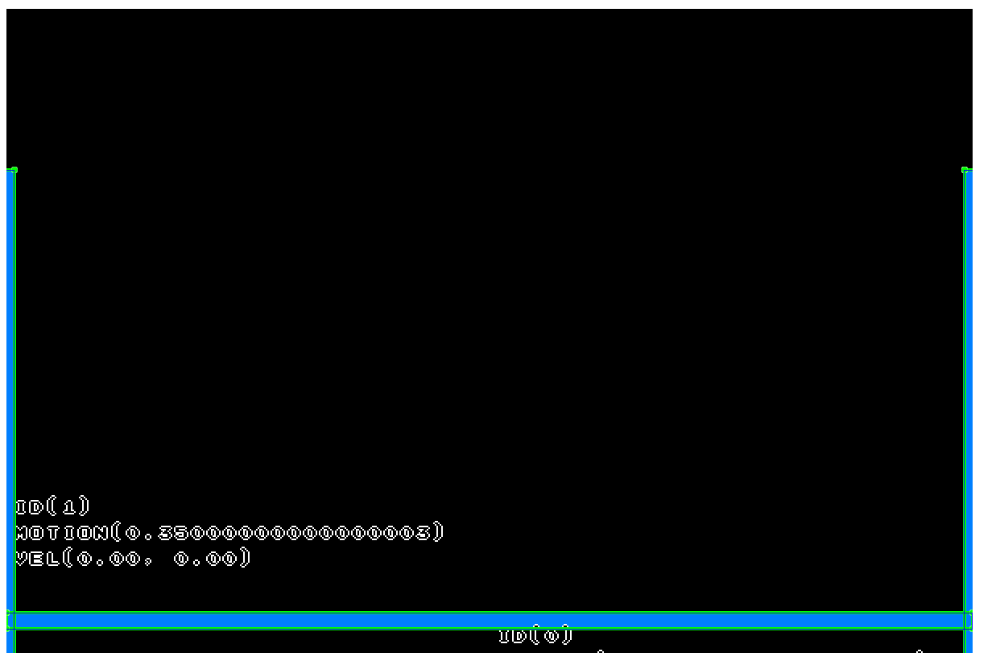
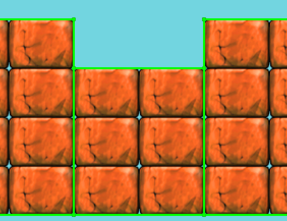
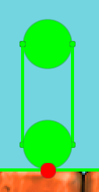
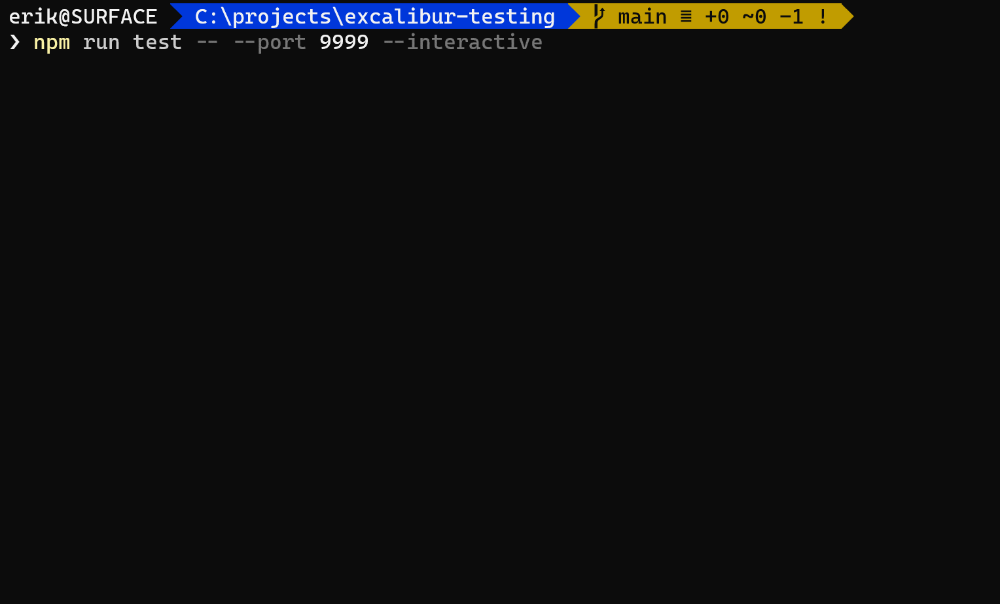

After a year of work, a lot of great additions and improvements have made it into Excalibur, and we are making good progress towards our v1.0 release! Check the [development roadmap](https://github.com/excaliburjs/Excalibur/issues/1161) for our current plans. It's hard to believe how different things are now since the [first commit of Excalibur](https://github.com/excaliburjs/Excalibur/commit/aefa1a125bcbeeb97f20500a220523962eb99702) (back when it was called GameTS)!

Excalibur started as a tech demo in a presentation to show how powerful TypeScript can be. The engine has come so far since then, it's really amazing!

We are really excited to share this release with you! This release contains over 30 bug fixes and 50 new features! It's been a labor of love over the last year by many people, and we have some big features to share.

Check out the [official release](https://github.com/excaliburjs/Excalibur/releases/tag/v0.25.0)!

`npm install excalibur@0.25.0`

## Performance

There is a combination of features (mentioned below) that resulted in big performance gains. Across the board, there's been a dramatic increase in what Excalibur can do in v0.25.0 vs v0.24.5.

In the gif below, we demonstrate the graphics performance specifically.


There is much better performance across the board with a higher baseline FPS in v0.25.0 for the same number of actors. You'll notice that FPS improves over time as more actors are offscreen in v0.25.0 compared to v0.24.5.



This benchmark was performed in the Chrome browser on a Surface Book 2 with the power plugged in.

- Processor: Intel(R) Core(TM) i7-8650U CPU @ 1.90GHz, 2112 Mhz, 4 Core(s), 8 Logical Processor(s)
- Physical Memory: (RAM) 16.0 GB
- Graphics: NVIDIA GeForce GTX 1060

## New plugin versioning strategy

We are adopting a similar versioning strategy to Angular, during pre-1.0. All plugins compatible with the core library will share the same prefix through the minor version. For example, if core Excalibur is `excalibur@0.25.0`, then the plugins that support that version are formatted like `@excaliburjs/plugin-tiled@0.25.x`.

## DisplayMode updates

Excalibur DisplayModes have been refactored and renamed to clarify their utility.

- FillContainer - Fill the game viewport to take up as much of the immediate parent as possible
- FillScreen - Fill the game viewport to take up as much of the screen as possible
- FitContainer - Fit the game maintaining aspect ratio into the immediate parent
- FitScreen - Fit the game maintaining aspect ration into the screen
- Fixed - Specify a static size for the game width/height

## Refactor to Entity Component System (ECS) based architecture

The core plumbing of Excalibur has been refactored to use an ECS style architecture. However, developers using Excalibur do not need to know or care about the this underlying change to ECS if they don't want to.

What does ECS mean for Excalibur? At a high level, ECS architecture breaks down into three things:

- `Components` contain data needed for various systems.
- `Systems` implement the "behavior" by looping over entities that match a list of components.
  - For example, the graphics system processes all entities with a `TransformComponent` and a `GraphicsComponent`
- `Entities` are the "holders" of components

`Actor`, `Scene`, and `Engine` remain as the familiar interface to build games; they're only implemented differently under-the-hood. The reason for the change was to break down ever-growing and complex logic that had accumulated in the `Actor` and `Scene` implementations into Components and Systems for maintainability. This change increases the flexibility of Excalibur, and allows you to add new novel behavior directly into the core loop with custom components ones if you desire.

Excalibur does not have the purest implementation of an ECS by design; our built-in components are more than just data. The built-in components do provide behavior, convenience features, and helper functions to maintain our core mission of keeping Excalibur easy to use. The Excalibur core team goal with ECS is flexibility and maintainability, not performance. If you wish, you can [read more about our goals for ECS](https://github.com/excaliburjs/Excalibur/issues/1361).

Here's A quick example of using the new ECS features:

```typescript
class SearchComponent extends ex.Component<'search'> {
    public readonly type = 'search'
    constructor(public target: ex.Vector) {
        super();
    }
}

class SearchSystem extends ex.System<ex.TransformComponent | SearchComponent> {
    // Types need to be listed as a const literal
    public readonly types = ['ex.transform', 'search'] as const;

    // Lower numbers mean higher priority
    // 99 is low priority
    public priority = 99;

    // Run this system in the "update" phase
    public systemType = ex.SystemType.Update

    private _searchSpeed = 10 // pixels/sec

    public update(entities: ex.Entity[], delta: number) {
        for (let entity of entities) {
            const target = entity.get(SearchComponent)!.target;
            // ex.TransformComponent is a built in type
            const transform = entity.get(ex.TransformComponent) as ex.TransformComponent;

            const direction = target.sub(transform.pos);
            const motion = direction.normalize().scale(this._searchSpeed);

            // Moves these entities towards the target at 10 pixels per second
            transform.pos = transform.pos.add(motion.scale(delta / 1000))
        }
    }
}

// Actors come with batteries included built in features
const actor = new ex.Actor({
    pos: ex.vec(100, 100),
    width: 30,
    height: 30,
    color: ex.Color.Red
});
actor.addComponent(new SearchComponent(ex.vec(400, 400)));

// Create a scene with your new system
const scene = new ex.Scene();
scene.world.add(new SearchSystem());
scene.add(actor);
```

## Collision system improvements

The collision system has been significantly overhauled to improve the quality of the simulation and the stability of collisions. The core simulation loop "solver" has been redone to use an [iterative impulse constraint solver](https://erikonarheim.com/posts/understanding-collision-constraint-solvers/), which provides a robust method of computing resolution that has improved performance and stability.

Collision intersection logic has now also been refactored to report multiple contact points at once. Multiple contacts improves the stability of stacks of colliders over single contact collisions (which can result in oscillations of boxes back and forth).


Colliding bodies can now optionally go to sleep. This relieves some of the pressure on the collision solver and improves the stability of the simulation by not moving these objects if they don't need to move. Colliders can be started asleep before a player in a game might interact with them



New `CompositeCollider`s now make it possible to combine Excalibur Collider primitives (`PolygonCollider`, `CircleCollider`, and `EdgeCollider`) to make any arbitrary collision geometry. These new composite colliders power the new `TileMap` cell collisions and also power the new `ex.Shape.Capsule(width, height)` collider.



The `Capsule` collider is a useful geometry tool for making games with ramps or slightly jagged floors you want a character to glide over without getting stuck. This collider also helps with any ["ghost collisions"](https://box2d.org/posts/2020/06/ghost-collisions/) that you might run into under certain conditions in your game.



`CollisionGroup`s allow more granular control over what collides above and beyond [collision type](https://excaliburjs.com/api/enum/CollisionType/). Collsion groups allow you to create named groups of colliders like "player", "npc", or "enemy". With these groups, you can specify that players and enemies collide, player and npcs don't collide, and that npcs and enemies don't collide without needing to implement that logic in a collision event handler.

```typescript
// Create a group for each distinct category of "collidable" in your game
const playerGroup = ex.CollisionGroupManager.create('player');
const npcGroup = ex.CollisionGroupManager.create('npcGroup');
const floorGroup = ex.CollisionGroupManager.create('floorGroup');
const enemyGroup = ex.CollisionGroupManager.create('enemyGroup');

// Define your rules
const playersCanCollideWith = ex.CollisionGroup.collidesWith([
  playersGroup, // collide with other players
  floorGroup, // collide with the floor
  enemyGroup // collide with enemies
]);

const player = new ex.Actor({
  collisionGroup: playersCanCollideWith
});
```

## New graphics system

The new Excalibur graphics system has been rebuilt from the ground up with speed in mind. It is now built on a WebGL foundation with a built-in batch renderer. This means that Excalibur will batch up draw commands and submit the minimum amount of draw calls to the machine when the screen is updated. This dramatically improves the draw performance and also the number of things wec can display on screen (as noted in the benchmarks earlier).

For drawing hooks the `ExcaliburGraphicsContext` is replacing the browser `CanvasRenderingContext2D`. If you still need to do some custom drawing using the `CanvasRenderingContext2D` the new `Canvas` graphic can help you out.

```typescript
const canvas = new ex.Canvas({
  cache: true, // If true draw once until flagged dirty again, otherwise draw every time
  draw: (ctx: CanvasRenderingContext2D) => {
    ctx.fillStyle = 'red';
    ctx.fillRect(0, 0, 200, 200);
  }
});

actor.graphics.use(canvas);
```

## TileMap and Tiled updates

[Tiled](https://www.mapeditor.org/) is easily one of the best tools out there for building and designing levels for your game. It has certainly been a valuable tool in our toolbox. We have doubled down on our efforts to provide a first class Tiled integration with Excalibur via the `excaliburjs/plugin-tiled`. This work also involved a few improvements to the `TileMap` to improve it's graphics API and collision performance.

Check out the [Tiled Excalibur Plugin](https://github.com/excaliburjs/excalibur-tiled)!

- Full support for the Tiled object model
- Full support for all Tiled file types
- Excalibur built ins
- Not yet supported
  - Tiled Group Layers
  - Custom Tile colliders
  - Isometric/Hexagonal maps
  - Parallax


## Documentation

A lot of time was spent reviewing and improving our documentation. Part of this work was ensuring that the [snippets](https://github.com/excaliburjs/excalibur-snippets) don't go stale over time by building them in GitHub Actions.

Please check out the new and shiny doc site with new code examples at [excaliburjs.com](https://excaliburjs.com/)!

## Testing

The Excalibur core repo now has [WallabyJS](https://wallabyjs.com/) enabled to improve the VS Code test development and debugging experience. Wallaby is a paid tool; because of that Excalibur will always also support the Karma based testing framework for official tests.

A useful update to `excalibur-jasmine` allows async matchers, which greatly simplifies checking image diffs in Jasmine unit tests.

```typescript
it('should match images', async () => {
  let engine = new ex.Engine({width: 100, height: 100});
  await expectAsync(engine.canvas).toEqualImage('images/expectedcanvas.png', .99);
});
```

A brand new integration test utility has been created called `@excaliburjs/testing`, which provides a quick way to drive Excalibur games with Puppeteer and do image-based snapshot testing.

```typescript
// excalibur testing

test('An integration test', async (page) => {
    // Check for the excalibur loaded page
    await expectLoaded();

    // Compare game to expected an expected image
    await expectPage('Can check a page', './images/actual-page.png').toBe('./images/expected-page.png');

    // Use puppeteer page object to interact
    await page.evaluate(() => {
        var actor = ((window as any).actor);
        actor.pos.x = 400;
        actor.pos.y = 400;
    });

    // Compare game to a new expected image
    await expectPage('Can move an actor and check', './images/actual-page-2.png').toBe('./images/expected-page-2.png');
});
```



## Templates

There are a lot of different ways to build web apps; we've created repo templates for some of the popular ones:

- [Webpack v5](https://github.com/excaliburjs/template-ts-webpack)
- [Parcel v2](https://github.com/excaliburjs/template-ts-parcel-v2)
- [Parcel v1](https://github.com/excaliburjs/template-ts-parcel)
- [Rollup](https://github.com/excaliburjs/template-ts-rollup)

## Samples

- [Brick Breaker](https://github.com/excaliburjs/sample-breakout)
- [Platformer](https://github.com/excaliburjs/sample-platformer)
- [Shoot'em Up](https://github.com/excaliburjs/sample-shootemup)

## Community

We've had tons of community contributions since the last release. Heartfelt thanks to everyone in the discussions, issues and pull requests!

Contributors:
- @jedeen
- @kamranayub
- @alanag13
- @DaVince
- @DrSensor
- @djcsdy
- @catrielmuller
- @AndrewCraswell
- @miqh
- @rledford
- @SirPedr
- @helloausrine
- @dpayne5
- @herobank110
- @didii
- @Charkui
- @muirch
- @rumansaleem
- @mogoh
- @kala2
- @MrBartusek
- @josh-greenlaw
- @LokiMidgard
- @romaintailhurat
- @EduardoHidalgo
- @jaredegan

## Breaking changes

There are some breaking changes in v0.25.0 from v0.24.5; see the [changelog](https://github.com/excaliburjs/Excalibur/blob/main/CHANGELOG.md) and [release notes](https://github.com/excaliburjs/Excalibur/releases/tag/v0.25.0) for more specifics, but they generally fall into the categories below. See the [migration guide](https://excaliburjs.com/docs/migration) for guidance.

- New APIs replacements
  - Graphics API
  - Actor drawing functions moved to graphics component
- API renames for clarity
- Bug fixed necessitated change
- Extracted behavior to a plugin
  - Perlin noise is now offered as a plugin and is no longer included in the core library @excaliburjs/plugin-perlin
- Big plugin changes
  - The Tiled plugin is now published under `@excaliburjs/plugin-tiled` and will start with version v0.25.0

## Looking towards "version 1"

- Pointer events plumbing refactor; the current system is hard to follow and debug/enhance
- Particle system refactor
- Graphics enhancements to support advanced postprocessing/shaders
- ExcaliburGraphicsContext enhancements to grant more flexibility
- Event system redo
- Better Scene management and granular asset loading
- Expand and enhance TileMap
- Progressive WebAssembly enhancements in the physics simulation
- Potential new plugins on the horizon
  - Browser Debugger Utility
  - [Aseprite](https://www.aseprite.org/)
  - [Pyxel Edit](https://pyxeledit.com/)
- AI patterns and plugins like A* search
- API finalization

I want to thank everyone who helped make this version of Excalibur possible. A lot of effort went into it and I'm really proud of what we achieved.

`- Erik`
