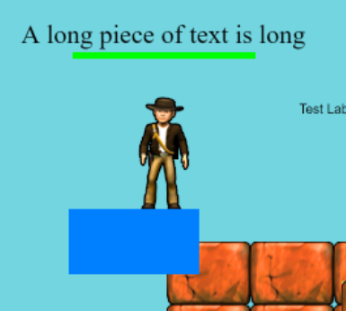

After the winter break, the team has released [Excalibur@v0.25.2](https://github.com/excaliburjs/Excalibur/releases/tag/v0.25.2) with a lot of improvements to the core engine and plugins! Check the [roadmap](https://github.com/excaliburjs/Excalibur/issues/1161) for our current plans.

Check out the new version on npm!

```
> npm install excalibur@0.25.2
```

> "Winter holiday, when developers work on their side projects" - Anonymous Coworker

## Dev tools

```
> npm install @excaliburjs/dev-tools
```

We've built a [new tool to help debug Excalibur games](https://github.com/excaliburjs/dev-tools)! This tool lets you see information about the Excalibur engine, scenes, actors, clocks, and more!

Debugging why things aren't working has historically been pretty difficult. This plugin will greatly assist in the game development cycle. Nearly everything is available and configurable.

It's pretty low effort to install into your game:

```typescript
import { DevTool } from '@excaliburjs/dev-tools';

const game = new ex.Engine({...});
const devtool = new DevTool(game);
```


## Tiled updates

```
> npm install @excaliburjs/plugin-tiled
```

The Tiled plugin now implicitly adds a z-index to each layer (which can be overridden) which means things will look as you expect in Excalibur as they do in the Tiled editor.

Set the starting layer z (defaults to -1) and get gaming!

```typescript
const map = new TiledMapResource('path/to/map.tmx', { firstLayerZIndex: -2 });
```


## Renderer performance improvements

The performance gains were achieved through some core renderer refactors and identifying places where expensive calculations could be cached!

This is huge, we stay above 30fps in the 4000 actor benchmark, and we have dramatic improvement in average fps in both cases!


This benchmark was performed in Chrome on a Surface Book 2 with the power plugged in.

- Processor: Intel(R) Core(TM) i7-8650U CPU @ 1.90GHz, 2112 Mhz, 4 Core(s), 8 Logical Processor(s)
- Physical Memory: (RAM) 16.0 GB
- Graphics: NVIDIA GeForce GTX 1060

A number of improvements were made to the Excalibur graphics systems to get to this performance.
The big factors to this improvement were:

1. Avoiding recalculation of graphics transforms and other expensive operations when they can be cached
2. Refactoring the renderer to be simpler and to use index buffers to share geometry vertices.
3. Rendering batches at the actual maximum for the batch renderer
4. Avoid recreating `Matrix` types, they are somewhat expensive to create then garbage collect

## Post processing

The postprocessor improvements allow custom WebGL shaders, which can produce some cool effects! (Minimally modified from [this ShaderToy](https://www.shadertoy.com/view/Ms23DR))


To produce the above effect, Excalibur has a new built in `ScreenShader` type for doing quick shaders meant for the whole screen.

```typescript
class CrtPostProcessor implements ex.PostProcessor {
  private _shader: ex.ScreenShader;
  initialize(gl: WebGLRenderingContext): void {
    const crtEffectSource = document.getElementById("modified-crt-shader-source").innerText;
    this._shader = new ex.ScreenShader(crtEffectSource);
  }

  getLayout(): ex.VertexLayout {
    return this._shader.getLayout();
  }

  getShader(): ex.Shader {
    return this._shader.getShader();
  }
}

game.graphicsContext.addPostProcessor(new CrtPostProcessor());
```

## Renderer improvements

### Renderer design

When v0.25.0 was released, it was a "monolithic" renderer design, meaning everything Excalibur could possibly draw was built into a single renderer and shader program. This became onerous fairly quickly. And as the old adage goes: "you don't know how to build something until you've built it twice".

With v0.25.2, each type of drawing is split internally into separate renderer plugins. While this does come with some overhead when switching shader programs, it's worth it for the the simplicity, maintainability, and extensibility benefits.

### Image filtering

Excalibur now allows you the ability to control the WebGL image filtering mode both implicitly and explicitly. Really this means Excalibur will try to pick a smart default, but allows overrides

Explicitly when loading `ex.ImageSource`:

```typescript
const myImage = new ex.ImageSource('path/to/image', false, ex.ImageFiltering.Pixel);
```

- `ex.ImageFiltering.Blended` - Blended is useful when you have high resolution artwork and would like it blended and smoothed

  

- `ex.ImageFiltering.Pixel` - Pixel is useful for pixel art when you do not want smoothing aka antialiasing applied to your graphics.

  

Implicitly if the `ex.EngineOption` antialiasing property is set:

- `antialiasing: true`, then the blend mode defaults to `ex.ImageFiltering.Blended`
- `antialiasing: false`, then the blend mode defaults to `ex.ImageFiltering.Pixel`

## Custom renderer plugins

Excalibur knows how to draw many types of graphics to the screen by default comes with those pre-installed into the ExcaliburGraphicsContext. However, you may have a unique requirement to provide custom WebGL commands into Excalibur, this can be done with a custom renderer plugin.

A custom renderer can be registered with Excalibur and draw in any draw routine! Read more in the [docs about custom rendere plugins](https://excaliburjs.com/docs/custom-renderer-plugins)

```typescript
const game = new ex.Engine({...});

export class MyCustomRenderer extends ex.RendererPlugin {
    public readonly type = 'myrenderer';
    ...
}

game.start().then(() => {
    // register
    game.graphicsContext.register(new MyCustomRenderer());
});

// call from a graphics callback or event
const actor = new ex.Actor({...});
actor.graphics.onPostDraw = (graphicsContext) => {
    graphicsContext.draw<MyCustomRenderer>('myrenderer', ...);
}
```

## Community

We've had a lot of community engagement this iteration, especially through the issues and [github discussions](https://github.com/excaliburjs/Excalibur/discussions). Lots of good issues, and lots of cool things in the show and tell

Big thanks to everyone who helped with this release:

- @ivasilov
- @luttje
- @tsanyqudsi
- @lampewebdev
- @joshuadoan
- @berkayyildiz
- @simon-jaeger
- @YJDoc2
- @JumpLink

## The future

We are progressing at full speed toward the v1 vision, there is still a lot to do but the end is in sight. Here are a few things that I'm personally really excited for:

- Event system redo
- Particle system refactor
- Final deprecation of old drawing api
- New TileMap enhancements for hexagonal and isometric maps

This was a point release, but despite that a lot of exciting things were added! Looking forward to v0.26.0!

_-Erik_
