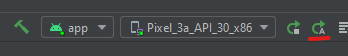

**Updated to the latest Excalibur, Capacitor.js & Parcel!**

In this post we put a web canvas game built in Excalibur into an Android (or iOS) app with [Capacitor.js](https://capacitorjs.com/)!

In the past I would have used something like Cordova, but this new thing from the folks at [Ionic](https://ionic.io/) has TypeScript support out of the box for their native APIs and support for using any Cordova plugins you might miss.

TLDR [show me the code](https://github.com/eonarheim/capacitor-game-v2)

## Capacitor Setup

The capacitor project setup is pretty straightforward from their docs, it can [drop in place](https://capacitorjs.com/docs/getting-started#adding-capacitor-to-an-existing-web-app) in an existing project or [create a brand new project](https://capacitorjs.com/docs/getting-started#optional-starting-a-fresh-project) from scratch.

I opted for the brand new project:
```
> npm init @capacitor/app
```

Then follow their wizard and instructions to configure.

After that step add the platforms you're interested in, in this case Android

```
> npx cap add android
```

I recommend reading the [capacitor documentation](https://capacitorjs.com/docs/basics/workflow) on workflow with a hybrid native app. The gist is this
1. Run `npx cap sync` to copy your web project into capacitor
2. Run `npx cap run android` to start the project on android (or start in the Android SDK)

### Android Setup

Before you try to run the project

1. Download Android Studio [Android Studio](https://developer.android.com/studio) 
2. Open it up and check for updates if needed (first time initialization takes some time)
3. Accept your SDK package licenses, the easiest way I've found to do this is with the SDK command line tools with Powershell on W.
   1. Find the SDK Manager
   
   2. In SDK Tools, check `Android SDK Command-line Tools`
   
3. Next we need to accept licenses.
  
   - In powershell, navigate to the Android SDK Location for command line tools
   `C:\Users\<username>\AppData\Local\Android\Sdk\cmdline-tools\latest\bin`
   - Set your java home temporarily `$env:JAVA_HOME = 'C:\Program Files\Android\Android Studio\jre'`
   - Run `.\sdkmanager.bat --licenses` and select `y` for each

### Starting the App

Now that we have Android all setup we can start the app with the capacitor command line.

The gist is that it copies the final compiled html/css/js assets from your favorite frontend frameworks and build tools into the native container
```
> npx cap sync
```

After that we can open it in Android Studio with the capacitor commandline

```
> npx cap open android
```

Building the project and running the first time can take some time, so be patient after hitting the big green play button.


ProTip<sup>TM</sup> **The Emulator is MEGA slow** to start so once you get it on, leave it on. You can redeploy the app to a running emulator with the "re-run" hightlighted below.




If your Android emulator crashes on the first try like mine did with something like `The emulator process for AVD Pixel_3a_API_30_x86 was killed`, this [youtube video](https://www.youtube.com/watch?v=AOK9ZxiBOGg) was super helpful. For me the problem was disk space, the AVD needs 7GBs of disk space to start so I had to clean out some junk on the laptop 😅

## Building Your Canvas Game

The dev cycle is pretty slick, run `npm cap copy android` to move your built JS living in the `www` to the right android folder. The default app looks like this after running it in the android emulator.


### Setting Up Your JS Build

First let's setup our TypeScript by installing and creating an empty `tsconfig.json`
```
> npm install typescript --save-dev --save-exact
> npx tsc --init`
```

Recently I've been a big fan of [parcel](https://parceljs.org/)(v1) for quick and easy project setup, and it works great with [excalibur](https://github.com/excaliburjs/template-ts-parcel) also [webpack is cool too](https://github.com/excaliburjs/template-ts-webpack) if you need more direct control of your js bundling.

```
> npm install parcel --save-dev --save-exact
```

I copied the generated `manifest.json`, `index.html`, and `css/` folder out of the original generated `www/` and put it into `game/`. 


We need to setup our development and final build script in the `package.json`. The npm `"start"` script tells parcel to run a dev server and use `game/index.html` as our entry point to the app and follow the links and build them (notice the magic inline `<script type="module" src="./main.ts"></script>`) ✨ 

```html
<!DOCTYPE html>
<html lang="en" dir="ltr">
<head>
  <meta charset="UTF-8">
  <title>Game Test</title>
  <meta name="viewport" content="viewport-fit=cover, width=device-width, initial-scale=1.0, minimum-scale=1.0, maximum-scale=1.0, user-scalable=no">
  <meta name="format-detection" content="telephone=no">
  <meta name="msapplication-tap-highlight" content="no">

  <link rel="manifest" href="./manifest.json">
  <link rel="stylesheet" href="./css/style.css">
</head>
<body>
  <script type="module" src="./main.ts"></script>
</body>
</html>
```

In this setup I'm sending all my built output with `--dist-dir` into the `www` directory, which is what capacitor will copy to android. I went ahead and deleted the provided default app in the `www` directory.

```json
/* package.json */
{
  "name": "my-cool-game",
  "scripts": {
    "start": "parcel game/index.html --dist-dir www",
    "typecheck": "tsc -p . --noEmit",
    "build": "parcel build game/index.html --dist-dir www"
  }
  ...
}
```


### Vanilla Canvas code

To start with I have a really awesome game that shows the fps and a red square. This shows how get started from scratch with the HTML Canvas.

```typescript
// main.ts
const canvas = document.createElement('canvas') as HTMLCanvasElement;
const ctx = canvas.getContext('2d') as CanvasRenderingContext2D;

canvas.height = window.innerHeight;
canvas.width = window.innerWidth;
document.body.appendChild(canvas);

let lastTime = performance.now();
const mainloop: FrameRequestCallback = (now) => {
    const delta = (now - lastTime)/1000;
    lastTime = now;
    ctx.fillStyle = 'blue';
    ctx.fillRect(0, 0, canvas.width, canvas.height);
    
    ctx.font = '50px sans-serif';
    ctx.fillStyle = 'lime';
    ctx.fillText((1/delta).toFixed(1), 20, 100);

    ctx.fillStyle = 'red';
    ctx.fillRect(canvas.width/2, canvas.height/2, 40, 40);

    requestAnimationFrame(mainloop);
}

mainloop(performance.now());
```


## Using Excalibur🗡

Using the Excalibur engine with capacitor and parcel will be a breeze! Really any web based game engine could be substituted here if you want. Here is the [source on github](https://github.com/eonarheim/capacitor-game-v2)!

```
> npm install excalibur --save-exact
```

Update the `main.ts` with some Excalibur
```typescript
import { Actor, DisplayMode, Engine, Input, Loader, ImageSource } from "excalibur";

const game = new Engine({
    displayMode: DisplayMode.FillScreen,
    pointerScope: Input.PointerScope.Canvas
});

const sword = new ImageSource('assets/sword.png');
const loader = new Loader([sword]);

game.start(loader).then(() => {
    game.input.pointers.primary.on('move', event => {
        const delta =  event.worldPos.sub(actor.pos);
        actor.vel = delta;
        // Original asset is at a 45 degree angle need to adjust
        actor.rotation = delta.toAngle() + Math.PI/4;
    });

    const actor = new Actor({
        x: game.halfDrawWidth,
        y: game.halfDrawHeight,
        width: 40,
        height: 40
    });
    actor.graphics.use(sword.toSprite());

    game.add(actor);
});
```

Note, depending on your emulator settings you may need to tweak it's graphics settings and restart Android Studio for it to build and run (This works out of the box fine on real hardware tested in BrowserStack, for some reason the emulator graphics can be confused)


Tada! 🎉 


Hope this helps you web game devs out there!

-Erik