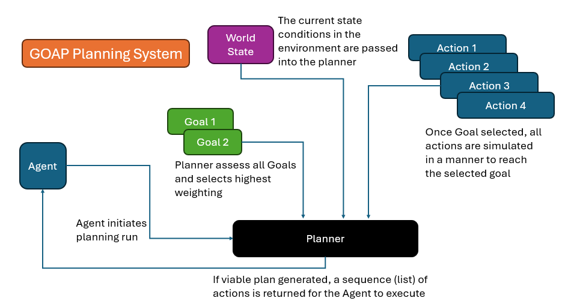
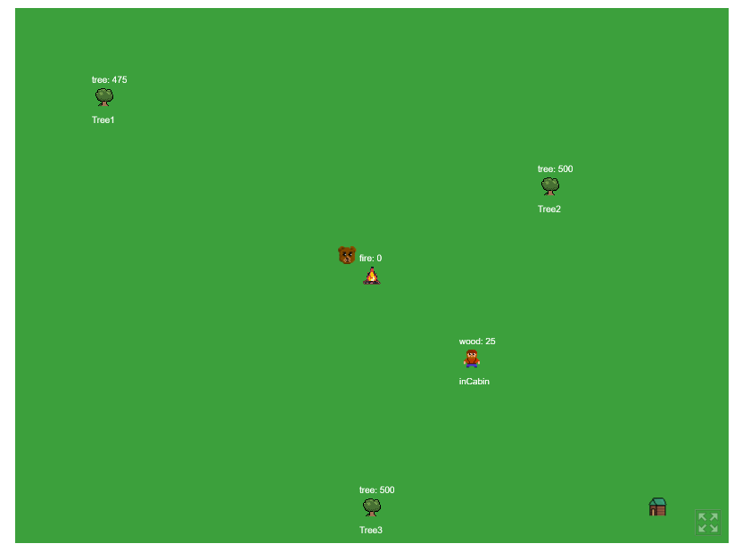

I have been in need of an AI system that can execute a simulation that I desire to run. In my research, I have come across
Goal-Oriented Action Planning. This technique can give me the flexibility I need to run my simulation, let's dive into the
implementation a bit.

[Link to GOAP Demo](https://mookie4242.itch.io/goap-ai-simulation-using-excaliburjs-engine)

## GOAP, what is it

Goal-Oriented Action Planning, or GOAP, is a flexible AI technique that enables the developer build up a set of actions and objectives,
and allows the NPC (agent) itself determine what the best objective is, and how to accomplish said objective.

GOAP includes the use of Agents, Goals, Actions, and State, to plan out its next series of decisions and activities. This is a useful
system for Non-Playable Characters(NPCs) or enemy AI logic.

## Quick History

GOAP was developed by Jeff Orkin in the early 2000's while working on the AI system for
[F.E.A.R.](<https://en.wikipedia.org/wiki/F.E.A.R._(video_game)>)

The desire was to generate automated planning sequences for Enemies and NPCs to create a more immersive game experience.

GOAP can be considered an alternative to classic behavioral trees, which was more standard at that time.

## Theory of operations

There are 5 aspects of GOAP that interact to create the magic: State, Agents, Goals, Actions, and the Planner.



First, let's talk about State.

### State

State is the data set conditions that describes the world in which an agent exists. For my implementation, an established set of
key/value pair data was used to fuel the simulation. A simple example of a world state:

```ts
	world = {
		trees: 3;
		bears: 1;
		playerPosition: {x: 100, y:200};
	};
```

This is the data that gets used, not only as a starting point, but gets cloned and mutated over the course of the algorithm processing
the plan.

### Goals

Next, let us review the goals or objectives that are intended to be accomplished. The goal defines the target state that the algorithm
evaluates against to determine if the objectives are met.

The goal assessment will take a copy of the mutated state and compare it against the target state defined for the goal, and if it
matches, let's the algorithm know that is done with that branch of evaluation.

The goal also contains a method of assessing its own priority conditions, which takes in the world state and returns a defined factor
of prioritization. For example, a floating-point value from 0.0 to 1.0, where 1.0 is the highest priority.

### Agents

Agencts are the entities (enemies or other NPCs) that get the planning system attached to it. If the entity is not currently executing
a plan, it can call the planning process to assess what it should do next.

One aspect of the agents that is important to remember, is including the ability to cancel the plan, and reassess, even if the sequence
isn't complete.

Think about if the environment in which the current plan was created, no longer is viable, you need to be able to change your mind.
i.e. a power up is no longer available, or a targeted enemy is dead, etc...

### Actions

Actions are very discrete units of activity:

- Move to spot
- Pick up Item
- Fire weapon
- Duck

These actions should have a cost component, time or energy is common, and the actions will be linked together to form a sequence of
actions that constitutes 'plan'.

What is unique about components of an action beyond cost, is the precondition and effect components. These are super important.

The precondition component is what the planner evaluates if the action is viable under the current condition. The current condition is
the cloned, mutated state that is considered for that sequence of the plan.

If the conditions are true for the precondition, then the action is considered an available choice for the next step.

The effect component of an action is the defined changes to state that occur when that action is executed. This is used by the planner
to clone and mutate the state as it churns through the different possible options.

### Planner

The planner is the algorithm which generates the plan, and it has several tasks. To use the Planner, you pass the current world state,
all available actions for the agent, all available goals for the agent.

The planner's first task is to assess all available goals for the agent to determine which is the highest priority.

Then, with that goal selected and the current world state, find a list of actions that can be executed.

With your state, your goal, and your available actions, you can start building a graph network, a branching tree of available plans.

When the graph is constructed, the planner can assess the best course of action based on any number of custom factors, and returns the
sequence of actions as the plan.

## The algorithm

There are two aspects of the algorithm that should be discussed. The graph network and the assessment.

### The graph network


The graph network is built with a recursion that forms a tree structure, and branching is based on the new available list of actions
that meet the mutated state condition, for that branch.

As you walk through each branch, the actions taken at each node will mutate the state. That mutated stated then gets checked against
the goal provided, to see if you are done.

If the goal passes, an endnode is created. If not, then that newly mutated state is used to generate the new list of available actions
and the recursion continues.

The recursion ends when a branch's mutated state cannot create further list of actions, or the goal is met.

### Picking a plan

Once the graph is assembled, you can filter out any branches that do not end in a completed goal, then the Planner can assess which
path makes most sense.

This is where you can have different style planners. The planner i created simply creates a 'cheapest cost' plan based on the the
aggregate cost of each plan created.

I use a [dijkstra's algorithm](https://en.wikipedia.org/wiki/Dijkstra%27s_algorithm) to calculate, based on each actions 'cost', the
cheapest path to execute.

But there is flexibility here as well, including using different costing structures, maybe you want to balance energy and time both?
Then you could construct a planner that favors one over the other based on conditions.

## The test



[Link to Demo](https://mookie4242.itch.io/goap-ai-simulation-using-excaliburjs-engine)

I spent a couple weeks building a simulation of my GOAP library that I created. It is a simple "actor feeds fire with wood, while
avoiding bears" simulation.

The Actor has two goals, "keep fire aive", and "avoid bear"

If the actor is currently without a plan to execute, it passes its worldstate into the planner. The world state looks vaguely like
this:

```ts
export const world = {
  tree: 500,
  tree2: 500,
  tree3: 500,
  campfire: 0,
  player: 0,
  playerState: playerState.idle,
  bearDistance: 300,
};
```

The actions available are:

```ts
player.goapActions = [
  feedFireAction,
  collectWoodAction,
  moveToTreeAction,
  moveToFireAction,
  moveToTree2Action,
  collectWood2Action,
  moveToTree3Action,
  collectWood3Action,
  runAwayAction,
  relaxAction,
];
```

When the planner is fed these components, it assesses the priority of each action based on their weighting, is the fire getting low? or
is the bear close by?

With the goal selected, it uses the state data to determine which actions to take, for the fire building, the first round of actions
usually are moving to trees. That is unless the player is holding some wood, then it will decide to just go to the fire directly.

If the player moves to a tree, it then collects its wood, then it moves to fire, and feeds the fire, and it waits till the fire gets
lower before going to collect more wood.

I mentioned earlier that agents have to be able to cancel their plans. If the bear comes close to the player, it triggers a
cancelPlan() method and the player is forced to generate a new plan.

Since the bear is close, it picks "avoid bear" plan, and then the process starts again with that new goal.

## Conclusion

We have covered GOAP, some history of it, what the components of a GOAP system are, and how to implement them.

What I have learned in this process is that GOAP is very powerful and flexible. That does not imply that GOAP is easy, I would consider
implementing a GOAP system at the intermediate level.

When trying to connect different actions and insuring they chain together to form a complete plan, there are many chances in
implementation to create issues. But when dialed in, GOAP can provide a foundation for a very flexible AI system that can lead to
enriching gameplay.
