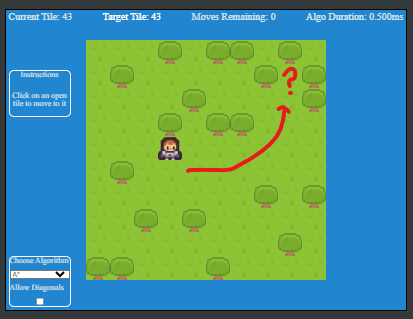
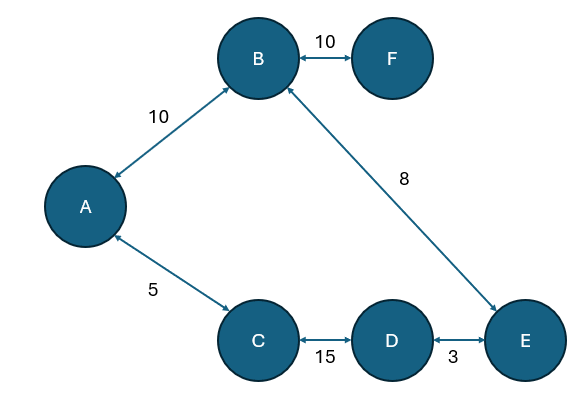
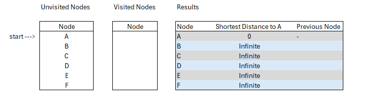
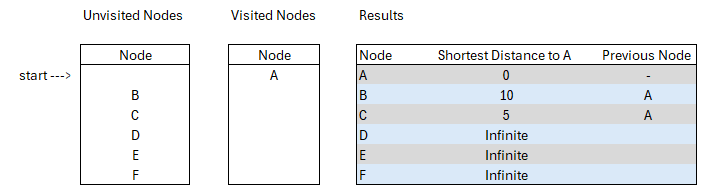
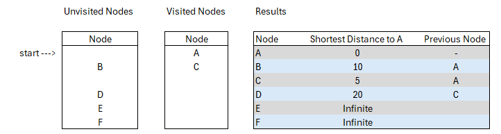
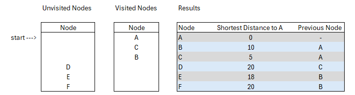
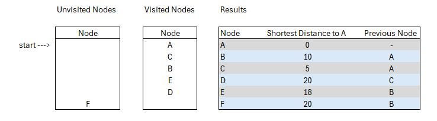
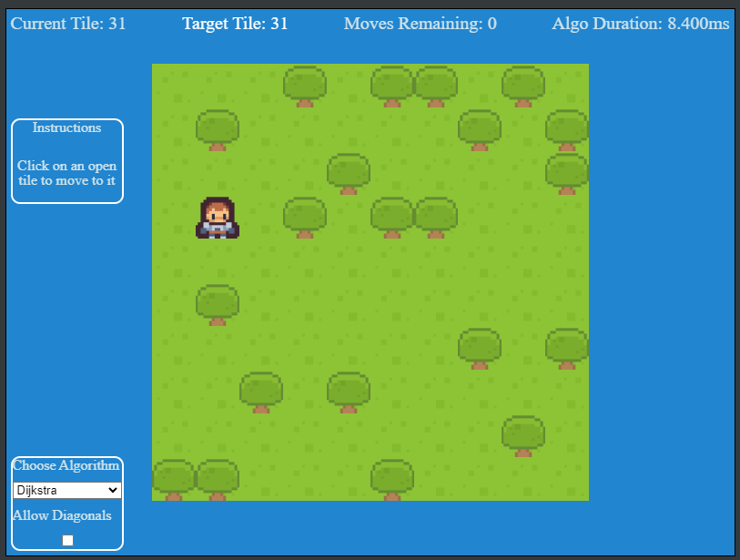

One of the most common problems that need solved in game development is navigating from one tile to a separate tile somewhere else. Or
sometimes, I need just to understand if that path is clear between one tile and another. Sometimes you can have a graph node tree, and
need to understand the cheapest decision. These are the kinds of challenges where one could use a pathfinding algorithm to solve.



[Link to Pathfinding Demo](https://excaliburjs.com/sample-pathfinding/)

## Pathfinding, what is it

Quick research on pathfinding gives a plethora of resources discussing it. Pathfinding is calculating the shortest path through some
'network'. That network can be tiles on a game level, it could be roads across the country, it could be aisles and desks in an office,
etc etc.

Pathfinding is also an algorithm tool to calculate the shortest path through a graph network. A graph network is a series of nodes and
edges to form a chart. For more information on this: [click here](https://www.google.com/search?q=Graph%20Thoery)

For the sake of clarity, there are two algorithms we specifically dig into with this demonstration: Dijkstra's Algorithm and A\*.

COMING SOON
We study A\* more in Part 2

## Quick History

### Dijkstra's Algorithm

Dijkstra's Algorithm is a formula for finding the shortest path through a graph that presents weighting (distances) between
different nodes. The algorithm essentially dictates a starting node, then it systematically calculates the distance to all other nodes
in the graph, thus, giving one the ability to find the shortest path.



Edsger Dijkstra, was sipping coffee at a cafe in Amtserdam in 1956, and was working through a mental exercise regarding
how to get from Roggerdam to Groningen. Over the course of 20 minutes, he figured out the algorithm. In 1959, it was formally
published.

## Algorithm Walkthrough

### Dijkstra's Algorithm


Let's start with this example graph network. We will manage our walkthrough using a results table and two lists, one for unvisited
nodes, and one for visited nodes.

Let's declare A our starting node and update our results object with this current information. Since we are starting at node A, we then
review A's connected neighbors, in this example its nodes B and C.



Knowing that B is distance 10 from A, and that C is distance 5 from A, we can update our results chart with the current information.

With that update, we can move node A from unvisited to visited list, and we have this new state.



Now the algorithm can start to be recursive. We identify the node with the smallest distance to A of our unvisited nodes. In this
instance, that is node C.

Now that we are evaluating C, we start with identifying its unvisited neighbors, which in this case is only node D. The algorithm would
update all the unvisited neighbors with their distance, adding it to the cumulative amount traveled from A to this point. So with that,
D has a distance of 15 from C, and we'll add that to the 5 from A to C.

We continue to repeat this algorithm until we have visited all nodes.

From here we will quickly loop through the rest of the table.

This is when we visit node C:



Node B is closer to Source than node D, so we visit it next.



Unvisited neighbors of B are E and F. E is closes to A, so we visit it next.

D is E's unvisited neighbor, but its distance via E is longer than what's already in the result index, so we do not add this data up.

D is the only unvisited neighbor, and we hit a dead end on this branch, so D gets visited, but with no updates to the results table



So since we are looping through all unvisited Nodes, F is the final unvisited node, and its a neighbor of B. We can now visit F through
B, and we do not have any results table updates with this visit, as F has no unvisited neighbors.

## What do we do with this data?

My library module for using this algorithm includes a method that runs the analysis, then uses the results table to get the shortest
path.

It takes in the starting node, and ending (destination) node and returns the list of nodes needed to traverse the path.

```ts
  shortestPath(startnode: Node, endnode: Node): Node[] {
    let dAnalysis = this.dijkstra(startnode);

    //iterate through dAnalysis to plot shortest path to endnode
    let path: Node[] = [];
    let current: Node | null | undefined = endnode;
    while (current != null) {
      path.push(current);
      current = dAnalysis.find(node => node.node == current)?.previous;
      if (current == null) {
        break;
      }
    }
    path.reverse();
    return path;
  }
```

So for Example, if I said starting node is A, and endingnode is D, then the returned array would look like.

```ts
//[Node C, Node D]
```

If you need the starting node in the path, you can unshift it in.

```ts
path.unshift(startnode);
//[Node A, Node C, Node D]
```

## The test



[Link to Demo](https://excaliburjs.com/sample-pathfinding/)

[Link to Github Project](https://github.com/excaliburjs/sample-pathfinding)

The demo is a simple example of using a Excalibur Tilemap and the pathfinding plugin. When the player clicks a tile that does NOT have
a tree on it, the pathfinding algorithm selected is used to calculate the path. Displayed in the demo is the amount of tiles to
traverse, and the overall duration of the process required to make the calculation.

Also included, are the ability to add diagonal traversals in the graph. Which simply modifies the graph created with extra edges added,
please note, diagonal traversal is slightly more expensive than straight up/down, left/right traversal.

## Conclusion

In this article, we reviewed a brief history of Dijkstra's Algorithm, then we created and example graph network and stepped through it
using the algorithm, and then was able to use it to determine the shortest path of nodes.

This algorithm I have found is more expensive than A\*, but is a nice tool to use when you don't understand the shape and size of the
graph network. As a programming exercise, I had a lot of fun interating on this problem till I got it working, and it felt like an
intermediate coding problem to tackle.


