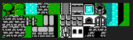
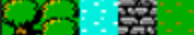

import img from './images/image.png';
import img1 from './images/image-1.png';
import img2 from './images/image-2.png';
import img3 from './images/image-3.png';
import img4 from './images/image-4.png';
import img5 from './images/image-5.png';
import img6 from './images/image-6.png';
import img7 from './images/image-7.png';
import img8 from './images/image-8.png';
import img9 from './images/image-9.png';
import img10 from './images/image-10.png';
import img11 from './images/image-11.png';
import img12 from './images/image-12.png';
import img13 from './images/image-13.png';
import img14 from './images/image-14.png';
import img15 from './images/image-15.png';
import img16 from './images/image-16.png';
import img17 from './images/image-17.png';
import img18 from './images/image-18.png';

One challenge of indie game development is about striking a balance. Specifically, the balance between hand crafted level design,
player replayability, and the lack of enough hours in a day to commit to being brilliant at both. This is where people turn to
procedural generation as a tool to help strike that balance. One of the most magical and interesting tools in the proc gen toolbox is
Wave Function Collapse (WFC). In this article, we'll dive into the how/why of WFC, and how you can add this tool to your repertoire for
game development.

# What is Wave Function Collapse

WFC is a very popular procedural generation technique that can generate unique outputs of tilemaps or levels based off prompted input
images or tiles. WFC is an implementation of the model synthesis algorithm. WFC was created by Maxim Gumin in 2016. The WFC algorithm
is VERY similar to the model synthesis algorithm developed in 2007 by Paul Merrell. For more information on WFC specifically, you can
review Maxim's Github repo [here.](https://github.com/mxgmn/WaveFunctionCollapse)

It is based off the theory from quantum mechanics. Its application in Game Development though is a bit simpler. Based on a set of input
tiles or input image, the algorithm can collapse pieces of the output down based on the relationship of that tile or image area.

Example input image:

 (Yes I do have an unhealthy fascination with the original Final Fantasy)

Example output images:


# Entropy

Digging into the quantum mechanics context of WFC will introduce us to the term Entropy. Entropy is used as a term that describes the
state of disorder. The way we will use it today is the number of different tile options a certain tile can be given the state of its
neighbor tiles. We will demonstrate this further down.

The concept essentially states that the algorithm selects the region of the output image with the lowest possible options, collapses it
down to its lowest state, then using that, propogating the rules to each of the neighbor tiles, thus limiting what they can be. The
algorithm continues to iterate and collapsing down tiles until all tiles are selected. The rules are the meat and potatoes of the
algorithm. When you setup the algorithm's run, you not only provide the tileset, but also the rules for what tiles can be

For this discussion, as the demo application focuses on using WFC with the ExcaliburJS game engine, we are focusing on the simple
tile-based WFC approach.

# Walkthrough of the algorithm

## The Rules

The rules are arguably the most critical aspect of the algorithm. For the simple tile-based mapping, this includes details and mappings
between each tile and what other tiles can be used as neighbors. If you were doing the input image form of WFC, the input image's
design would dictate the rules pixel by pixel.

Let us consider this subsection of the tilemap to demonstrate this:



Let's identify each tile as tree, treetop, water, road, and grass. For the sake of simplicity, we will focus on just four of them:
tree,water, grass, and treetop.

We will define some rules for the tiles as such.

```ts
let treeTileRules = {
  up: [treeTopTile, grassTile, waterTile],
  down: [grassTile, waterTile, treeTile],
  left: [grassTile, waterTile, treeTile],
  right: [grassTile, waterTile, treeTile],
};

let grassTileRules = {
  up: [treeTile, grassTile, waterTile],
  down: [grassTile, waterTile, treeTile],
  left: [grassTile, waterTile, treeTile],
  right: [grassTile, waterTile, treeTile],
};

let treeTopTileRules = {
  up: [grassTile, waterTile, treeTopTile],
  down: [treeTile],
  left: [grassTile, waterTile, treeTile],
  right: [grassTile, waterTile, treeTile],
};

let waterTileRules = {
  up: [treeTile, grassTile, waterTile],
  down: [grassTile, waterTile, treeTile],
  left: [grassTile, waterTile, treeTile],
  right: [grassTile, waterTile, treeTile],
};
```

What these objects spell out is that for tiles above the tree tile, it can be a grass, water, or treetop tile. Tiles below the treetile
can be another tree tile, or water, or grass... and so on. One special assignement to note, that below a treeTop tile, can ONLY be a
treeTile.

We can proceed to follow this pattern for each of the tiles, outlining for each tile what the 4 neighbor tiles CAN be if selected.

## The Process

The process purely starts out with an empty grid... or you actually can predetermine some portions of the grid for the algorithm to
build around... but for this explanation, empty:


Given that none of the tiles have been selected yet, we can describe the entropy of each tile as essentially Infinite, or more
accurate, <i>N</i> number of available tiles to choose from. i.e. , if there are 5 types of available tiles, then the highest entropy
is 5, and each tile in this grid is assigned that entropy value.

If we entered the algorithm with predetermined tiles, or what we could call collapsed, then the entropy of the surrounding neighbors of
those tiles would have a lower entropy as dictated by the rules we discussed above.

Let's begin by selecting a random tile on this grid... `{x: 3,y: 4}`. Due to the fact that all its neighbors are empty, it's pool of
available tiles is 4, tree, grass,water, or tree top. Let us pick tree, as this can simply be randomly picked from the set.


This leads us into the idea of looping through all the tiles and setting their entropy value based on what their neighbors are... we
have 4 available tiles for this experiment, so 4 will be the highest entropy value.


Take note that the neighbors of our fully collapsed tile are not at entropy 4, but at 3, as for each of these neighbors, our 'rules'
for the tree tile reduces their possible options. So now we start the process again, but instead of randomly selecting any tile, we
will form a list of the lowest entropy tiles, and that becomes our available pool. So, in this example:

`[{x:3,y:3}, {x:2,y:4}, {x:4, y:4}, {x:3,y:5}]` all have entropy values of 3, so they are what we select.

4,4 is selected from that pool, and based on the rules, it can be grass, water, or tree. Randomly selected: tree again. Looping through
the tiles and resetting the entropy, we get a new pool of tiles.


4,3 is the next selected from the new pool of lowest entropy tiles, and it becomes a grass tile. Looping through the tiles and
resetting entropy, we notice something different.


We see our first shift in the pool of lowest entropy. The reason behind tile 3,3 being entropy level 2 is due to the rules of grass and
tree tiles.

```ts
let treeTileRules = {
  up: [treeTopTile, grassTile, waterTile],
  down: [grassTile, waterTile, treeTile],
  left: [grassTile, waterTile, treeTile],
  right: [grassTile, waterTile, treeTile],
};

let grassTileRules = {
  up: [treeTile, grassTile, waterTile],
  down: [grassTile, waterTile, treeTile],
  left: [grassTile, waterTile, treeTile],
  right: [grassTile, waterTile, treeTile],
};
```

The left field for grass tiles allows for grass, water, and tree... while the up field for tree only allows grass, water, and treetop.
So between those two fields, there are only 2 tile types that match both requirements, thus there are only 2 available tiles to select
and now and entropy of 2.

The next iteration of the algorithm has only one tile in its pool of lowest entropy, 3,3 so it gets collapsed to either water or grass
based on its neighbors, so it becomes grass as a random selection.


This algorithm carries on until there are no more tiles to collapse


One note on this example is that we have really limited the amount of different tiles that are being accessed, and you see this
manifest itself in the entoropies of 3,4 consistently. The rules also are fairly permissive, which is why we don't see a huge variation
of entropies. More tiles available, and more restrictive rules, will drive much more variation in the entropy scores that will be
witnessed.

## Collisions

What you will find with this algorithm that there maybe created a conflict where there is no available tiles to select based on the
neighbors. This is called either a conflict or a collision, and can be handled in a couple different ways.

One thought is to reset the map and try again. From a process perspective, sometimes this is just the easiest/cheapest method to
resolve the conflict.

Another approach is to use a form of the command design pattern, and saving a stack of state snapshots that are captured during each
step of the algorithms iteration, and upon reaching a collision, 'backtrack' a bit and retry and generate again from a previous point.
The command design pattern essentially unlocks the undo button for an algorithm, and allows for this.

# Demo Application


[Link To Repo](https://github.com/jyoung4242/wfc-itch)

[Link To Demo](https://mookie4242.itch.io/wave-function-collapse-simulation)

The demo application that's online is a simple, quick simulation that runs a few algorithm iterations... and can regenerate the
simulation on Spacebar or Mouse/Touch tap.

First, it uses WFC to generate the terrain, only using the three tiles of grass, tree, treetops.

Second, it finds spots to draw two buildings. The rules around this is to not collide the two buildings, and also not have the
buildings overrun the edges of the map. I use WFC to generate random building patterns using a number of tiles.

Finally, and this has nothing to do with WFC, I use a pathfinding algorithm I wrote to find a path between the two doors of the houses,and draw a road between them... I did that for my own amusement.

Pressing the spacebar in the demo, or a mouse tap, attempts to regenerate another drawing. Now, not every generation is
perfect, but this seems to have a >90% success rate, and for the purposes of this article, I can accept that. I intentionally did not
put in a layer of complexity for managing collisions, as I wanted to demonstrate what CAN happen using this method, and how one needs
to account for that in their output validation.

# Why Excalibur


Small Plug...

[ExcaliburJS](https://excaliburjs.com/) is a friendly, TypeScript 2D game engine that can produce games for the web. It is free and
open source (FOSS), well documented, and has a growing, healthy community of gamedevs working with it and supporting each other. There
is a great discord channel for it [HERE](https://discord.gg/ScX52wD4eM), for questions and inquiries. Check it out!!!

# Conclusions

Wrapping up, my goal was to help demystify the algorithm of Wave Function Collapse. There are some twists to the pattern, but overall
it is not the most complicated of generation processes.

We also discussed the concept of Entropy, and how it applies to the algorithm overall, in essence it helps prioritize the next tile to
be collapsed. Collapsing a tile is simply the process of picking from of available tiles that a specific tile CAN be by means of the
rules provided.

In my experience, and I've done a few WFC projects, the rules provide the constraints of the algorithm.  Ultimately, it is where I
always spend the most time tweaking and adjusting the project. Too tight of rules, and you'll need to be VERY good at managing
collisions. However, too few rules, and you're output maybe a very noisy mess.

I suggest you give WFC a try, it can be VERY fun and rewarding to see the unique solutions it can come up with.
