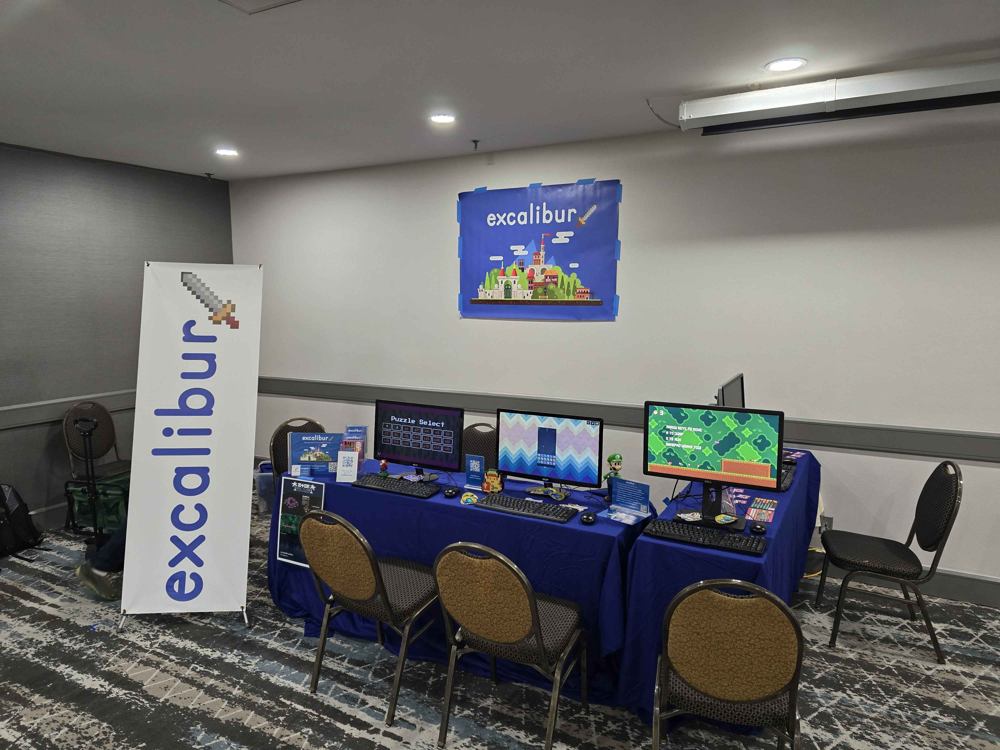
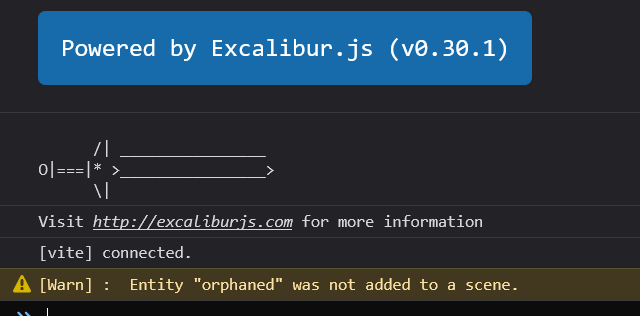
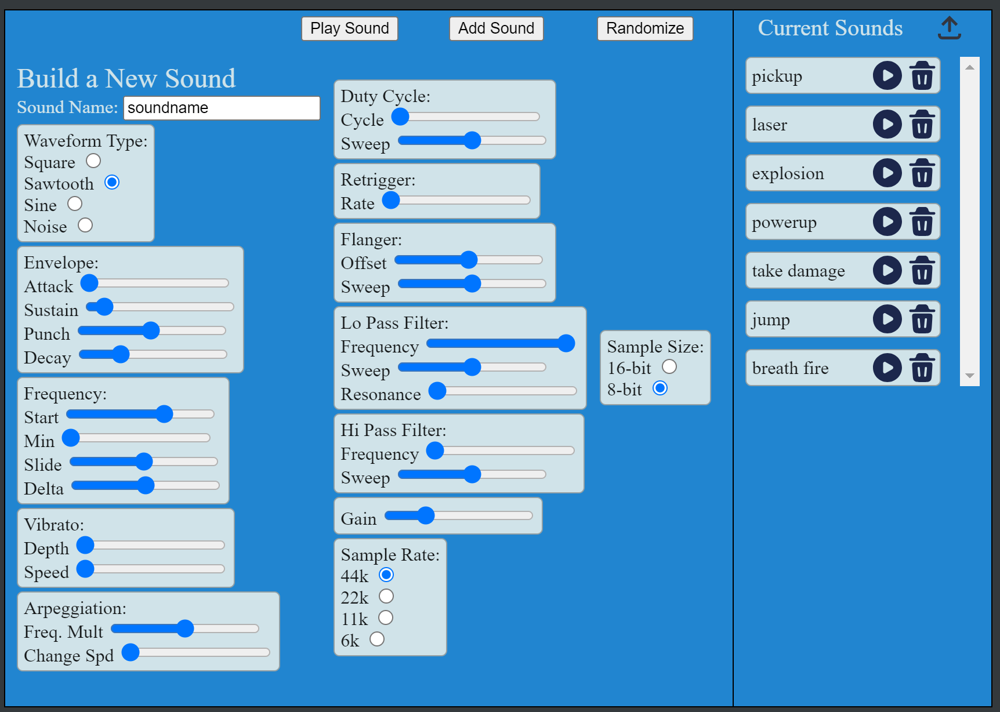
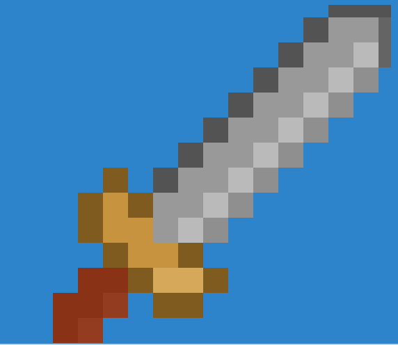
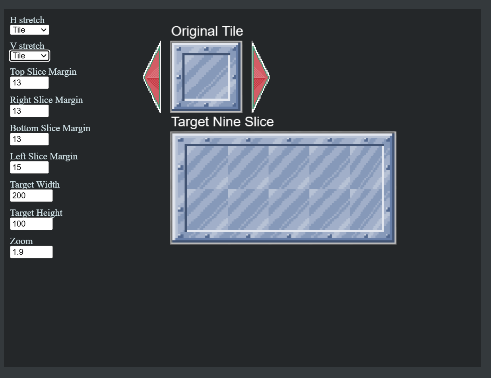
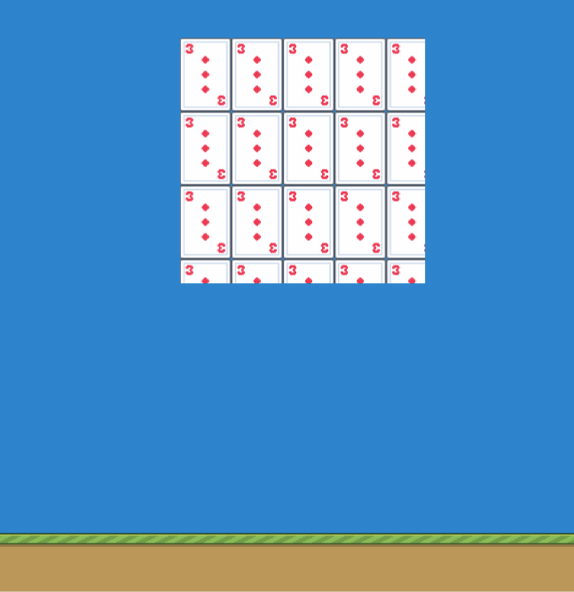
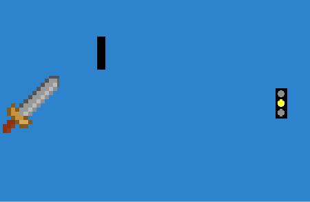
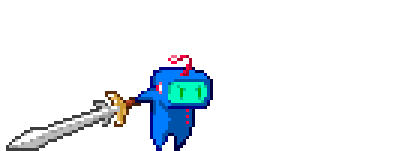

Today we are excited to announce the biggest and best version of Excalibur.js yet! We have a lot of accomplishments to talk about and a lot of thank you's to give!

Install the latest version today! Check out the [full release notes](https://github.com/excaliburjs/Excalibur/releases/tag/v0.30.0)

```sh
npm install excalibur@0.30.1
```


## Project Health

At a high level:
* Big thanks to our [Sponsors](https://excaliburjs.com/donate) and [Patrons](https://www.patreon.com/join/erikonarheim)
* 1.8k [Stars on Github](https://github.com/excaliburjs/Excalibur/stargazers)! Give us a Star!
* 15k average monthly page views of [excaliburjs.com](https://excaliburjs.com) 
* Record number of OSS contributors to the project for this release
   * Code
   * Documentation
   * Issues & Discussions
   * Discord discussions
* Huge community growth in the [discord](https://discord.gg/W6zUd4tTY3)
* 2 New Core Contributors
  * [Matt Jennings](https://mattjennin.gs/)
  * [Justin Young](https://mookie4242.itch.io/)
* Join the [Excalibur.js Newsletter](https://news.excaliburjs.com/)
* Subscribe to the [Excalibur.js YouTube channel](https://www.youtube.com/@excaliburjstv) for upcoming videos

Also we did our first in person event @ 2D Con in Bloomington, Minnesota! We'll be at VGM Con this spring!




## New "Excalibird" Tutorial

With this release we've added [a brand new tutorial](https://excaliburjs.com/docs/excalibird-flappy-bird) inspired by Flappy Bird. This was built from the ground up to help you write excalibur games like we write them. This tutorial is geared at building a sustainable project structure that can grow as your game design does. Check out the full [source code](https://github.com/excaliburjs/sample-excalibird/) and [play it now](https://excaliburjs.com/sample-excalibird/). Big thanks to discord user `.rodgort` for all the helpful feedback.

<iframe width="600" height="800" src="https://excaliburjs.com/sample-excalibird/"></iframe>

## New Quick Start

Did you know we have an [Excalibur CLI](https://github.com/excaliburjs/create-excalibur) to help you bootstrap games quickly? Check out our new [quick start guide](https://excaliburjs.com/docs/quick-start) to get up to speed in record time with your new project in your preferred frontend tech (including vanilla.js).

```sh
npx create-excalibur@latest
```

We've updated all the [Excalibur.js templates](https://github.com/excaliburjs/?q=template-&type=all&language=&sort=#org-profile-repositories) that power this CLI to the latest and greatest!

Did you know that community member [Manu Hernandez](https://github.com/mahbarahona) built this? Send him a thanks on the [Discord](https://discord.gg/W6zUd4tTY3)!

## Quality of Life

### Browser Extension
New [Excalibur.js Dev Tools Extension](https://github.com/excaliburjs/excalibur-extension/) is available in BOTH [Firefox](https://addons.mozilla.org/en-US/firefox/addon/excalibur-dev-tools/) and [Chrome](https://chromewebstore.google.com/detail/excalibur-dev-tools/dinddaeielhddflijbbcmpefamfffekc)


If you are looking to contribute, we have a [big wish list of features](https://github.com/excaliburjs/excalibur-extension/?tab=readme-ov-file#features-that-we-want) for the extension

### Development Excalibur Builds

We are publishing new `excalibur.development.js` builds that have increased debug output to catch common issues while in development. For example if you forget to add an Actor to a scene (a common thing that I run into)!

```typescript
const orphan = new ex.Actor({
    name: 'orphaned'
});

// OOOPS! I forgot to add orphan Actor to a Scene
```



When `NODE_ENV=production` these extra warnings are removed for you prod build!

This big quality of life feature was added by [Matt Jennings](https://mattjennin.gs/)!

### Static Debug Draw API

You can now use the ex.Debug.* API to do debug drawing without needing to know about a graphics context. These draws are only visible when the engine is in debug mode `ex.Engine.isDebug`.

This is great for check your points, rays, lines, etc. are where you expect them to be!

Another great feature idea from [Matt Jennings](https://mattjennin.gs/).

```typescript
onPreUpdate(engine: ex.Engine, elapsedMs: number): void {
    this.vel = ex.Vector.Zero;

    this.graphics.use('down-idle');
    if (engine.input.keyboard.isHeld(ex.Keys.ArrowRight)) { ... }
    if (engine.input.keyboard.isHeld(ex.Keys.ArrowLeft)) { ... }
    if (engine.input.keyboard.isHeld(ex.Keys.ArrowUp)) { ... }
    if (engine.input.keyboard.isHeld(ex.Keys.ArrowDown)) { ... }

    ex.Debug.drawRay(new ex.Ray(this.pos, this.vel), { distance: 100, color: ex.Color.Red });
}
```


## New Samples

### Tiny Tactics

High fidelity example of a tactics game, with multiple levels, AI, and pathfinding!

https://github.com/excaliburjs/sample-tactics


### Jelly Jumper

High fidelity sample of a platforming game with jump physics inspired by Super Mario World!

https://github.com/excaliburjs/sample-jelly-jumper


### Excalibird

This is a sample clone of the popular mobile game flappy bird.

https://github.com/excaliburjs/sample-excalibird/


### Path finding

Sample using the pathfinding plugin with A* and Dijkstra!

https://github.com/excaliburjs/sample-pathfinding


### UI With HTML/CSS/JS 

Example of how to build vanilla html/css/js UIs with Excalibur code. The main gist is to put an HTML layer above the canvas layer and use that for UI.

https://github.com/excaliburjs/sample-html


### JSFXR

This is a quick demo project that uses the Excalibur-JSFXR Plugin to Create, Store, and Play generated sound effects!

https://github.com/excaliburjs/sample-jsfxr



## New Templates

Check out our new [Tauri v2](https://github.com/excaliburjs/template-tauri-v2) and [Capacitor.js](https://github.com/excaliburjs/template-capacitorjs) templates for building Mobile and Desktop games!

Tauri comes with a nifty Rust backend, so if that's your jam, this might be the thing to use to go to all the app stores. 

Capacitor.js is the spiritual successor of Cordova and provides a number of cross platform plugins to build for iOS and Android apps at the same time. 

## Performance, Performance, Performance

This release really had a strong focus on improving performance across the board in Excalibur. Community member [Autsider](https://github.com/autsider666) was a BIG BIG help in this area.

* New Image Renderer that has 2x performance of draws
* New "Sparse Hash Grid" Collision Spatial Data Structure that improves collision performance
* Code optimizations to remove allocations in the hot loop where possible
  * Reduces javascript GC pauses
  * Improves general speed of the engine
* ECS optimizations the speed up Entity queries

We also have a new [Excalibur Bunnymark](https://github.com/excaliburjs/excalibur-bunnymark) that stresses the renderer, I can get to 100k at 30fps on my Surface Pro Laptop! 


## New Features

This release is JAM PACKED full of new cool stuff, and a lot of it was directly designed by community discussions on the [discord](https://discord.gg/W6zUd4tTY3)!

Check out the [full release notes](https://github.com/excaliburjs/Excalibur/releases/tag/v0.30.0) for all the changes

### ImageSource from SVG and Canvas

You can now source images from SVG literal strings, SVG files, and HTML Canvas elements! This increases the flexibility of images that you can use to make your games. Plus SVG and Canvas rock 🤘

```typescript
const svgExternal = new ex.ImageSource('../images/arrows.svg');
const svg = (tags: TemplateStringsArray) => tags[0];

const svgImage = ex.ImageSource.fromSvgString(svg`
  <svg version="1.1"
       id="svg2"
       xmlns:sodipodi="http://sodipodi.sourceforge.net/DTD/sodipodi-0.dtd"
       xmlns:inkscape="http://www.inkscape.org/namespaces/inkscape"
       sodipodi:docname="resize-full.svg" inkscape:version="0.48.4 r9939"
       xmlns="http://www.w3.org/2000/svg" 
       width="800px" height="800px"
       viewBox="0 0 1200 1200" enable-background="new 0 0 1200 1200" xml:space="preserve">
  <path id="path18934" fill="#000000ff" inkscape:connector-curvature="0"  d="M670.312,0l177.246,177.295L606.348,418.506l175.146,175.146
      l241.211-241.211L1200,529.688V0H670.312z M418.506,606.348L177.295,847.559L0,670.312V1200h529.688l-177.246-177.295
      l241.211-241.211L418.506,606.348z"/>
  </svg>
`);

const myCanvas = document.createElement('canvas')!;
myCanvas.width = 100;
myCanvas.height = 100;
const ctx = myCanvas.getContext('2d')!;
ctx.fillStyle = ex.Color.Black.toRGBA();
ctx.fillRect(20, 20, 50, 50);

const canvasImage = ex.ImageSource.fromHtmlCanvasElement(myCanvas);
```

### GPU Particles

GPU particles give you the power to emit very large amounts of particles for low overhead. They have the same API as CPU particles.

```typescript
var particles = new ex.GpuParticleEmitter({
  pos: ex.vec(100, 0),
  z: 1,
  emitterType: ex.EmitterType.Circle,
  maxParticles: 100_000,
  particle: {
    acc: ex.vec(0, 200),
    minSpeed: 1,
    maxSpeed: 5,
    opacity: 0.7,
    life: 7000,
    maxSize: 5,
    minSize: 5,
    startSize: 15,
    endSize: 1,
    beginColor: ex.Color.White,
    endColor: ex.Color.Transparent
  },
  radius: 600,
  emitRate: 1000,
  isEmitting: true
});
```


### Slide Scene Transition

New `ex.Slide` scene transition, which can slide a screen shot of the current screen: `up`, `down`, `left`, or `right`. Optionally you can add an `ex.EasingFunction`, by default `ex.EasingFunctions.Linear`. Think the Legend of Zelda dungeon room transition
  ```typescript
  game.goToScene('otherScene', {
    destinationIn: new ex.Slide({
      duration: 1000,
      easingFunction: ex.EasingFunctions.EaseInOutCubic,
      slideDirection: 'up'
    })
  });
  ```


### Bezier Curves & Actor.actions.curveTo/curveBy Actions

We have Bezier!!!! Long time requested and desired, we can now use bezier curves and the new curveTo and curveBy actions to move actors around.

```typescript
const start1 = ex.vec(500, 500);
const dest = ex.vec(500, 100);
const cp1 = ex.vec(100, 300);
const cp2 = ex.vec(150, 800);

// Curve object for sampling points
const curve = new ex.BezierCurve({
  controlPoints: [start1, cp1, cp2, dest],
  quality: 10
});

var points: ex.Vector[] = [];
const drawCurve = () => {
  points.length = 0;
  for (let i = 0; i < 100; i++) {
    points.push(curve.getPoint(i / 100));
  }
};
drawCurve();

// Use the curve action to move along a curve
actor.actions.repeatForever((ctx) => {
  ctx.curveTo({
    controlPoints: [cp1, cp2, dest],
    duration: 5000,
    mode: 'uniform'
  });
  ctx.curveTo({
    controlPoints: [cp2, cp1, start1],
    duration: 5000,
    mode: 'uniform'
  });
});

```


### Flash Action

We now have a convenient flash action that can be used to flash a color on your actor's graphics. This is super useful for things that take damage, or if you need to indicate something to the player.

```typescript
actor.actions.flash(ex.Color.White, 1000)
```



### Nine-Slice Sprites

The new`ex.NineSlice` `Graphic` can be for creating arbitrarily resizable rectangular regions, useful for creating UI, backgrounds, and other resizable elements.

  ```typescript
  var nineSlice = new ex.NineSlice({
    width: 300,
    height: 100,
    source: inputTile,
    sourceConfig: {
      width: 64,
      height: 64,
      topMargin: 5,
      leftMargin: 7,
      bottomMargin: 5,
      rightMargin: 7
    },
    destinationConfig: {
      drawCenter: true,
      horizontalStretch: ex.NineSliceStretch.Stretch,
      verticalStretch: ex.NineSliceStretch.Stretch
    }
  });

  actor.graphics.add(nineSlice);
  ```

Check out the [demo](https://mookie4242.itch.io/excalibur-9-slice-demo)



### Tiling Sprites & Animations

Brand new convenience types `ex.TiledSprite` and `ex.TiledAnimation` for Tiling Sprites and Animations
  ```typescript
  const tiledGroundSprite = new ex.TiledSprite({
    image: groundImage,
    width: game.screen.width,
    height: 200,
    wrapping: {
      x: ex.ImageWrapping.Repeat,
      y: ex.ImageWrapping.Clamp
    }
  });

  const tilingAnimation = new ex.TiledAnimation({
    animation: cardAnimation,
    sourceView: {x: 20, y: 20},
    width: 200,
    height: 200,
    wrapping: ex.ImageWrapping.Repeat
  });
  ```



### Full GIF Image Spec Support

We now support the majority of the gif spec and can parse gif files as resources!

```typescript
var gif: ex.Gif = new ex.Gif('./loading-screen.gif');
var gif2: ex.Gif = new ex.Gif('./sword.gif');
var gif3: ex.Gif = new ex.Gif('./stoplight.gif');
var loader = new ex.Loader([gif, gif2, gif3]);
game.start(loader).then(() => {
  var stoplight = new ex.Actor({
    x: game.currentScene.camera.x + 120,
    y: game.currentScene.camera.y,
    width: gif3.width,
    height: gif3.height
  });
  stoplight.graphics.add(gif3.toAnimation());
  game.add(stoplight);

  var sword = new ex.Actor({
    x: game.currentScene.camera.x - 120,
    y: game.currentScene.camera.y,
    width: gif2.width,
    height: gif2.height
  });
  sword.graphics.add(gif2.toAnimation());
  game.add(sword);

  var loading = new ex.Actor({
    x: game.currentScene.camera.x,
    y: game.currentScene.camera.y,
    width: gif2.width,
    height: gif2.height
  });
  loading.graphics.add(gif.toAnimation());
  game.add(loading);
});
```



### GPU Garbage Collection

Excalibur now watches for textures that have not been drawn in 60 seconds and unloads them from the GPU. This is essential for the bigger games with lots of different assets over time.

### Coroutine Improvements

* Nested coroutines
* Awaitable
* Custom schedules
* Stop/start/resume


## Caliburn Games

The Excalibur.js contributors are offering consulting services! You can hire us to do game dev, custom dev, or support! If you're interested check out our current list of products https://caliburn.games/products/

Caliburn Games' goal is to build friendly games in TypeScript and support the Excalibur.js community and open source project.

## The Glorious Future

We are really excited and optimistic about the future of Excalibur.js and we have a lot of cool plans for 2025. We are re-affirming our commitment to being an open source project, we will always be open source and will never change the license from BSD.

### New Ventures

1. Keep an eye out for Excalibur courses @ https://excaliburjs.tv, we are looking to publish a number of free and paid course options.

2. We are building an OPEN SOURCE "Excalibur Studio" visual editor, this is to further our mission to bring game development to as many people as possible. The editor will be a pay what you want model, where $0 is totally acceptable. We don't want income to be a boundary for people to get into making games.

3. Caliburn Games will be publishing games to various platforms so look out for them in 2025! Also reach out if you are interested in hiring us to help with your games!

### Road Excalibur v1

Our plan is to have a release candidate for v1 in early 2025, the core engine is reaching a point where we are really happy with it. Not much will change in the API from v0.30.0 to v1.0.0.

A lot of folks have asked about WebGPU, we are going to wait on a renderer implementation until the standardization of the API to stabilize and for WebGPU implementations to be on by default in browsers.

Next on the plan:
* More performance!
* Physics enhancements! Ropes! Inverse Kinematics!
* Headless Excalibur on the server
* Input mapping and A11y improvements 
* 2D Lighting support


## THANK YOU

We've been working on Excalibur.js for over a decade and it's been a lot of fun

EXCALIBUR!!!



GIF of Cal courtesy of discord user `hintoflime`