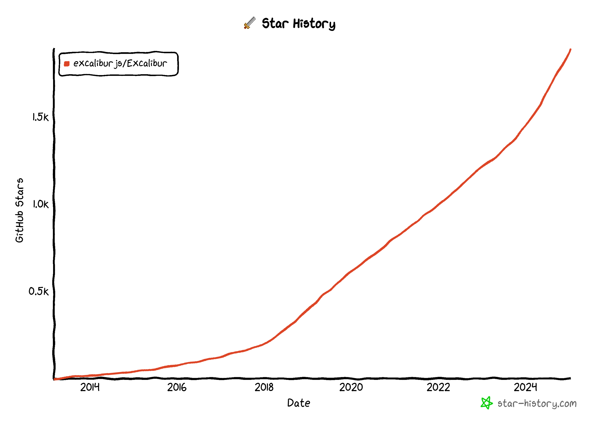
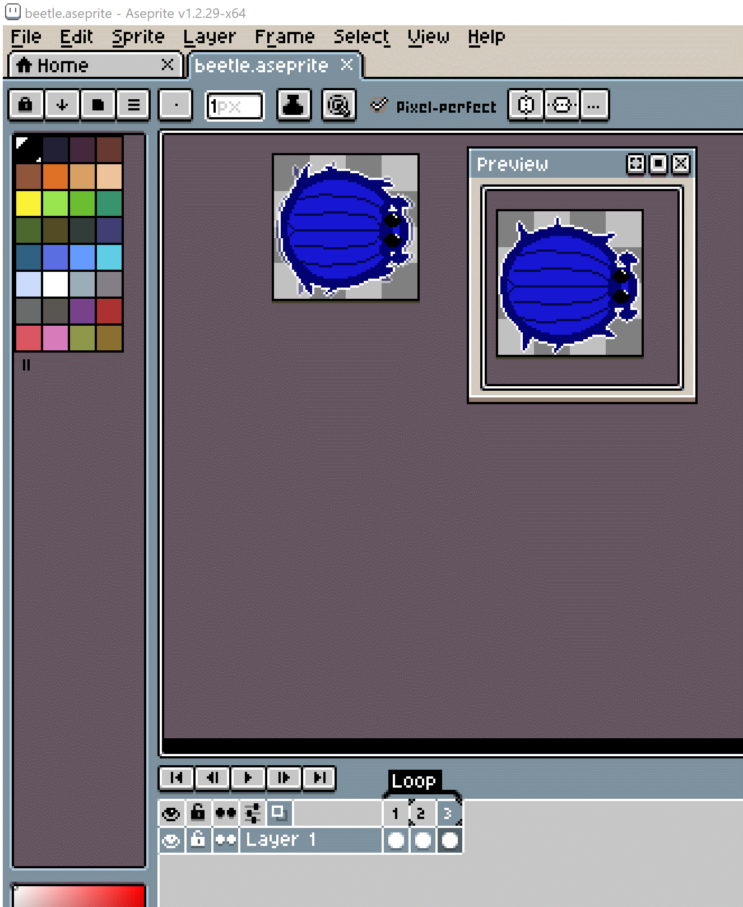

import lightingVideo from './lighting.mp4';
import browserExtensionVideo from './browser-extension.mp4';
import quickStartVideo from './quick-start.mp4';
import idleSurvivors from './idle-survivors.mp4';
import jumpAnimation from './jump.mp4';
import pixelArtTrue from './pixel-art-true.mp4';
import aaTrue from './aa-true.mp4';
import nineSlice from './nine-slice.mp4';
import tilingSprite from './tilingGround.mp4';
import tilingAnimation from './tilingAnimation.mp4';
import './style.css';

# Happy New Year Excalibur!

We've put together a <a href="https://github.com/excaliburjs/sample-fireworks">fireworks demo</a> to commemorate the occasion! 

Tap, click, or keypress to add more fireworks:

<iframe src="https://excaliburjs.com/sample-fireworks" width="600" height="600"></iframe>

In 2024 a lot happened for Excalibur! We had 3 big releases v0.28.x, v0.29.x, and v0.30.x! Join the [newsletter](https://news.excaliburjs.com/) to make sure you don't miss a thing!

2 new core conributers: [Matt Jennings](https://mattjennin.gs/) & [Justin Young](https://mookie4242.itch.io/)

[Thriving discord](https://discord.gg/W6zUd4tTY3) with lots of cool games being built 😍

[![Discord][discord-badge]][discord-url]

[discord-badge]: https://img.shields.io/discord/1195771303215513671?logo=discord&logoColor=white&label=Discord&color=blue
[discord-url]: https://discord.gg/W6zUd4tTY3

RECORD number of outside code contributions to Excalibur! Everyone that's commented, made an issue, discussion, or commited to a repo!


We are at 1.9k stars on github and growing, [give us a star](https://github.com/excaliburjs/Excalibur)!



AND We have [GitHub Sponsors](https://github.com/sponsors/eonarheim) & [Patreons](https://www.patreon.com/join/erikonarheim)! Many thanks!

* 2 x Anonymous
* Ribsom
* PlanetCraft
* AdamE
* Latanya
* Feremabraz
* MRJP-Consulting

## Highlights

### Development Build & EcmaScript Modules

We now ship a excalibur.development.js, which provides additional debug information about issues that you would probably not want to ship to a production game. This provides a better development experience for our devs helping them find bugs faster.

Additionally we ship both an UMD and ESM bundle in Excalibur for modern bunders, the ESM build drastically reduces bundle sizes for folks. 

### Quick Start

A big boost to productivity is the new Excalibur CLI for quickly scaffolding games in your favorite bundler technology or even vanilla JavaScript! This tool pulls all our open source template repos from github.

```sh
npx create-excalibur@latest
```

This tool was built by contributor [Manu Hernandez](https://github.com/mahbarahona), big thanks to him for donating his time and building this great tool!

<video width="600" height="400" controls>
  <source src={quickStartVideo} type="video/mp4"/>
</video>


### Performance

We've really turned the screws on performance in excalibur with v0.30.x being roughly 2-3 times faster than v0.29.x, both in the physics and the graphics! A lot of this was achieved through new data structures, and removing allocations from the hot loop using arena style object pools.

Check out the [Excalibur Bunnymark](https://github.com/excaliburjs/excalibur-bunnymark) for raw draw performance!

<iframe src="https://excaliburjs.com/excalibur-bunnymark/" width="700" height="700"></iframe>

In the physics realm we switched to a new spatial data structure ["SparseHashGrid"](https://github.com/excaliburjs/Excalibur/blob/c96a2e7ffba4a47158aa4b3dfc653e25ed7f388f/src/engine/Collision/Detection/SparseHashGrid.ts#L113) that seems to yield better performance than our ["DynamicAABBTree"](https://github.com/excaliburjs/Excalibur/blob/c96a2e7ffba4a47158aa4b3dfc653e25ed7f388f/src/engine/Collision/Detection/DynamicTree.ts#L46) previously, especially for large numbers of colliders. Autsider666 really helped dig into this collision performance endeavor, check out his [Idle Survivors](https://github.com/Autsider666/idle-survivors-2). We can support many 100s of collisions at once!

<video width="600" height="400" controls>
  <source src={idleSurvivors} type="video/mp4"/>
</video>

### Debugging

We have new debug drawing API you can use anywhere in your game to debug. 

```typescript
ex.Debug.drawRay(ray: Ray, options?: { distance?: number, color?: Color })
ex.Debug.drawBounds(boundingBox: BoundingBox, options?: { color?: Color })
ex.Debug.drawCircle(center: Vector, radius: number, options?: ...)
ex.Debug.drawPolygon(points: Vector[], options?: { color?: Color })
ex.Debug.drawText(text: string, pos: Vector)
ex.Debug.drawLine(start: Vector, end: Vector, options?: LineGraphicsOptions)
ex.Debug.drawLines(points: Vector[], options?: LineGraphicsOptions)
ex.Debug.drawPoint(point: Vector, options?: PointGraphicsOptions)
```

```typescript
onPreUpdate(engine: ex.Engine, elapsedMs: number): void {
    this.vel = ex.Vector.Zero;

    this.graphics.use('down-idle');
    if (engine.input.keyboard.isHeld(ex.Keys.ArrowRight)) { ... }
    if (engine.input.keyboard.isHeld(ex.Keys.ArrowLeft)) { ... }
    if (engine.input.keyboard.isHeld(ex.Keys.ArrowUp)) { ... }
    if (engine.input.keyboard.isHeld(ex.Keys.ArrowDown)) { ... }

    ex.Debug.drawRay(
      new ex.Ray(this.pos, this.vel),
      { distance: 100, color: ex.Color.Red }
    );
}
```


We now have a chrome & firefox extension to help debug your games in the browser. (This is a great place to contribute to open source! We have a [LONG wish list](https://github.com/excaliburjs/excalibur-extension/?tab=readme-ov-file#features-that-we-want) for the plugin)

<video width="600" height="400" controls>
  <source src={browserExtensionVideo} type="video/mp4"/>
</video>

Big thanks to [Adam Due Hansen](https://github.com/Adamduehansen) for adding recent fixes that allow debug settings to be saved across browser refresh!


### ECS (Entity Component System)

Simplified Custom System implementations
* Systems are passed an ECS world as a default constructor
* Systems can use any number of queries

```typescript
import * as ex from 'excalibur';

export class MySystem extends ex.System {
  static priority = ex.SystemPriority.Average;
  public readonly systemType = ex.SystemType.Draw;
  query: Query<typeof ex.TransformComponent | typeof ex.GraphicsComponent>;

  constructor(public world: ex.World) {
    super();
    this.query = this.world.query([ex.TransformComponent, ex.GraphicsComponent]);
  }

  public update(elapsed: number): void {

    // TODO implement system using query(s)
  }

}
```

New Tag Queries

- New simplified way to query entities `ex.World.query([MyComponentA, MyComponentB])`
- New way to query for tags on entities `ex.World.queryTags(['A', 'B'])`

### Coroutines

These are a powerful tool for doing computation over time, and one of the best examples of that is animation. Coroutines are create for complex behavior and animations over time. They read very linearly for doing complex sequences over time compared to another approach where you might set flags and track timing in a class.


You can do lots of cool things in the body of coroutines in excalibur:

```typescript
ex.coroutine(function*() {
  ...
  yield 100; // wait 100ms
  yield; // wait to next frame
  yield Promsie.resolve(); // wait for promise
  yield* ex.coroutine(function* () { ..}); // wait for nested coroutine
});
```


A more concrete example is in Jelly Jumper, [where we use coroutines to handle the complex squash/stretch of player's graphic](https://github.com/excaliburjs/sample-jelly-jumper/blob/dfb05d7b9df6c53e580778af41f5227a4feb8d09/src/actors/player.ts#L598-L638)

<video width="400" height="400" controls>
  <source src={jumpAnimation} type="video/mp4"/>
</video>

```typescript
// apply a stretch animation when jumping
if (this.animation.is('jump') && this.oldVel.y >= 0 && this.vel.y < 0) {
  ex.coroutine(
    this.scene!.engine,
    function* (this: Player): ReturnType<ex.CoroutineGenerator> {
      const duration = 70
      const scaleTo = 1 + 1 * this.FX_SQUISH_AMOUNT
      const easing = ex.EasingFunctions.EaseOutCubic
      const force = this.vel.y

      let elapsed = 0

      // stretch player graphic while jumping
      while (this.vel.y < force * 0.25) {
        elapsed += yield 1

        if (elapsed < duration) {
          this.squishGraphic(
            easing(Math.min(elapsed, duration), 1, scaleTo, duration)
          )
        }
      }

      elapsed = 0

      // un-stretch player graphic while jumping
      while (!this.touching.bottom.size) {
        elapsed += yield 1

        if (elapsed < duration) {
          this.squishGraphic(
            easing(Math.min(elapsed, duration), scaleTo, 1, duration * 2)
          )
        }
      }

      this.squishGraphic(1)
    }.bind(this)
  )
}
```

### Graphics

#### Pixel Art

First class pixel art art support with custom shaders/settings for the nicest looking pixel art you've ever seen. This removes common shimmering/banding artifacts that are visible when using pixel art with nearest neighbor filtering. 

```typescript
const engine = new ex.Engine({
  pixelArt: true,
  ...
});
```
Check out `pixelArt: true`! Smooth as butter AA but still preserving the pixel art!

<video width="600" height="400" controls>
  <source src={pixelArtTrue} type="video/mp4"/>
</video>


Compared with before when using `antialiasing: false`, you may need to go fullscreen but obvious banding and fat pixels are visible. This is a common visual issue when working with pixel art

<video width="600" height="400" controls>
  <source src={aaTrue} type="video/mp4"/>
</video>


The magic is doing subtle subpixel antialiasing along the pixel seams to avoid artifacts by adjusting the UVs and letting bilinear filtering do the hard work for us.

```c
// Inigo Quilez pixel art filter 
// https://jorenjoestar.github.io/post/pixel_art_filtering/
vec2 uv_iq(in vec2 uv, in vec2 texture_size) {
  vec2 pixel = uv * texture_size;

  vec2 seam=floor(pixel+.5);
  vec2 dudv=fwidth(pixel);
  pixel=seam+clamp((pixel-seam)/dudv,-.5,.5);

  return pixel/texture_size;
}
```

#### SVGs as Graphics

Did you know you can use SVG's now as graphics in excalibur?! You can!

You can inline an SVG string if you're really strong in SVG markup, or you want to generate SVG's on the fly!

```typescript

const svgImage = ex.ImageSource.fromSvgString(svg`
  <svg version="1.1"
       id="svg2"
       xmlns:sodipodi="http://sodipodi.sourceforge.net/DTD/sodipodi-0.dtd"
       xmlns:inkscape="http://www.inkscape.org/namespaces/inkscape"
       sodipodi:docname="resize-full.svg" inkscape:version="0.48.4 r9939"
       xmlns="http://www.w3.org/2000/svg" 
       width="800px" height="800px"
       viewBox="0 0 1200 1200" enable-background="new 0 0 1200 1200" xml:space="preserve">
  <path id="path18934" fill="#000000ff" inkscape:connector-curvature="0"  d="M670.312,0l177.246,177.295L606.348,418.506l175.146,175.146
      l241.211-241.211L1200,529.688V0H670.312z M418.506,606.348L177.295,847.559L0,670.312V1200h529.688l-177.246-177.295
      l241.211-241.211L418.506,606.348z"/>
  </svg>
`);
```

Additionally you can load svgs from files

```typescript
const svgExternal = new ex.ImageSource('path/to/my.svg');
```

#### Nine Slice Sprites

Excalibur now supports Nine Slice Sprites! Thanks [Justin](https://github.com/jyoung4242)!

Check out the [demo app](https://mookie4242.itch.io/excalibur-9-slice-demo) to play around with this feature!

Useful for creating bits of UI, or for tiling areas with a boarder!


```typescript
const nineSlice = new ex.NineSlice({
  width: 300,
  height: 100,
  source: inputImageSource,
  sourceConfig: {
    width: 64,
    height: 64,
    topMargin: 5,
    leftMargin: 7,
    bottomMargin: 5,
    rightMargin: 7
  },
  destinationConfig: {
    drawCenter: true,
    horizontalStretch: ex.NineSliceStretch.Stretch,
    verticalStretch: ex.NineSliceStretch.Stretch
  }
});

actor.graphics.add(nineSlice);

```

<video width="400" height="400" controls>
  <source src={nineSlice} type="video/mp4"/>
</video>


#### Tiling Sprites & Animations

We now have convenient and performant tiling support for sprites and animations! You can specify you wrapping mode in x/y. If one of the dimensions exceeds the intrinsic width/height of the original image it can be Clamped (which stretches the last pixel), Repeat (which repeats the pixels from left to right), or RepeatMirror (which repeats the pixels from the last edge like a mirror).

```typescript
const tiledGroundSprite = new ex.TiledSprite({
  image: groundImage,
  width: game.screen.width,
  height: 200,
  wrapping: {
    x: ex.ImageWrapping.Repeat,
    y: ex.ImageWrapping.Clamp
  }
});
```
<video width="400" height="400" controls>
  <source src={tilingSprite} type="video/mp4"/>
</video>

This can also be done with animations!

```typescript
const tilingAnimation = new ex.TiledAnimation({
  animation: cardAnimation,
  sourceView: {x: 20, y: 20},
  width: 200,
  height: 200,
  wrapping: ex.ImageWrapping.Repeat
});
```

<video width="400" height="400" controls>
  <source src={tilingAnimation} type="video/mp4"/>
</video>

#### Bezier Curves

```typescript
player.actions.rotateTo({angleRadians: angle, duration: 1000, rotationType});
player.actions.moveTo({pos: ex.vec(100, 100), duration: 1000});
player.actions.scaleTo({scale: ex.vec(2, 2), duration: 1000});
player.actions.repeatForever(ctx => {
  ctx.curveTo({
    controlPoints: [cp1, cp2, dest],
    duration: 5000,
    mode: 'uniform'
  });
  ctx.curveTo({
    controlPoints: [cp2, cp1, start1],
    duration: 5000,
    mode: 'uniform'
  });
});
```


#### HTML UI with Pixel Conversion

Convert from Excalibur "world" pixles to CSS pixels

```css
.ui-container {
  pointer-events: none;
  position: absolute;
  transform-origin: 0 0;
  transform: scale(
    calc(var(--ex-pixel-ratio)),
    calc(var(--ex-pixel-ratio)));
}
```

#### GPU Particles 

You already saw the fireworks! With GPU particles you can run hundreds of thousands of particles no sweat using instanced rendering with transform feedback under the hood. This means that the entire particle simulation runs on the GPU for maximum speed.

```typescript
export class Firework extends Actor {
    random: Random;
    trail: GpuParticleEmitter;
    explosion: GpuParticleEmitter;
    explosion2: GpuParticleEmitter;
    life: number;
    body: BodyComponent;
    originalPos: Vector;
    inProgress: boolean = false;

    constructor(pos: Vector, life: number, random: Random) {
        super({ name: "Firework" })
        this.random = random;
        this.originalPos = pos.clone();
        this.pos = pos;
        this.acc = vec(0, 800);

        this.body = new BodyComponent();
        this.life = life;

        this.trail = new GpuParticleEmitter({
            isEmitting: false,
            emitRate: 70,
            particle: {
                life: 1000,
                endColor: Color.White,
                beginColor: Color.White,
                minSpeed: 10,
                maxSpeed: 30,
                startSize: 3,
                endSize: 0,
                fade: true,
                acc: vec(0, 50),
            }
        });

        this.explosion = new GpuParticleEmitter({
            isEmitting: false,
            particle: {
                life: 2000,
                fade: true,
                startSize: 5,
                endSize: 2,
                minSpeed: 10,
                maxSpeed: 200,
                acc: vec(0, 100),
                beginColor: this.randomColor(),
                endColor: this.randomColor()
            }
        });
        this.explosion2 = new GpuParticleEmitter({
            isEmitting: false,
            particle: {
                life: 1000,
                fade: true,
                startSize: 5,
                endSize: 2,
                minSpeed: 10,
                maxSpeed: 200,
                acc: vec(0, 100),
                beginColor: this.randomColor(),
                endColor: this.randomColor()
            }
        });

        this.addChild(this.trail);
        this.addChild(this.explosion);
        this.addChild(this.explosion2);
    }

    private _colors = [
        Color.fromHex("#ff0000"),
        Color.fromHex("#0078ff"),
        Color.fromHex("#ffffff"),
        Color.fromHex("#d059c5"),
        Color.fromHex("#dff241"),
        Color.fromHex("#05ff1c"),
        Color.fromHex("#ffdf00"),
        Color.fromHex("#3e00f9"),
        Color.fromHex("#ff5fc0"),
        Color.fromHex("#ff3f3f"),
        Color.fromHex("#f66706"),
    ]

    private randomColor(): Color {
        return this.random.pickOne(this._colors);
    }

    launch() {
        if (this.inProgress) return;
        this.inProgress = true;
        this.pos = this.originalPos;

        coroutine(this.scene!.engine, (function*(this: Firework) {
            this.vel = vec(this.random.floating(-200, 200), this.random.floating(-800, -1000));
            this.trail.isEmitting = true;
            let hasExploded = false;
            let life = this.life;
            while (life > 0) {
                const elapsed = yield;
                life -= elapsed;
                if (this.vel.y >= 0 && !hasExploded) {
                    hasExploded = true;
                    this.trail.isEmitting = false;
                    this.explosion.emitParticles(500);
                    this.explosion2.emitParticles(500);
                }
            }
            this.trail.clearParticles();
            this.explosion.clearParticles();
            this.explosion2.clearParticles();
            this.inProgress = false;
        } as CoroutineGenerator).bind(this))
    }
}
```

### Materials

Use custom shader code to do neat effects in excalibur, like doing <a href="https://excaliburjs.com/sample-material/src/star/index.html">Star Marbles</a>.

<aside>Click to add marbles!</aside>

<iframe src="https://excaliburjs.com/sample-material/src/star/index.html" width="600" height="600"></iframe>


You can use the screen texture to do cool things like <a href="https://excaliburjs.com/sample-material/src/water/index.html">reflections in the water.</a>

<aside>Move the mouse to see the sword reflect in the water!</aside>

<iframe src="https://excaliburjs.com/sample-material/src/water/index.html" width="600" height="600"></iframe>

### Scene Transitions

We have a new API for transitioning between scenes! 

My favorite is the Slide animation, which is like the Zelda dungeon room transition 

TODO zelda transition

### Scene Ergonomics

You can now define scenes up front and get strong typing in addition to `addScene(...)` 

```typescript
const game = new ex.Engine({
  scenes: {
    scene1: {
      scene: scene1,
      transitions: {
        out: new ex.FadeInOut({duration: 1000, direction: 'out', color: ex.Color.Black}),
        in: new ex.FadeInOut({duration: 1000, direction: 'in'})
      }
    },
    scene2: {
      scene: scene2,
      loader: ex.DefaultLoader, // Constructor only option!
      transitions: {
        out: new ex.FadeInOut({duration: 1000, direction: 'out'}),
        in: new ex.FadeInOut({duration: 1000, direction: 'in', color: ex.Color.Black })
      }
    },
  scene3: ex.Scene // Constructor only option!
  } 
})

// Specify the boot loader & first scene transition from loader
game.start('scene1',
{
  inTransition: new ex.FadeInOut({duration: 500, direction: 'in', color: ex.Color.ExcaliburBlue})
  loader: boot,
});
```

### Tile Map Plugins

Tiled plugin was completely rewritten and is SO MUCH better, we support nearly every feature of Tiled now!

New LDtk Plugin

New Spritefusion Plugin

### Aseprite Plugin

Native `.aseprite` support iterate on your assets whild you build your game.

```typescript
import { AsepriteResource } from "@excaliburjs/plugin-aseprite";

const game = new Engine({
    width: 600,
    height: 400,
    displayMode: DisplayMode.FitScreen
});

// Native
const asepriteSpriteSheet = new AsepriteResource('./beetle.aseprite');
// Or JSON export
// const asepriteSpriteSheet = new AsepriteResource('./beetle.json');

const loader = new Loader([asepriteSpriteSheet]);
game.start(loader).then(() => {

    const anim = asepriteSpriteSheet.getAnimation('Loop');
    const actor = new Actor({pos: vec(100, 100)});
    actor.graphics.use(anim);
    
    game.currentScene.add(actor);
});
```



If you're curious about how this was built, we live streamed the process!

<iframe width="560" height="315" src="https://www.youtube.com/embed/r2HJubu_gYM?si=Wj2iYHGCQoS_aRFo" title="YouTube video player" frameborder="0" allow="accelerometer; autoplay; clipboard-write; encrypted-media; gyroscope; picture-in-picture; web-share" referrerpolicy="strict-origin-when-cross-origin" allowfullscreen></iframe>

### Path finding Plugin

Justin put together an official [path finding plugin](https://github.com/excaliburjs/excalibur-pathfinding) that supports both Djikstra & A*! 

You can see the plugin in action in this [sample](https://github.com/excaliburjs/sample-pathfinding), click to move the little guy around.
<iframe src="https://excaliburjs.com/sample-pathfinding/" width="600" height="600"></iframe>


### JSFXR Plugin

TODO 

### New Tutorial

We have a [new tutorial](https://excaliburjs.com/docs/excalibird-flappy-bird)! It's a new flappy bird clone called "Excalibird".

<iframe src="https://excaliburjs.com/sample-excalibird/" width="600" height="800"></iframe>

### New High Fidelity Samples

* [Jelly Jumper by Matt Jennings](https://excaliburjs.com/sample-jelly-jumper/) and the [source code](https://excaliburjs.com/sample-jelly-jumper/)
* [Sum Monsters](https://excaliburjs.com/sum-monsters/) and the [source code](https://github.com/excaliburjs/sum-monsters/)
* [Tiny Tactics](https://excaliburjs.com/sample-tactics/) and the [source code](https://github.com/excaliburjs/sample-tactics/)
* [Excalibird](https://excaliburjs.com/sample-excalibird/) and the [source code](https://github.com/excaliburjs/sample-excalibird/)

## Accomplishments & Cool Stuff

You might notice a pattern here but Justin (aka Mookie) has been an MVP this year

[Goal Oriented Action Planning](https://excaliburjs.com/blog/goal-oriented-action-planning) by Justin Young

[Wave Function Collapse](https://excaliburjs.com/blog/Wave%20Function%20Collapse) by Justin Yound

[Dev.to Web Game Challenge](https://dev.to/devteam/congrats-to-the-winners-of-our-first-web-game-challenge-32co) Winner Justin Young

Games people are making in Excalibur

* Tetris by morecox
  * https://discord.com/channels/1195771303215513671/1195779663386136706/1290769876214087681
* Roll Masters by stinkfire
  * https://discord.com/channels/1195771303215513671/1195779663386136706/1330778106453037096
* Orbit Connect by Mookie
  * https://discord.com/channels/1195771303215513671/1195777821520437248/1196455435557949470
* Untitled project by Cjadwick
  * https://discord.com/channels/1195771303215513671/1195777821520437248/1198760682976444647
* Excali-farm by Manuhb
  * https://discord.com/channels/1195771303215513671/1195777821520437248/1199910531465744507

* Platformer project by Drew Conley
  * https://discord.com/channels/1195771303215513671/1195777821520437248/1204979529802715176
  * https://discord.com/channels/1195771303215513671/1195777821520437248/1196668055514775592
* Era of the Artificer by Mortallife
  * https://discord.com/channels/1195771303215513671/1195777821520437248/1213987270038913136
* Viginti by Peezy
  * https://discord.com/channels/1195771303215513671/1195777821520437248/1214989038923288636
* RTS Game by SamplePack
  * https://discord.com/channels/1195771303215513671/1195777821520437248/1226423851286659083
* by BusterCode

 * https://discord.com/channels/1195771303215513671/1195777821520437248/1229878337262846022
* Zelda PvP by Drew Conley
 * https://www.youtube.com/watch?v=ru1uo9k4v0s
* Excalibur UI by matt
 * https://discord.com/channels/1195771303215513671/1195777821520437248/1243659280645881949
* Untitle project by muhajirdev
 * https://discord.com/channels/1195771303215513671/1195777821520437248/1246321026376400917
* Postprocessor palette swap
 * https://discord.com/channels/1195771303215513671/1195777821520437248/1251559281120120843
* Slopes by matt
  * https://discord.com/channels/1195771303215513671/1195777821520437248/1251970337684324382
* Systemless components by matt
  * https://mattjennin.gs/blog/systemless-components-with-excalibur-js
  * https://mattjennin.gs/blog/systemless-components-with-excalibur-js
* Rope Constraints by matt
  * https://discord.com/channels/1195771303215513671/1195777821520437248/1263266110158016512
* Shadow Casting by Autsider
  * https://discord.com/channels/1195771303215513671/1195777821520437248/1265414927192166411
* Dungeon Crawler by Noiz
  * https://discord.com/channels/1195771303215513671/1195779663386136706/1291765055553011785
  * https://discord.com/channels/1195771303215513671/1195777821520437248/1266486278237720689
* Untitled game by Doc
  * https://discord.com/channels/1195771303215513671/1195777821520437248/1267500015560163328
* PixelWar by JeanOmeg
  * Works on mobile
  * https://discord.com/channels/1195771303215513671/1195779663386136706/1297216104778956862
  * https://discord.com/channels/1195771303215513671/1195777821520437248/1269740779006460014
* The Prophets of the Triumvirate by mosesintech
  * https://discord.com/channels/1195771303215513671/1195777821520437248/1293383436354060300
  * https://discord.com/channels/1195771303215513671/1195777821520437248/1294689555676532756
  * https://discord.com/channels/1195771303215513671/1195777821520437248/1301040818554929153
* Smashbros inspired Character Select by hintoflime
  * https://discord.com/channels/1195771303215513671/1195777821520437248/1301347167172296767
* Crossroads by lildoobie 
  * https://discord.com/channels/1195771303215513671/1195777821520437248/1301613732467703918
* Run and Gun Project by Mookie (Justin) 
  * https://discord.com/channels/1195771303215513671/1195777821520437248/1302861896269168680
* Untitled project by Rick
  * https://discord.com/channels/1195771303215513671/1195777821520437248/1306645059189342229
* Platformer Project by Shane
  * https://discord.com/channels/1195771303215513671/1195777821520437248/1308272070483771454
* Tactics Project by RokS
  * https://discord.com/channels/1195771303215513671/1195777821520437248/1309022287067877496
* Zombie Brawl by Shaheim (CaptainCodey)
  * https://discord.com/channels/1195771303215513671/1195777821520437248/1279545838330445949
  * https://discord.com/channels/1195771303215513671/1195777821520437248/1290038430952325212
  * https://discord.com/channels/1195771303215513671/1195777821520437248/1304939526556352603
  * https://discord.com/channels/1195771303215513671/1195777821520437248/1313989865863647255
* Retroski by Maaaat
  * https://discord.com/channels/1195771303215513671/1195777821520437248/1314311431516328031
* Excalibur + Quasar + Vue by ArcaneCat
  * https://discord.com/channels/1195771303215513671/1195777821520437248/1314551741693300747
* Coloroids by Adamduehansen
  * https://discord.com/channels/1195771303215513671/1195777821520437248/1314602376287617124
* Daria (not ex but VERY COOL)
* Game-ified Task Manager by Brennan(CreaDev Labs)
  * https://discord.com/channels/1195771303215513671/1195777821520437248/1316815456459423754
* Burger Buddies by Peezy
  * https://discord.com/channels/1195771303215513671/1195777821520437248/1319211859219578942
* Claw Game by discord Italo Capasso
  * https://discord.com/channels/1195771303215513671/1195777821520437248/1319444144808132660
* Awesome Excalibur.js by discord user Rhaegal(LK)
  * https://discord.com/channels/1195771303215513671/1195777821520437248/1321748323023061003
* Idle Survivors
* Catalog Chronicles by discord user mosesintech 
  * https://discord.com/channels/1195771303215513671/1195777821520437248/1313305401990713376
  * https://discord.com/channels/1195771303215513671/1195777821520437248/1323839869331439698 
  * https://discord.com/channels/1195771303215513671/1195777821520437248/1324596232362135592
* Discord User Dark Shines Input Mapping Library
* R.O.K.E. 0.1 from discord user icarito
* TOI impact with Swept AABB in Excalibur by discord user hintoflime
  * https://discord.com/channels/1195771303215513671/1195777821520437248/1324087861951074426 


## Caliburn Games

The core contributors around Excalibur have started a business! We are modeling ourselves off of w4games, providing support, project development, and console porting services. Excalibur.js and Excalibur Studio will always be open source.

Visit <a href="https://caliburn.games">caliburn.games</a> today and start working with us.

### Excaliburjs.TV

We are planning on releasing a number of free and paid courses through Caliburn Games.

## Near Future

### Sound Manager

* Organize sounds into different "tracks" that can be mixed and muted independently. For example sound effects and background music.

### Collision and Physics

* Continuous Collision Improvements
* 

### Lighting 

The future versions of Excalibur will have lighting features to really enhance your games.

<video width="600" height="400" controls>
  <source src={lightingVideo} type="video/mp4"/>
</video>


### More HTML UI Integration

Discord user Cjadwick is working on some 

Input Mapping Plugin

Excalibur Studio

TODO Screenshot of studio

The majority of APIs are now stable
