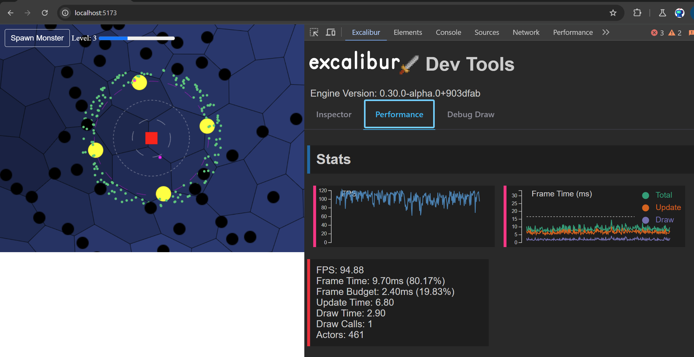

import lightingVideo from './lighting.mp4';
import browserExtensionVideo from './browser-extension.mp4';
import quickStartVideo from './quick-start.mp4';
import './style.css';

# Happy New Year Excalibur!

We've put together a <a href="https://github.com/excaliburjs/sample-fireworks">fireworks demo</a> to commemorate the occasion!

<iframe src="https://excaliburjs.com/sample-fireworks" width="600" height="600"></iframe>


In 2024 a lot happened for Excalibur! We had 3 big releases v0.28.x, v0.29.x, and v0.30.x!

2 new core conributers: [Matt Jennings](https://mattjennin.gs/) & [Justin Young](https://mookie4242.itch.io/)

[Thriving discord](https://discord.gg/W6zUd4tTY3) with lots of cool games being built 😍

[![Discord][discord-badge]][discord-url]

[discord-badge]: https://img.shields.io/discord/1195771303215513671?logo=discord&logoColor=white&label=Discord&color=blue
[discord-url]: https://discord.gg/W6zUd4tTY3

RECORD number of outside code contributions to Excalibur! Everyone that's commented, made an issue, discussion, or commited to a repo!


We are at 1.9k stars on github and growing, [give us a star](https://github.com/excaliburjs/Excalibur)!


AND We have [GitHub Sponsors](https://github.com/sponsors/eonarheim) & [Patreons](https://www.patreon.com/join/erikonarheim)! Many thanks!

* 2 x Anonymous
* Ribsom
* PlanetCraft
* AdamE
* Latanya
* Feremabraz
* MRJP-Consulting

## Highlights

### Development Build & EcmaScript Modules

We now ship a excalibur.development.js, which provides additional debug information about issues that you would probably not want to ship to a production game. This provides a better development experience for our devs helping them find bugs faster.

Additionally we ship both an UMD and ESM bundle in Excalibur for modern bunders, the ESM build drastically reduces bundle sizes for folks. 

### Quick Start

A big boost to productivity is the new Excalibur CLI for quickly scaffolding games in your favorite bundler technology or even vanilla JavaScript! This tool pulls all our open source template repos from github.

```sh
npx create-excalibur@latest
```

This tool was built by contributor [Manu Hernandez](https://github.com/mahbarahona), big thanks to him for donating his time and building this great tool!

<video width="600" height="400" controls>
  <source src={quickStartVideo} type="video/mp4"/>
</video>


### Performance

We've really turned the screws on performance in excalibur with v0.30.x being roughly 2-3 times faster than v0.29.x, both in the physics and the graphics! A lot of this was achieved through new data structures, and removing allocations from the hot loop using arena style object pools.

Check out the [Excalibur Bunnymark](https://github.com/excaliburjs/excalibur-bunnymark) for raw draw performance!

<iframe src="https://excaliburjs.com/excalibur-bunnymark/" width="700" height="700"></iframe>

In the physics realm we switched to a new spatial data structure ["SparseHashGrid"](https://github.com/excaliburjs/Excalibur/blob/c96a2e7ffba4a47158aa4b3dfc653e25ed7f388f/src/engine/Collision/Detection/SparseHashGrid.ts#L113) that seems to yield better performance than our ["DynamicAABBTree"](https://github.com/excaliburjs/Excalibur/blob/c96a2e7ffba4a47158aa4b3dfc653e25ed7f388f/src/engine/Collision/Detection/DynamicTree.ts#L46) previously, especially for large numbers of colliders. Autsider666 really helped dig into this collision performance endeavor, check out his [Idle Survivors](https://github.com/Autsider666/idle-survivors-2). We can support many 100s of collisions at once!



### Debugging

We have new debug drawing API you can use anywhere in your game to debug.

```typescript
onPreUpdate(engine: ex.Engine, elapsedMs: number): void {
    this.vel = ex.Vector.Zero;

    this.graphics.use('down-idle');
    if (engine.input.keyboard.isHeld(ex.Keys.ArrowRight)) { ... }
    if (engine.input.keyboard.isHeld(ex.Keys.ArrowLeft)) { ... }
    if (engine.input.keyboard.isHeld(ex.Keys.ArrowUp)) { ... }
    if (engine.input.keyboard.isHeld(ex.Keys.ArrowDown)) { ... }

    ex.Debug.drawRay(
      new ex.Ray(this.pos, this.vel),
      { distance: 100, color: ex.Color.Red }
    );
}
```


We now have a chrome & firefox extension to help debug your games in the browser

<video width="600" height="400" controls>
  <source src={browserExtensionVideo} type="video/mp4"/>
</video>


### ECS

Simplified Custom System implementations
* Systems are passed an ECS world as a default constructor
* Systems can use any number of queries

New Tag Queries

- New simplified way to query entities `ex.World.query([MyComponentA, MyComponentB])`
- New way to query for tags on entities `ex.World.queryTags(['A', 'B'])`

### Coroutines

These are a powerful tool for doing computation over time, and one of the best examples of that is animation. Coroutines are create for complex behavior and animations over time. They read very linearly for doing complex sequences over time compared to another approach where you might set flags and track timing in a class.


You can do lots of cool things in the body of coroutines in excalibur

```typescript
ex.coroutine(function*() {
  ...
  yield 100; // wait 100ms
  yield; // wait to next frame
  yield Promsie.resolve(); // wait for promise
  yield* ex.coroutine(function* () { ..}); // wait for nested coroutine
});
```


TODO Example of custom squash and stretch animation from Jelly Jumper
TODO Rev Jelly Jumper

### Graphics

#### Pixel Art
First class pixel art art support with custom shaders/settings for the nicest looking pixel art you've ever seen. This removes common shimmering/banding artifacts that are visible when using pixel art with nearest neighbor filtering. 

```typescript
const engine = new ex.Engine({
  pixelArt: true,
  ...
});
```

The magic is doing subtle subpixel antialiasing along the pixel seams to avoid artifacts by adjusting the UVs and letting bilinear filtering do the hard work for us.

```glsl
// Inigo Quilez pixel art filter https://jorenjoestar.github.io/post/pixel_art_filtering/
vec2 uv_iq(in vec2 uv, in vec2 texture_size) {
  vec2 pixel = uv * texture_size;

  vec2 seam=floor(pixel+.5);
  vec2 dudv=fwidth(pixel);
  pixel=seam+clamp((pixel-seam)/dudv,-.5,.5);

  return pixel/texture_size;
}
```

#### Nine Slice Sprites

Useful for creating bits of UI 

<iframe src="https://mookie4242.itch.io/excalibur-9-slice-demo"></iframe>

#### Tiling Sprites & Animations

TODO example of tiling sprite

#### Bezier Curves


#### GPU Particles 

You already saw the fireworks! With GPU particles you can run hundreds of thousands of particles no sweat using instanced rendering with transform feedback under the hood. This means that the entire particle simulation runs on the GPU for maximum speed.


### Materials

Use custom shader code to do neat effects in excalibur, like doing <a href="https://excaliburjs.com/sample-material/src/star/index.html">Star Marbles</a>.

<aside>Click to add marbles!</aside>

<iframe src="https://excaliburjs.com/sample-material/src/star/index.html" width="600" height="600"></iframe>


You can use the screen texture to do cool things like <a href="https://excaliburjs.com/sample-material/src/water/index.html">reflections in the water.</a>

<aside>Move the mouse to see the sword reflect in the water!</aside>

<iframe src="https://excaliburjs.com/sample-material/src/water/index.html" width="600" height="600"></iframe>

### Scene Transitions

We have a new API for transitioning between scenes! 

My favorite is the Slide animation, which is like the Zelda dungeon room transition 

### Tile Map Plugins

Tiled plugin was completely rewritten and is SO MUCH better, we support nearly every feature of Tiled now!

New LDtk Plugin

New Spritefusion Plugin

### Aseprite Plugin

Native `.aseprite` support iterate on your assets whild you build your game.

```typescript
import { AsepriteResource } from "@excaliburjs/plugin-aseprite";

const game = new Engine({
    width: 600,
    height: 400,
    displayMode: DisplayMode.FitScreen
});

// Native
const asepriteSpriteSheet = new AsepriteResource('./beetle.aseprite');
// Or JSON export
// const asepriteSpriteSheet = new AsepriteResource('./beetle.json');

const loader = new Loader([asepriteSpriteSheet]);
game.start(loader).then(() => {

    const anim = asepriteSpriteSheet.getAnimation('Loop');
    const actor = new Actor({pos: vec(100, 100)});
    actor.graphics.use(anim);
    
    game.currentScene.add(actor);
});
```


If you're curious about how this was built, we live streamed the process!

<iframe width="560" height="315" src="https://www.youtube.com/embed/r2HJubu_gYM?si=Wj2iYHGCQoS_aRFo" title="YouTube video player" frameborder="0" allow="accelerometer; autoplay; clipboard-write; encrypted-media; gyroscope; picture-in-picture; web-share" referrerpolicy="strict-origin-when-cross-origin" allowfullscreen></iframe>

### Path finding Plugin

Justin put together an official [path finding plugin](https://github.com/excaliburjs/excalibur-pathfinding) that supports both Djikstra & A*! 

You can see the plugin in action in this [sample](https://github.com/excaliburjs/sample-pathfinding), click to move the little guy around.
<iframe src="https://excaliburjs.com/sample-pathfinding/" width="600" height="600"></iframe>

### New Tutorial

We have a [new tutorial](https://excaliburjs.com/docs/excalibird-flappy-bird)! It's a new flappy bird clone called "Excalibird".

<iframe src="https://excaliburjs.com/sample-excalibird/" width="600" height="800"></iframe>

### New High Fidelity Samples

* Jelly Jumper by Matt Jennings
* Sum Monsters
* Tiny Tactics
* Excalibird

## Accomplishments & Cool Stuff

You might notice a pattern here but Justin (aka Mookie) has been an MVP this year

[Goal Oriented Action Planning](https://excaliburjs.com/blog/goal-oriented-action-planning) by Justin Young

[Wave Function Collapse](https://excaliburjs.com/blog/Wave%20Function%20Collapse) by Justin Yound

[Dev.to Web Game Challenge](https://dev.to/devteam/congrats-to-the-winners-of-our-first-web-game-challenge-32co) Winner Justin Young

Games people are making

* 
* 

## Caliburn Games

The core contributors around Excalibur have started a business! We are modeling ourselves off of w4games, providing support, project development, and console porting services. Excalibur.js and Excalibur Studio will always be open source.

Visit <a href="https://caliburn.games">caliburn.games</a> today and start working with us.

### Excaliburjs.TV


## Near Future

### Lighting 

The future versions of Excalibur will have lighting features to really enhance your games.

<video width="600" height="400" controls>
  <source src={lightingVideo} type="video/mp4"/>
</video>


Input Mapping Plugin

Excalibur Studio

TODO Screenshot of studio

The majority of APIs are now stable
