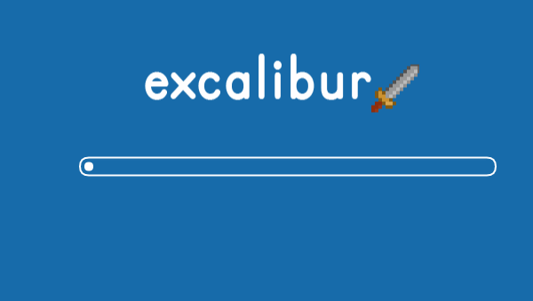

### What is Excalibur?

Excalibur is a **free [open source](https://github.com/excaliburjs/Excalibur) 2D game engine** written in **[TypeScript](https://www.typescriptlang.org/)** for the web written in TypeScript for making 2D games in HTML5 canvas.

Our goal is to make it easier for you to create 2D HTML/JS games, whether you're new to game development or you're an experienced game developer. We take care of all of the boilerplate engine code, cross-platform targeting, and more! Use as much or as little as you need!

### Getting started

Get started by [installing Excalibur](/docs/installation) in your project and [building your first game](/docs/getting-started), then dive in and learn [how to use Excalibur](/docs/engine). You can also check out the [samples](/samples) collection to see the engine in action.

Excalibur uses a theater-style metaphor to organize your games. There are `Actor`'s which can move around and do things in a currently active `Scene`, and all of that lives in the `Engine` container.

It’s free and always will be. We welcome any feedback or contributions! If you make something with Excalibur, please [let us know](https://github.com/excaliburjs/Excalibur/discussions?discussions_q=category%3A%22Show+and+tell%22) so we can feature you in our online gallery.

We are still pre-1.0 but Excalibur has many powerful features built-in already that let you focus on building and designing your games. Please feel free to help [by contributing to the project](https://github.com/excaliburjs/Excalibur/)

