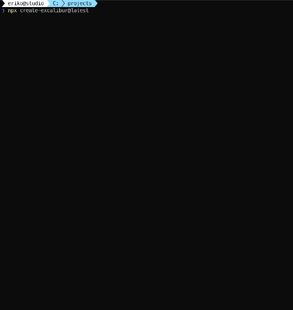
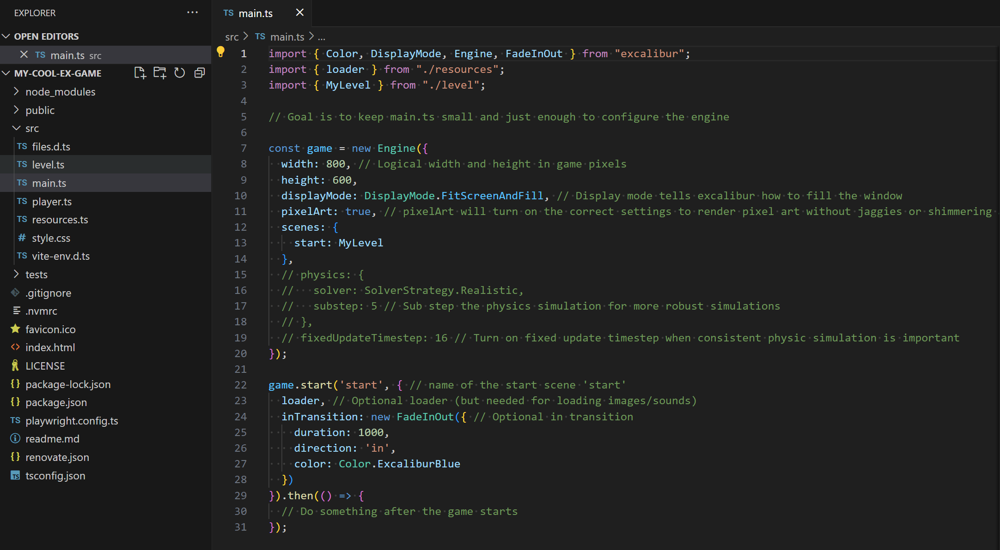
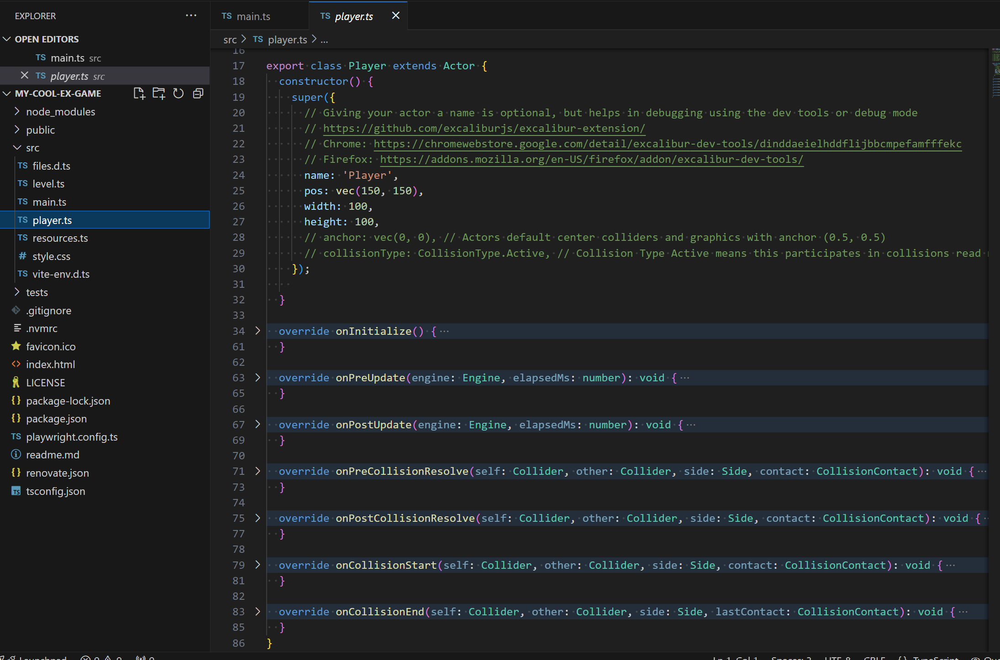
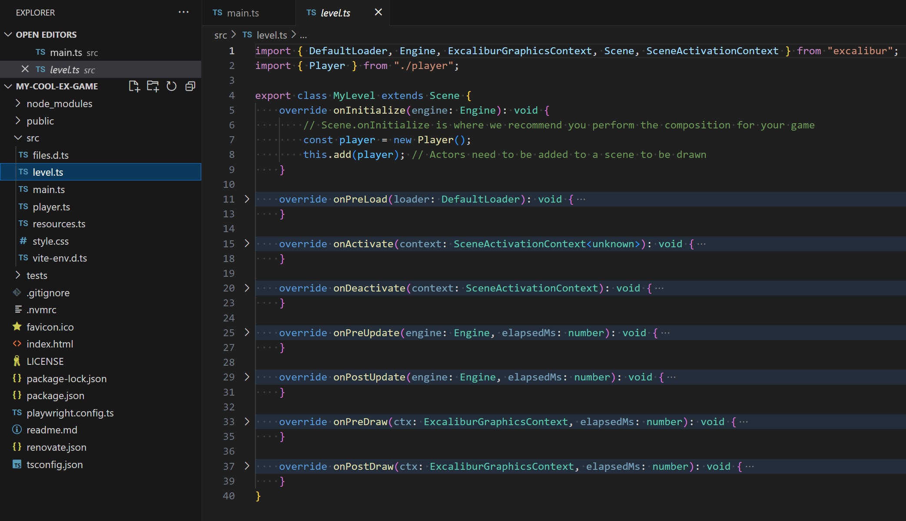

Excalibur uses a theater-style metaphor to organize your games. There are `Actor`'s which can move around and do things in the currently active `Scene`. All of that lives in the `Engine` container.

The fastest way to get an Excalibur project up and running is using the npm CLI tool. All of the included [templates are open source on our github](https://github.com/excaliburjs/?q=template-&type=all&language=&sort=#org-profile-repositories)

```sh
npx create-excalibur@latest
```



## Generated Project

The generated project will come with all the pieces you need to get started with `npm run start`!


### Excalibur Debug Tools

Be sure to check out our [Firefox and Chrome debugger extensions](/docs/debugging) to help make your games!


### Engine

The engine is typically configured in your entrypoint `main.ts` and is the main driver for the game. [Read more!](/docs/engine)



### Actors

Actors (or Entities) are the building blocks of your game, they can draw graphics, collide with each other, respond to events, have scripted behavior with actions, and do many other things! [Read more!](/docs/actors)



### Scenes

Scenes are your tool for composing Actors together into "levels". [Read more!](/docs/scenes)

