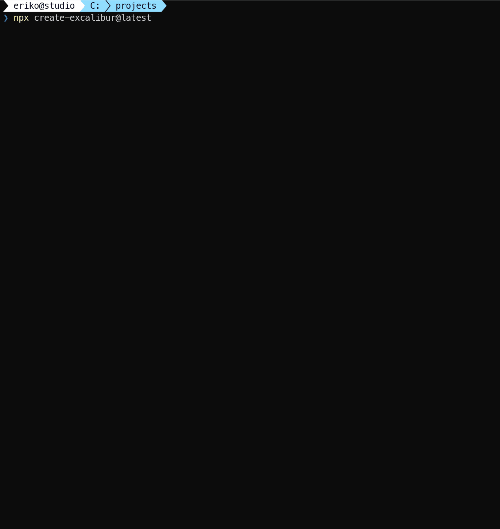
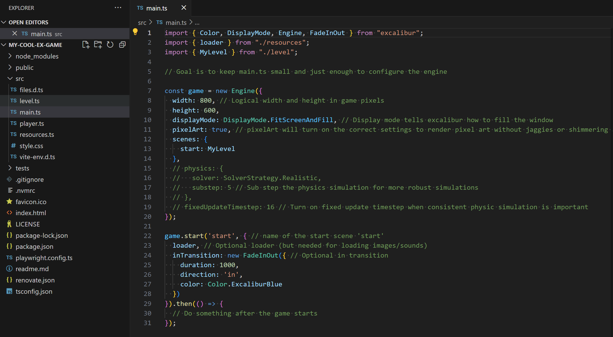
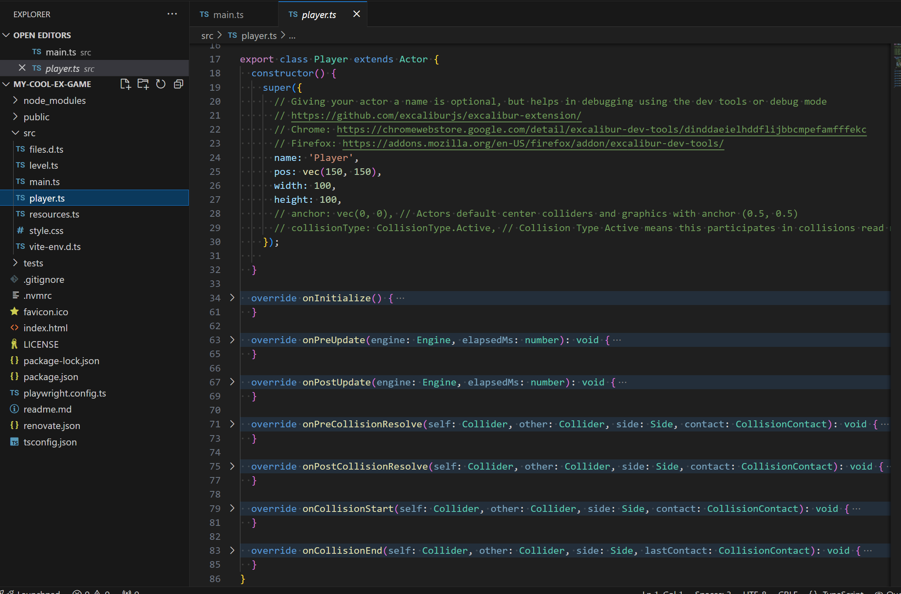
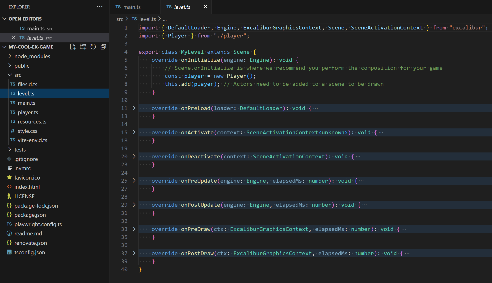

Excalibur uses a theater-style metaphor to organize your game projects. There are 'Actors' which can move around and do things in a 'Scene'. Every `Actor` and `Scene` lives inside the `Engine` container.

## Creating a game project

The fastest way to get an Excalibur project up and running is by using our CLI tool (you'll need to [install npm](https://docs.npmjs.com/downloading-and-installing-node-js-and-npm) first).
```sh
npm init excalibur@latest
```



All of the [quickstart templates](https://github.com/excaliburjs/?q=template-&type=all&language=&sort=#org-profile-repositories) the CLI tool supports are open source and available on GitHub.


## Running the game

The generated project template will come with all the pieces you need to build a game! To run the game in a browser, you can use the following command:

```sh
npm run start
```

You'll see a basic game template in your browser similar to the gif below.


## Game template overview

### Engine

The Engine is the main driver for the game, and is typically configured in the entrypoint `main.ts` file. [Read more about the Engine](/docs/engine).



### Actors

Actors are the primary building blocks of a game. They can draw graphics, collide with each other, respond to events, and more! [Read more about Actors](/docs/actors).



### Scenes

Scenes used to compose Actors together into "levels". [Read more about Scenes](/docs/scenes).



## Debugging tools

We also publish [Firefox and Chrome debugger extensions](/docs/debugging) to make debugging your games easier!

