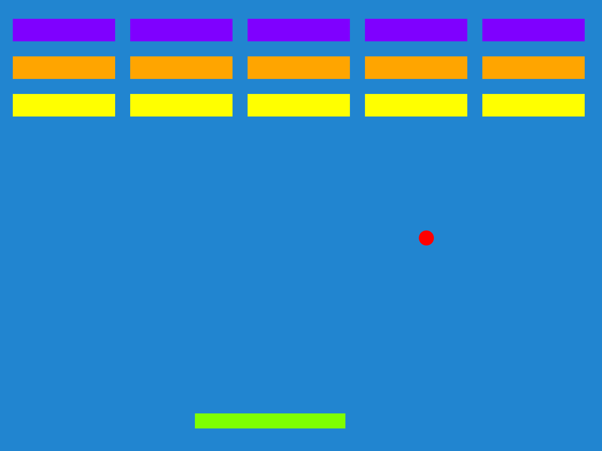

# Hello Excalibur

Review the [Installing Guide](/docs/installation) for instructions.

## Introduction

Excalibur uses a theater-style metaphor to organize your games. There are `Actor`'s which can move around and do things in a currently active `Scene`, and all of that lives in the `Engine` container.

## Global Namespace vs. Imports

### Imports

In this tutorial, we are using "ES Style" imports, but the global `ex.` namespace can also be used if you are using a standalone script tag.

<Note>

See [docs on how to configure bundlers for ES imports](/docs/bundlers) with module loaders and bundlers, there are template repos for [parcel v1](https://github.com/excaliburjs/template-ts-parcel), [parcel v2](https://github.com/excaliburjs/template-ts-parcel-v2), [vite](https://github.com/excaliburjs/template-ts-vite), [webpack](https://github.com/excaliburjs/template-ts-webpack), and [rollup](https://github.com/excaliburjs/template-ts-rollup).

</Note>

```ts
// ES Style Imports
import { Actor } from 'excalibur'

const actor = new Actor()
```

### Script Tag

If you are using a standalone script, the excalibur types will have a `ex.` in front of them.

Excalibur can be used as a script reference, see [standalone script](/docs/installation#script-reference-or-download) for more info

```html
<html>
  <head> </head>
  <body>
    <!-- Include your script at the end of the body tag -->
    <script src="./path/to/my/excalibur-version.js"></script>
    <script src="game.js"></script>
  </body>
</html>
...
```

```ts
// game.js
// Standalone style 'ex' global exists ambiently from an included script.

const actor = new ex.Actor()
```

## Hello Excalibur: Building Breakout!

In this example we'll build a simple version of the popular game breakout. [Breakout](https://en.wikipedia.org/wiki/Breakout_(video_game)) is a game where you break bricks at the top of the screen using a ball that bounces off of a player paddle. You must break all the bricks to win and avoid the ball falling off the bottom of the screen.

The whole code example in this guide is on [GitHub](https://github.com/excaliburjs/sample-breakout) if you want to skip to the code.

<Note>

This example creates the game in a single file for simplicity, we recommend splitting you game into separate files to keep your project more manageable.

</Note>

### Basic Engine Start

Create a script in your project, here I’ve named it `game.ts`. Excalibur games are built off of the [Engine](/docs/engine) container. It is important to start the engine once you are done building your game.

<Note>

It is important to call `game.start()` otherwise the game wont start!

</Note>

```typescript
// ES style import from excalibur
import { Engine } from 'excalibur'
```

`embed:sample-breakout/src/main.ts{snippet: "create-engine"}`

```typescript
// Start the engine to begin the game.
game.start()
```

Open a browser and view the blank blue screen of goodness.

## Creating the paddle with an Actor

Game elements that have a position and are drawn to the screen are called [Actor][docs-actor]. Actors are the primary way to draw things to the screen.

Actors must be added to a [Scene][docs-scene] to be drawn and updated.

Think of actors like you would the actors in a play. If you change scenes different actors might be on stage.

<Note>

Actors must be added to a scene to be drawn or updated! `game.add(actor)` Will add an actor to the current scene.

</Note>

Below we are going to create the paddle Actor for our breakout game. Actors can be given a position, width, and height.

`embed:sample-breakout/src/main.ts{snippet: "create-paddle"}`

Open up your favorite browser and you should see something like this:


That’s neat, but this game is way more fun if things move around. Let’s make the paddle follow the mouse around in the x direction. The paddle will be centered on the mouse cursor.

`embed:sample-breakout/src/main.ts{snippet: "mouse-move"}`

<Note>

**Important!** Actors have a default [anchor][docs-graphics-component-anchor] of (0.5, 0.5) which means their graphics are positioned in their center (not top-left) by default.

</Note>

## Creating the ball with Actors

What’s breakout without the ball? Excalibur comes pre-built with a physics collision system to help you out with things like balls bouncing off of other objects.

To make the ball, we switch the collider to a circle with the `useCircleCollider(radius)` helper.

In this case we want to handle the resolution ourselves to emulate the the way breakout works. We use the `ex.CollisionType.Passive` which will send an event that there has been an intersection but not resolve the positions.

Read more about the different [CollisionTypes](/docs/physics/#collision-types) that excalibur supports.

`embed:sample-breakout/src/main.ts{snippet: "create-ball"}`

The ball is now setup to move at 100 pixels per second down and right. Next we will make the ball bounce with the side of the screen, let’s take advantage of the `postupdate` event.

`embed:sample-breakout/src/main.ts{snippet: "screen-collision"}`

## Creating the bricks with Actors

Breakout needs some bricks to break. To do this we calculate our brick layout and add them to the current scene.

`embed:sample-breakout/src/main.ts{snippet: "create-bricks"}`

When the ball collides with bricks, we want to remove them from the scene. We use the `collisionstart` handler to accomplish this. This handler fires when objects first touch, if you want to know every time resolution is completed use `postcollision`.

`embed:sample-breakout/src/main.ts{snippet: "ball-brick-collision"}`

Finally, if the ball leaves the screen, the player loses!

`embed:sample-breakout/src/main.ts{snippet: "lose-condition"}`



Congratulations! You have just created your first game in Excalibur! You can download this example here https://github.com/excaliburjs/sample-breakout

It's time to [get introduced][docs-intro] to the engine for more examples or advanced users can browse the [API Reference][docs-api].

<CodeSandboxEmbed
  src="https://codesandbox.io/embed/github/excaliburjs/sample-breakout/tree/main/?fontsize=14&hidenavigation=1&theme=dark&view=preview"
  title="excaliburjs/sample-breakout"
/>

[docs-install]: /docs/installation
[docs-intro]: /docs/engine
[docs-actor]: /docs/actors
[docs-scene]: /docs/scenes
[docs-graphics-component-anchor]: /docs/graphics-component/#component-specific-overrides
[docs-api]: /docs/api/edge
