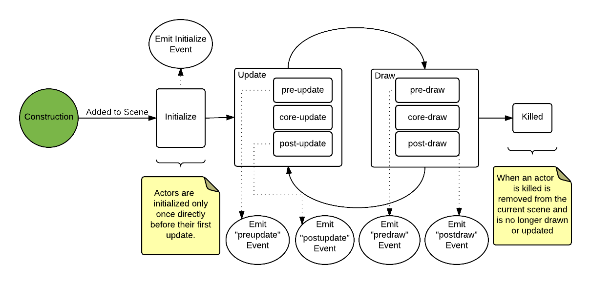
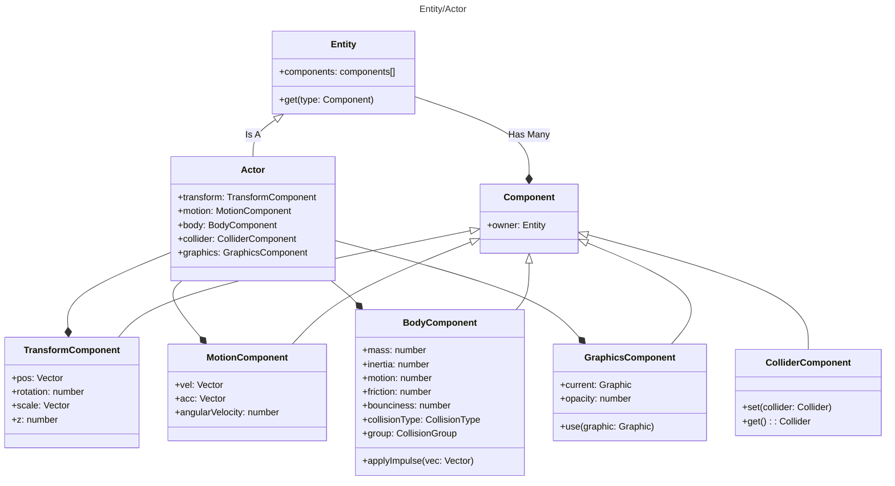

import BasicActorExample from '!!raw-loader!./examples/basic-actors.ts';
import ActorCollisionExample from '!!raw-loader!./examples/collision.ts';

# Actors

[[Actor|Actors]] are prebuilt Excalibur [[Entity|Entities]] that come with the batteries included for most applications.
Such as [[TransformComponent|position]], [[MotionComponent|velocity]], [[GraphicsComponent|graphics]], and [[ColliderComponent|collision detection]].

[[Actor|Actors]] are the recommended way to use Excalibur to show something on the screen.

If you don't want these built-ins and you want to build only what you want, read about entities [here](/docs/entities)

```twoslash include ex
/// <reference path="../src/engine/excalibur.d.ts" />
declare const game: ex.Engine;
```

:::warning

Actors use collision geometry for pointer events meaning they need at least a width/height or custom collider, but can be configured to use graphics bounds for pointer testing.

[[Actor.pointer]] and [[PointerComponent]]

Read more [here](/docs/pointers#actor-pointer-events)

::: 

## Basic actors

For quick and dirty games, you may be able to create an instance of an [[Actor]]
and manipulate it directly.

Actors (and other entities) must be added to a [Scene](/docs/scenes) to be drawn
and updated on-screen.

<PlaygroundEmbed
  title="Basic actors"
  code={BasicActorExample} 
/>

[[Engine.add|game.add]] is a convenience method for adding an actor to the current scene. The equivalent verbose call is [[Scene.add|game.currentScene.add]].

## Custom actors

For "real-world" games, it is common to extend the `Actor` class.
This is optional, and gives you much greater control and encapsulates logic for that
actor.

```ts twoslash
// @include: ex
// ---cut---
class ShootemUpPlayer extends ex.Actor {
  public health: number = 100;
  public ammo: number = 20;

  constructor() {
    super({ x: 10, y: 10 });
  }

  shoot() {
    if (this.ammo < 1) {
      return;
    }

    this.ammo -= 1;
  }
}
```

Custom actors make it easy to hook into the actor lifecycle and encapsulate the actor's state better than a basic actor.


## Child Actors

Actors can be nested with within another, and all children have their transform (position, rotation, scale, z) relative to their parent. This is useful for a few a number of use cases.

```typescript
const parent = new ex.Actor({...});

const child = new ex.Actor({...});

parent.addChild(child);
```

1. Paper doll assemblies - Moving a parent body actor and having child actor arms, legs, head, etc. pieces move.
2. Area Trigger Sensors - Adding invisible child actor to listen to collisions
3. Temporary attachment - Attaching a player to a moving platform

## Actor lifecycle

An actor has a basic lifecycle that dictates how it is initialized, updated, and drawn. Once an actor is part of a
[scene](/docs/scenes), it will follow this lifecycle.





## Updating actors

In most games, things are happening on screen: the background is parallax-ing, your hero responds to input, and enemies shoot bullets. In Excalibur, the logic that updates game state is run during the [update loop](/docs/engine#engine-lifecycle). Actors are a way to encapsulate that logic, such as a `Player`, `Enemy`, and `MenuButton`. Actors are designed to be pretty much anything!

### Initialization

You should override the [[Actor.onInitialize]] method to perform any startup logic
for an actor (such as configuring state). `onInitialize` gets called
**once** before the first frame of an actor is drawn/updated. It is passed
an instance of [Engine](/docs/engine) to access global state or perform coordinate math.

:::note

This is the recommended way to manage startup logic for actor, _not_ the constructor since
you don't incur the cost of initialization until an actor is ready to be updated in the game.

:::

```ts twoslash {9-12}
// @include: ex
// ---cut---
class Player extends ex.Actor {
  public level = 1;
  public endurance = 0;
  public fortitude = 0;

  constructor() {
    super({ x: 50, y: 50 });
  }

  public onInitialize(_engine: ex.Engine) {
    this.endurance = 20;
    this.fortitude = 16;
  }

  public getMaxHealth() {
    return 0.4 * this.endurance + 0.9 * this.fortitude + this.level * 1.2;
  }
}
```

There are three ways to hook into the update loop of an actor: [[Actor.onPreUpdate]], [[Actor.update]], and [[Actor.onPostUpdate]]. Actors (and other entities in Excalibur) all have "core" logic that runs in the update or draw loop. The pre- and post-method hooks allow you to choose when you want to run logic in each phase. _Normally_ you will run logic in the "post" hook but sometimes you may want to completely override the core logic or run logic that uses state that was updated _before_ the core logic runs.

All update methods are passed an instance of the Excalibur engine, which
can be used to perform coordinate math or access global state. It is also
passed `delta` which is the time in milliseconds since the last frame, which can be used
to perform time-based movement or time-based math (such as a [timer](/docs/utilities)).

:::note

Reference [Actor lifecycle](#actor-lifecycle) for a breakdown of each phase and when things are executed.

:::

### Update

You can override the core [[Actor.update]] but it is important to call the `super.update(...)` method in order to preserve the Excalibur core update implementation.

```ts twoslash {2-6}
// @include: ex
// ---cut---
class Player extends ex.Actor {
  public update(engine: ex.Engine, delta: number) {
    // Custom update here
    super.update(engine, delta);
    // Custom update here
  }
}

```

:::warning

Actors will not function properly if you override `Actor.update()` without calling the `super.update()`

:::

### Pre-update

Override the [[Actor.onPreUpdate]] method to update the state of your actor before [[Actor.update]].

:::note

**Important:** This logic will run _before_ the core Excalibur update logic runs, so you may not have the latest transform matrix applied or other positional information updated. Essentially you will be working with the _last frame's state_.

:::

```ts twoslash {2-6}
// @include: ex
// ---cut---
class Player extends ex.Actor {
  public onPreUpdate(engine: ex.Engine, delta: number) {
    // update velocity
    this.vel.setTo(-1, 0);
  }
}
```

### Post-update

[[Actor.onPostUpdate]] is called after [[Actor.update]] to prepare state for the _next_ frame. Things that need to be updated include state, drawing, and position.

:::tip

[[Actor.onPostUpdate]] is the recommended method to override for adding update logic to your actors since it runs after Excalibur has done all the update logic for the frame and before things get drawn to the screen.

:::

```ts twoslash {4-10}
// @include: ex
// ---cut---
class Player extends ex.Actor {
  private health: number = 100;

  public onPostUpdate(engine: ex.Engine, delta: number) {
    // check if player died
    if (this.health <= 0) {
      this.kill();
      return;
    }
  }
}

```

## Drawing actors

Actors by default have no associated [graphics](/docs/graphics), meaning that they will be rendered non-visually unless you've assigned a default [[Actor.color]].

If an actor has a color and width/height or radius is set, it will draw a box or circle in that color.

This can be useful at the beginning of development when you're just tinkering but for most games you might want to add sprites, animations, and other drawings over simple shapes.

### Sprite graphics

Think of an [[ImageSource]] as the raw image file that will be loaded into Excalibur from a url.

In order for it to be drawn it must be converted to a [Sprite](/docs/graphics#sprites). A common pattern is to define graphics in the `onInitialize` method of an actor.

```ts twoslash
// @module: esnext
// @allowUmdGlobalAccess
/// <reference path="../src/engine/excalibur.d.ts" />

// @filename: resources.ts
export const playerImage = new ex.ImageSource('./path/to/player.png');

// @filename: player.ts
// ---cut---
import { playerImage } from './resources';
//       ^?

class Player extends ex.Actor {
  public onInitialize() {
    // Set as the default drawing
    this.graphics.use(playerImage.toSprite());
  }
}
```

:::note

**Important!** Actors have a default anchor of (0.5, 0.5) which means their graphics are positioned in their center (not top-left) by default.

:::

### HTML Canvas graphics

If you need to do some custom drawing using the `CanvasRenderingContext2D` the new [[Canvas]] graphic has your back.

```ts twoslash {1-7, 12}
// @include: ex
// ---cut---
const canvas = new ex.Canvas({
  cache: true, // If true draw once until flagged dirty again, otherwise draw every time
  draw: (ctx: CanvasRenderingContext2D) => {
    ctx.fillStyle = 'red';
    ctx.fillRect(0, 0, 200, 200);
  }
});

class Player extends ex.Actor {
  public onInitialize(engine: ex.Engine) {
    // set as the "default" drawing
    this.graphics.use(canvas);
  }
}
```

### Pre-draw

[[GraphicsComponent.onPreDraw|Actor.graphics.onPreDraw]] is run _before_ the core draw logic to prepare the frame.

:::warning

[[GraphicsComponent.onPreDraw|Actor.graphics.onPreDraw]] runs _before_ Excalibur has run all its draw logic to apply effects, transform information, etc. so you essentially are working with the _last frame's draw state_.

Reference [Actor lifecycle](#actor-lifecycle) for a breakdown of each phase and when things are executed.

:::

```ts twoslash
// @include: ex
// ---cut---
class Player extends ex.Actor {
  constructor(config?: ex.ActorArgs) {
    super(config);

    /**
     * ADVANCED: This is run before Actor.graphics.onPreDraw core logic.
     */
    this.graphics.onPreDraw = (ctx: ex.ExcaliburGraphicsContext, delta: number) => {
      // custom drawing
    };
  }
}
```

### Post-draw

[[GraphicsComponent.onPostDraw|Actor.graphics.onPostDraw]] is run _after_ the core draw and will draw in the current frame.

:::tip

[[GraphicsComponent.onPostDraw|Actor.graphics.onPostDraw]] is the recommended method to override since Excalibur has run its core draw logic and you can now customize what gets drawn during the current frame.

:::

```ts twoslash
// @include: ex
// ---cut---
class Player extends ex.Actor {
  constructor(config?: ex.ActorArgs) {
    super(config);

    /**
     * ADVANCED: This is run after the core draw logic.
     */
    this.graphics.onPostDraw = (ctx: ex.ExcaliburGraphicsContext, delta: number) => {
      // custom drawing
    };
  }
}

```

### Adding actors to the scene

For an [[Actor]] to be drawn and updated, it needs to be part of the "scene graph".
The [[Engine]] provides several easy ways to quickly add/remove actors from the
current scene.

```twoslash include actors
const player = new ex.Actor();
const enemy = new ex.Actor();
```

```ts twoslash
// @include: ex
// ---cut---
// @include: actors

// add them to the "root" scene
game.add(player);
game.add(enemy);

// start game
game.start();
```

You can also add actors to a [[Scene]] instance specifically:

```ts twoslash
// @include: ex
// @include: actors
// ---cut---
const level1 = new ex.Scene();

// add actors to level1
level1.add(player);
level1.add(enemy);

// add level1 to the game
game.add('level1', level1);

// start the game
game.start();

// after player clicks start game, for example
game.goToScene('level1');
```

## Collision Detection

By default Actors do not participate in collisions. If you wish to make
an actor participate, you need to switch from the default [[CollisionType.PreventCollision|prevent collision]]
to an [[CollisionType.Active|active]], [[CollisionType.Fixed|fixed]], or [[CollisionType.Passive|passive]] collision type.

<PlaygroundEmbed code={ActorCollisionExample} />

:::note

For more information on collisions, see [Physics](/docs/physics).

:::
