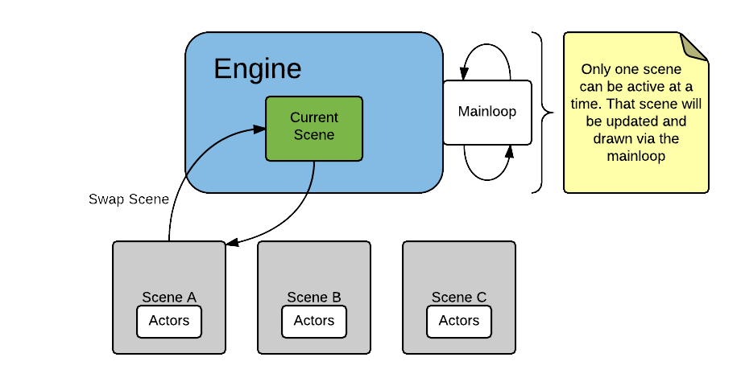
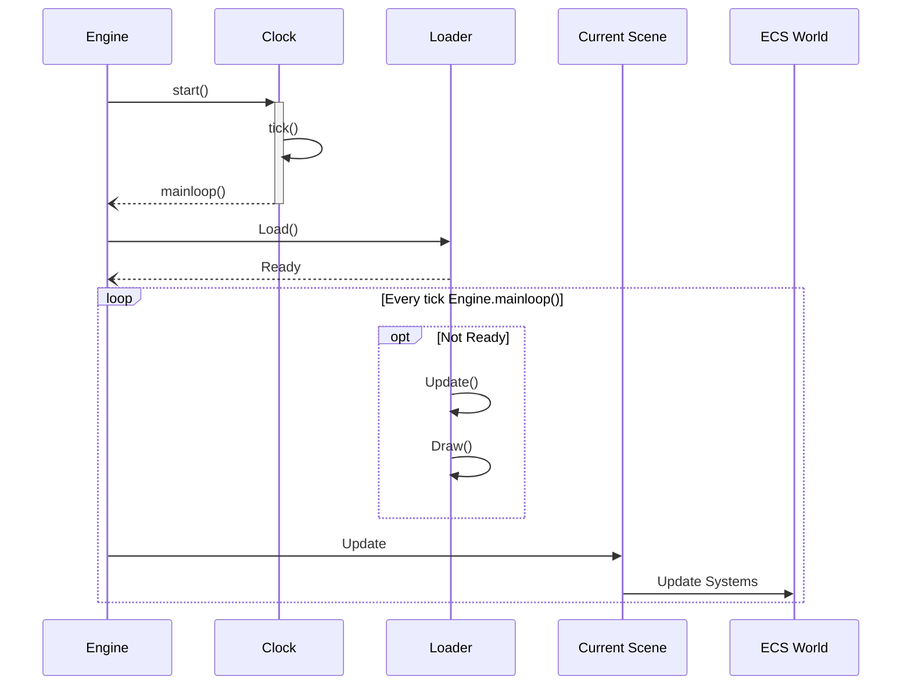

Excalibur uses the HTML5 Canvas API for drawing your game to the screen.
The canvas is available to all `draw` functions for raw manipulation,
but Excalibur is meant to simplify or completely remove the need to use
the canvas directly.

## Creating a game

To create a new game, create a new instance of [[Engine]] and pass in
the configuration ([[EngineOptions]]). Excalibur only supports a single
instance of a game at a time, so it is safe to use globally.
You can then call [[Engine.start|start]] which starts the game and optionally accepts
a [[Loader]] which you can use to [load assets](/docs/assets) like sprites and sounds.

```ts twoslash
/// <reference path="../src/engine/excalibur.d.ts" />

// ---cut---
const game = new ex.Engine({
  width: 800, // the width of the canvas
  height: 600, // the height of the canvas
  canvasElementId: '', // the DOM canvas element ID, if you are providing your own
  displayMode: ex.DisplayMode.FitScreen, // the display mode
  pointerScope: ex.Input.PointerScope.Document // the scope of capturing pointer (mouse/touch) events
});
// call game.start, which is a Promise
game.start().then(function () {
  // ready, set, go!
});
```

You would include your script (or [bundle it](/docs/installation#module-loaders-and-bundlers)) on an HTML page and that page does _not need anything else_.

```html
<!DOCTYPE html>
<html>
  <head>
    <title>My Cool Game!</title>
  </head>
  <body>
    <script src="game.js"></script>
  </body>
</html>
```

Excalibur can automatically generate a `<canvas>` element for you or you can provide your own using [[EngineOptions.canvasElementId]].

## The main loop

The Excalibur engine uses a simple main loop. The engine updates and renders
the "scene graph" which is the [[Scene|scenes]] and the tree of [[Actor|actors]] within that
scene. Only one [[Scene]] can be active at a time. The engine does not update/draw any other
scene, which means any actors will not be updated/drawn if they are part of a deactivated scene.





**Scene Graph**

```
Engine
  |_ Scene 1 (activated)
    |_ Actor 1
      |_ Child Actor 1
    |_ Actor 2
  |_ Scene 2 (deactivated)
  |_ Scene 3 (deactivated)
```

The engine splits the game into two primary responsibilities: updating and drawing. This is
to keep your game smart about splitting duties so that you aren't drawing when doing
logic or performing logic as you draw.

### Update loop

The first operation run is the **Update** loop. Actors and scenes both implement
an overridable/extendable `onPreUpdate` and `onPostUpdate` methods. Use them to perform any logic-based operations
in your game for a particular class.

### Draw loop

The next step is the **Draw** loop. A scene loops through its child actors and
draws each one. You can override the `onPreDraw` and `onPostDraw` methods on an actor or scene to customize their drawing.
You should **not** perform any logic in a draw call, it should only relate to drawing.

## Working with Scenes

The engine automatically creates a "root" [Scene](/docs/scenes). You can use this for whatever you want.
You can manipulate scenes using [[Engine.add|add]], [[Engine.remove|remove]],
and [[Engine.goToScene|goToScene]]. You can overwrite or remove the `root` scene if
you want. There always has to be at least one scene and only **one** scene can be
active at any one time.

Learn more about the [scene lifecycle](/docs/scenes#scene-lifecycle).

### Adding a scene

```js
const game = new ex.Engine();
// create a new level
const level1 = new ex.Scene();
// add level 1 to the game
game.add('level1', level1);
// in response to user input, go to level 1
game.goToScene('level1');
// go back to main menu
game.goToScene('root');
```

### Accessing the current scene

To add actors and other entities to the current scene, you can use [[Engine.add|add]]. Alternatively,
you can use [[Engine.currentScene]] to directly access the current scene.

## Constructor arguments

In Excalibur there are option bag constructors available on most types. These support any public property or member, **methods are not supported.** The API documentation does not provide an exhaustive list of possible properties but a list of commonly used properties.

For example instead of doing this:

```typescript
const actor = new ex.Actor(1, 2, 100, 100, ex.Color.Red);
actor.body.collisionType = ex.CollisionType.Active;
```

This is possible:

```typescript
const options: ActorArgs = {
   pos: new ex.Vector(1,2);
   width: 100,
   height: 100,
   color: ex.Color.Red,
}

const actor = new ex.Actor(options);
actor.body.collisionType = ex.CollisionType.Active;
```

In fact you can create a duplicate this way

```typescript
const actor = new ex.Actor({
  pos: new ex.Vector(1, 2)
});
const actorClone = new ex.Actor(actor);

expect(actor.pos).toBe(actorClone.pos); // true;
```

Types that support option bags can have their properties mass assigned using the assign method.

```typescript
const actor = new ex.Actor(options);

actor.assign({
  pos: new ex.Vector(100, 100),
  width: 1000,
  color: ex.Color.Red
});
```

## Extending the engine

For complex games, this is recommended for [[Actor|actors]] and [[Scene|scenes]], especially.
You can customize the options or provide more for your game by extending [[Engine]].

```ts
class Game extends ex.Engine {
  constructor() {
    super({ width: 800, height: 600, displayMode: DisplayMode.FitScreen });
  }

  public start() {
    // add custom scenes
    this.add('mainmenu', new MainMenu());
    return super.start(myLoader).then(() => {
      this.goToScene('mainmenu');
      // custom start-up
    });
  }
}
const game = new Game();
game.start();
```

## Event handling

When working with events, be sure to keep in mind the order of subscriptions
and try not to create a situation that requires specific things to happen in
order. Events are best used for input events, tying together disparate objects,
or for UI updates.

Excalibur events follow the convention that the name of the thrown event for listening
will be the same as the Event object in all lower case with the 'Event' suffix removed.

For example:

- PreDrawEvent event object and "predraw" as the event name

```typescript
actor.on('predraw', (evtObj: PreDrawEvent) => {
  // do some pre drawing
});
```

### Example: Actor events

Actors implement an EventDispatcher ([[Actor.events]]) so they can
send and receive events. For example, they can enable Pointer events (mouse/touch)
and you can respond to them by subscribing to the event names.
You can also emit any other kind of event for your game just by using a custom
`string` for the name, and any value for the event.

```js
var player = new ex.Actor(...);

// Enable pointer events for this actor
player.enableCapturePointer = true;
// subscribe to pointerdown event
player.on("pointerdown", function (evt: ex.Input.PointerEvent) {
  console.log("Player was clicked!");
});
// turn off subscription
player.off("pointerdown");
// subscribe to custom event
player.on("death", function (evt) {
  console.log("Player died:", evt);
});
// trigger custom event
player.emit("death", new DeathEvent());
```

### Example: Pub/Sub with Excalibur

You can also create an EventDispatcher for any arbitrary object, for example
a global game event aggregator (shown below as `vent`). Anything in your game can subscribe to
it, if the event aggregator is in the global scope.
_Warning:_ This can easily get out of hand. Avoid this usage, it just serves as
an example.

```js
// create a publisher on an empty object
const vent = new ex.EventEmitter();
// handler for an event
const handler = function (event) {
  console.log(event);
};
// add a handler
const sub = vent.on('someevent', handler);
// publish an event somewhere in the game
vent.emit('someevent', { any: 'value or object'});

// Clean up handler subscription, handler will no longer fire for 'someevent'
sub.close();
```

## Managing game state

Excalibur does not provide any out-of-the-box way to manage game state but typically you can either use class properties or introduce something more sophisticated like a [state machine](https://github.com/davidkpiano/xstate).

The benefit of something like a state machine is that state can be separated from the actions an actor may take and you can then _save_ and _load_ state more easily to enable save game management. You could choose for example to have a global game state that you can serialize and deserialize.

:::note

Have you implemented state management in your Excalibur game? [Let us know](https://github.com/excaliburjs/Excalibur#questions)!

:::

## Enabling debug mode

Call [[Engine.toggleDebug]], or [[Engine.showDebug]] with a `true` or `false` to enable or disable Excalibur's debug feature. This will enable [actor debug drawing](/docs/actors#debug-draw) to help diagnose drawing issues.
