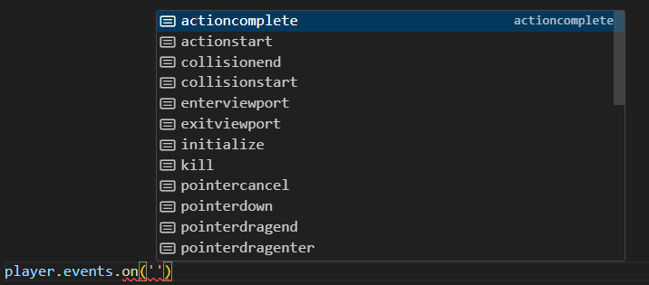

```twoslash include ex
// @module: esnext
// @allowUmdGlobalAccess
/// <reference path="../src/engine/excalibur.d.ts" />
```

Nearly everything in Excalibur has a way to listen to events! This is useful when you want to know exactly when things happen in Excalibur and respond to them with game logic. [[Actor|Actors]], [[Scene|Scenes]], [[Engine|Engines]], [[ActionsComponent|Actions]], [[Animation|Animations]], and various components have events you can hook into just look for the `.events` member!

:::info

Excalibur events are handled synchronously, which is great for debugging and reducing timing bugs.

:::

## Strongly-typed Events

Excalibur has types on all it's event listeners, you can check these types with Intellisense in VS Code or by following the Typescript definition.



## Pub/Sub or Signal-based Event Bus

Excalibur also allows you to listen/send any event you want to as well, but you'll need to provide your own types for that. At its core, the [[EventEmitter]] is a pub/sub mechanism (also called "Signals" in other engines), which means you can create an emitter as a way to pass messages between entities, components, or systems. This is how much of Excalibur works internally.

### Example: Health Depletion

Here is an example of emitting a custom `healthdepleted` event that is strongly-typed:


```ts twoslash
// @include: ex
// ---cut---
type PlayerEvents = {
  healthdepleted: PlayerHealthDepletedEvent;
}

export class PlayerHealthDepletedEvent extends ex.GameEvent<Player> {
  constructor(public target: Player) {
    super();
  }
}

export const PlayerEvents = {
  Healthdepleted: 'healthdepleted'
} as const;

export class Player extends ex.Actor {
  public events = new ex.EventEmitter<ex.ActorEvents & PlayerEvents>();
  private health: number = 100;

  public onPostUpdate() {
    if (this.health <= 0) {
      this.events.emit(PlayerEvents.Healthdepleted, new PlayerHealthDepletedEvent(this));
    }
  }
}
```

There are three main parts to this example:

1. The `type` declaration holds the mapping of event name to event class.
1. A `class` representing the custom event which can extend [[Events.GameEvent|GameEvent]]
1. A `const` declaration to provide a public way to pass the event name without using strings _(optional)_

:::tip
The third is optional but recommended to avoid "magic strings" especially for events used all over your codebase.
:::

Finally, you can expose an [[EventEmitter]] on your entity for other entities to subscribe/publish to. In this case, [[Actor.events]] is already provided by Excalibur, so you need to intersect your custom events with the existing events.

:::note

You don't _have to_ override the existing [[Actor.events]] property. You could also export a static emitter, or use a different property name. This example emitter lifecycle is tied to the `Player` and maintains a consistent way to emit other events but its just to illustrate a way to accomplish pub/sub.

:::

### Example: Strict Event Names

By default, [[EventEmitter]] is flexible to allow _any_ `string` event name and _any_ event.

If you want more strictness with TypeScript, you can do it by deriving a custom event emitter that overrides
the various overloaded methods to only allow strict event key names.

In this example, there's a typo, and a compiler error is thrown:

```ts twoslash {1-7, 10, 15}
// @include: ex
// @errors: 2345
type PlayerEvents = {
  healthdepleted: PlayerHealthDepletedEvent;
}

export const PlayerEvents = {
  Healthdepleted: 'healthdepleted'
} as const;

export class PlayerHealthDepletedEvent extends ex.GameEvent<Player> {
  constructor(public target: Player) {
    super();
  }
}

// ---cut---
type StrictEventKey<TEventMap> = keyof TEventMap;
class StrictEventEmitter<TEventMap extends ex.EventMap> extends ex.EventEmitter<TEventMap> {
  emit<TEventName extends StrictEventKey<TEventMap>>(eventName: TEventName, event: TEventMap[TEventName]): void;
  emit<TEventName extends StrictEventKey<TEventMap> | string>(eventName: TEventName, event?: TEventMap[TEventName]): void {
    super.emit(eventName as any, event as any);
  }
}

export class Player extends ex.Actor {
  public events = new StrictEventEmitter<ex.ActorEvents & PlayerEvents>();
  private health: number = 100;

  public onPostUpdate() {
    if (this.health <= 0) {
      this.events.emit("healthdpleted", new PlayerHealthDepletedEvent(this));
    }
  }
}
```

But when passing the appropriate constant, the error is gone:

```ts twoslash {7}
// @include: ex
type PlayerEvents = {
  healthdepleted: PlayerHealthDepletedEvent;
}

export const PlayerEvents = {
  Healthdepleted: 'healthdepleted'
} as const;

export class PlayerHealthDepletedEvent extends ex.GameEvent<Player> {
  constructor(public target: Player) {
    super();
  }
}

type StrictEventKey<TEventMap> = keyof TEventMap;
class StrictEventEmitter<TEventMap extends ex.EventMap> extends ex.EventEmitter<TEventMap> {
  emit<TEventName extends StrictEventKey<TEventMap>>(eventName: TEventName, event: TEventMap[TEventName]): void;
  emit<TEventName extends StrictEventKey<TEventMap> | string>(eventName: TEventName, event?: TEventMap[TEventName]): void {
    super.emit(eventName as any, event as any);
  }
}

// ---cut---
export class Player extends ex.Actor {
  public events = new StrictEventEmitter<ex.ActorEvents & PlayerEvents>();
  private health: number = 100;

  public onPostUpdate() {
    if (this.health <= 0) {
      this.events.emit(PlayerEvents.Healthdepleted, new PlayerHealthDepletedEvent(this));
    }
  }
}
```

:::note
This example is intentionally only showing the `emit` method, but you can override all the methods in the same way.
:::