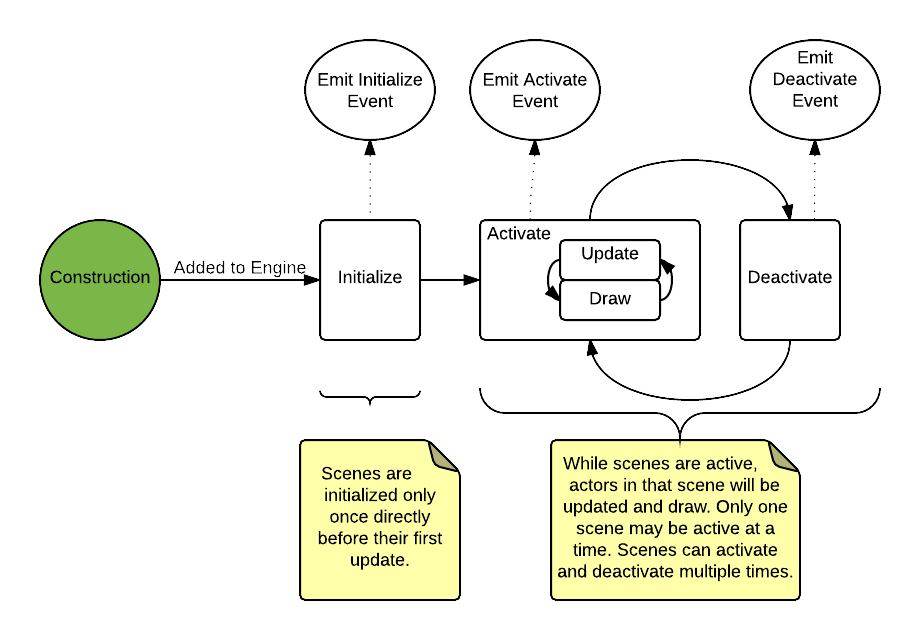
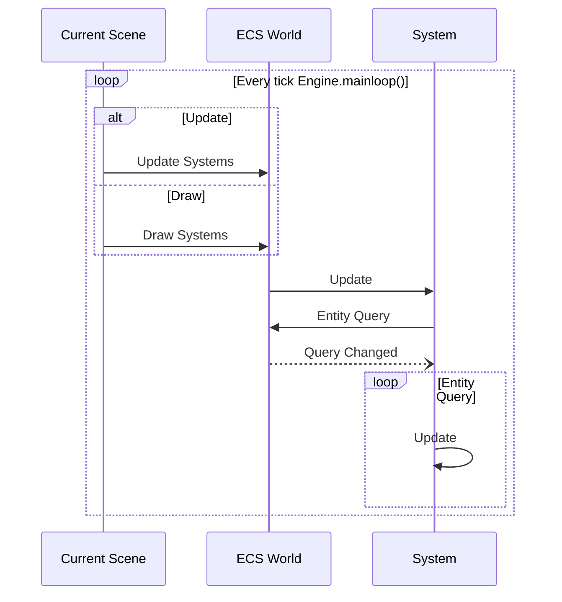

## Adding actors to the scene

For an [Actor](/docs/actors) to be drawn and updated, it needs to be part of the "scene graph".
The [Engine](/docs/engine) provides several easy ways to quickly add/remove actors from the
current scene.

```js
const game   = new ex.Engine(...);
const player = new ex.Actor();
const enemy  = new ex.Actor();
// add them to the "root" scene
game.add(player);
game.add(enemy);
// start game
game.start();
```

You can also add actors to a scene instance specifically using [[Scene.add]]:

```js
const game = new ex.Engine();
const level1 = new ex.Scene();
const player = new ex.Actor();
const enemy = new ex.Actor();
// add actors to level1
level1.add(player);
level1.add(enemy);
// add level1 to the game
game.add('level1', level1);
// start the game
game.start().then(() => {
  // after player clicks start game, for example
  game.goToScene('level1');
});
```

## Scene lifecycle

A scene has a basic lifecycle that dictates how it is initialized, updated, and drawn. Once a scene is added to
the engine it will follow this lifecycle:





For more complex games, you might want more control over a scene in which
case you can extend [[Scene]]. This is useful for menus, custom loaders,
and levels.

### Adding a scene Dynamically

Use [[Engine.add]] to add a new scene to the game. Each scene has a `string` key you can assign. You can then use
[[Engine.goToScene]] to switch scenes which runs the scene lifecycle hooks.

```ts
class MainMenu extends ex.Scene {}
// add to game and activate it
game.add('mainmenu', new MainMenu());
game.goToScene('mainmenu');
```

## Static Scene Collection

You may also add scenes up front as part of your [[Engine]] construction. In the `scenes:` map you can specify a Scene constructor, a Scene instance, or a Scene Custom Configuration.

* Scene Constructors may extend `export class StartScreen extends ex.Scene`
* Scene Custom Configurations, like the one named `sceneWithCustomTransitionAndLoader:` can also take a scene constructor or an instances

One advantage of using Scene constructors is Excalibur will only construct your Scene when needed to present. This can save a lot of memory on the bigger games.

```typescript
const game = new Engine({
  width: 800,
  height: 600,
  scenes: {
    startScreen: StartScreen,
    levelSelect: LevelSelect,
    tutorial: Tutorial,
    introLevel: new Level(Config.startingPuzzle),
    endScreen: EndScreen,
    sceneWithCustomTransitionAndLoader: {
      scene: scene2,
      loader: MyLoader,
      transitions: {
        out: new ex.FadeInOut({ duration: 500, direction: 'out' }),
        in: new ex.CrossFade({ duration: 2500, direction: 'in', blockInput: true })
      }
    },
  },
});
```


### Initialization

:::note

This is the recommended hook for setting up scene state

:::

[[Scene.onInitialize]] is called **once** when the scene is created for use in the game. It is called _before_ [[Scene.onActivate]] and can be used to set up the scene state. This is typically where you'd add any actors to the scene, set up initial state, and other startup tasks.

```ts
class MainMenu extends Scene {
  private _startButton: StartButton;

  /**
   * Start-up logic, called once
   */
  public onInitialize(engine: Engine) {
    // initialize scene actors
    this._startButton = new StartButton();
    this.add(this._startButton);
  }
}
```

You can even call [[Engine.start]] to preload assets for your scene, to avoid having to load them at game initialization time:

```ts
class MainMenu extends Scene {
  private _loaded: boolean = false;

  /**
   * Start-up logic, called once
   */
  public onInitialize(engine: Engine) {
    // load scene-specific assets
    engine.start(sceneLoader).then(() => {
      this._loaded = true;
    });
  }
}
```

### Activation

[[Scene.onActivate]] is called when the engine switches to the scene. It may be called more than once during the lifetime of a game, if you switch back and forth between scenes. It is useful for taking action before showing the scene. You may use this hook over `onInitialize` for anything specific to the context in which the scene was activated.

Data can be passed to a scene during activation via the `goToScene('sceneKey', { some: 'data' })`.

```ts
interface MyLevelData {
  spawnLocation: Vector;
}

class MainMenu extends Scene<MyLevelData> {
  private startButton: StartButton;

  /**
   * Each time the scene is entered (Engine.goToScene)
   */
  public onActivate(ctx: SceneActivationContext<MyLevelData>) {
    const { spawnLocation } = ctx.data;
    console.log(spawnLocation);
    if (ctx.previousScene instanceof Level) {
      this.startButton.text = 'Resume game';
    } else {
      this.startButton.text = 'Start game';
    }
  }
}
```

### Deactivation

[[Scene.onDeactivate]] is called when the engine exits a scene and is typically used for cleanup, exit tasks, and garbage collection.

```ts
class Level extends Scene {
  /**
   * Each time the scene is exited (Engine.goToScene)
   */
  public onDeactivate(ctx: SceneActivationContext) {
    this.saveState();
  }
}
```

## Loading

Scenes can now load resources specific to them by implementing the [[Scene.onPreLoad]].

```typescript
import * as ex from 'excalibur';

class LevelOne extends ex.Scene {
  spriteFont!: ex.ImageSource;
  playerSpriteSheet!: ex.ImageSource;

  override onPreLoad(loader: DefaultLoader) {
    this.spriteFont = new ex.ImageSource('./res/spritefont.png');
    this.playerSpriteSheet = new ex.ImageSource('./res/player-sheet.png');
    loader.addResource(this.spriteFont);
    loader.addResource(this.playerSpriteSheet);
  }
}

```

Read more in the [loaders documentation](/docs/loaders);