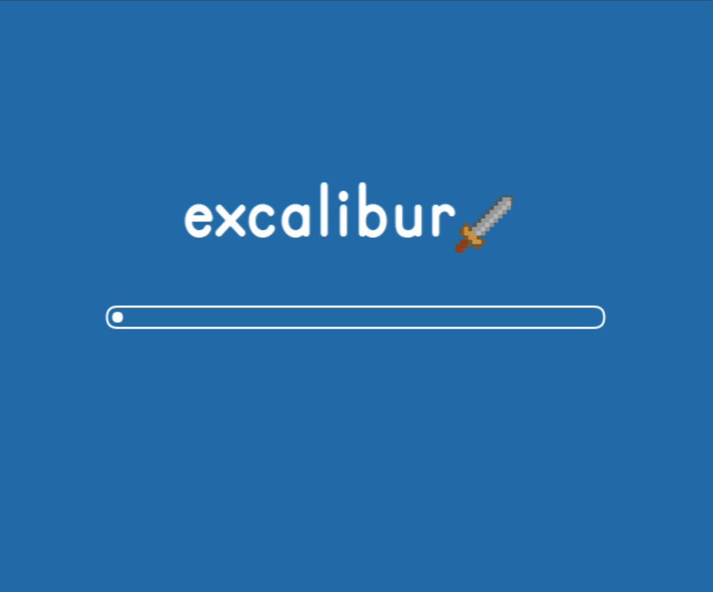

Games typically will have assets like image files, sound files, level data, etc. that you want to make available to your code. Excalibur has built in types to help you load assets. Excalibur loaders can load anything that implement the [[Loadable]] interface.

## Loader

Excalibur has a built in type [[Loader]] with the Excalibur logo, progress bar and a play button.




:::warning

You can suppress the play button with [[EngineOptions.suppressPlayButton]], but user input is required by the browser to unlock the audio context.

To unlock the audio context as part of a user action handler (clicking for example) call [[WebAudio.unlock]]

:::


## DefaultLoader & Customizing Loaders

[[DefaultLoader]] is the base loader type that all Excalibur loaders must derive from, in fact the built in [[Loader]] derives from this type.

It comes built in with a really simple logo-less loader that can be overridden.


```typescript
// my-loader.ts
import * as ex from 'excalibur';

export class MyLoader extends ex.DefaultLoader {

  override onUpdate(engine: ex.Engine, elapsedMilliseconds: number): void {
    // Perform something every tick, for example collect time elapsed or check
    // what file names have been loaded for drawing!
  }

  override onDraw(ctx: CanvasRenderingContext2D) {
    // Returns the progress of the loader as a number between [0, 1] inclusive.
    console.log(this.progress);
  }

  override async onUserAction(): Promise<void> {
    // Return a promise that resolves when the user interacts with the loading screen in some way,
    // usually a click.
    //
    // It's important to implement this in order to unlock the audio context in the browser.
    // Browsers automatically prevent audio from playing until the user performs an action.

  }

  override async onBeforeLoad(): Promise<void> {
    // Overrideable lifecycle method, called directly before loading starts
    // Useful if you need to do anything to the screen/viewport
  }

  override async onAfterLoad(): Promise<void> {
    // Overrideable lifecycle method, called after loading has completed
    // Useful if you need to do anything to the screen/viewport
  }
}

```

:::warning

[[DefaultLoader]] needs to have [[DefaultLoader.onUserAction]] implemented to unlock the audio context as part of a user interaction.

Present a button or something else for the user to interact, resolve `onUserAction` after the user interacts.

:::


## Scene Loading

Excalibur can load resources specific to a scene instead of all up front!

In your scene extend the [[Scene.onPreLoad]] method and you'll be passed any configured loader. [[Scene.onPreLoad]] will be called only once before [[Scene.onInitialize]];

```typescript
import * as ex from 'excalibur';

class LevelOne extends ex.Scene {
  spriteFont!: ex.ImageSource;
  playerSpriteSheet!: ex.ImageSource;

  override onPreLoad(loader: DefaultLoader) {
    this.spriteFont = new ex.ImageSource('./res/spritefont.png');
    this.playerSpriteSheet = new ex.ImageSource('./res/player-sheet.png');
    loader.addResource(this.spriteFont);
    loader.addResource(this.playerSpriteSheet);
  }
}

```

To customize the loader you are passed during [[Scene.onPreLoad]] update you scene config like so

```typescript
import * as ex from 'excalibur';
import { MyLoader } from './my-loader'

const game = new ex.Engine({
  scenes: {
    scene1: {
      scene: MyScene,
      loader: MyLoader
    }
  }
});

game.goToScene('scene1');

```

## Common Patterns

We recommend creating a `resource.ts` to house all your loadable resources in a strongly typed way. This also has the advantage of not cluttering up your main entrypoint. See an example of production game's [resources file](https://github.com/excaliburjs/sample-tactics/blob/main/src/resources.ts)


```typescript
// resources.ts
import * as ex from 'excalibur';

export const Resources = {
    TitleImage: new ex.ImageSource('./path/to/some/image.png'),
    KnightSpriteSheet: new ex.ImageSource('./path/to/some/other/image.png'),
    TitleMusic: new ex.Sound('.path/to/first-preference.wav', '.path/to/second-preference.wav'),
} as const; // < -- as const is important to get strong typing!

export const loader = new ex.Loader();

for (let res of Object.values(Resources)) {
    loader.addResource(res);
}
```

Inside your `main.ts` entry

```typescript
// main.ts
import * as ex from 'excalibur';
import { loader } from './resources';

const game = new ex.Engine({...});

game.start(loader);
```

Also you can reference your `Resources` in your game code

```typescript
// my-actor.ts
import * as ex from 'excalibur';
import { Resources } from './resources';

export class MyActor extends ex.Actor {
  override onInitialize() {
    const knightSpriteSheet = ex.SpriteSheet.fromImageSource({
      image: Resources.KnightSpriteSheet,
      grid: {
          rows: 1,
          columns: 4,
          spriteHeight: 32,
          spriteWidth: 32
      }
    });
    const idle = ex.Animation.fromSpriteSheetCoordinates({
        spriteSheet: knightSpriteSheet,
        strategy: ex.AnimationStrategy.Loop,
        frameCoordinates: [
            {x: 0, y: 0, duration: 200},
            {x: 1, y: 0, duration: 200},
            {x: 2, y: 0, duration: 200},
            {x: 3, y: 0, duration: 200}
        ]
    });
    this.graphics.use(idle);
  }
}

```


