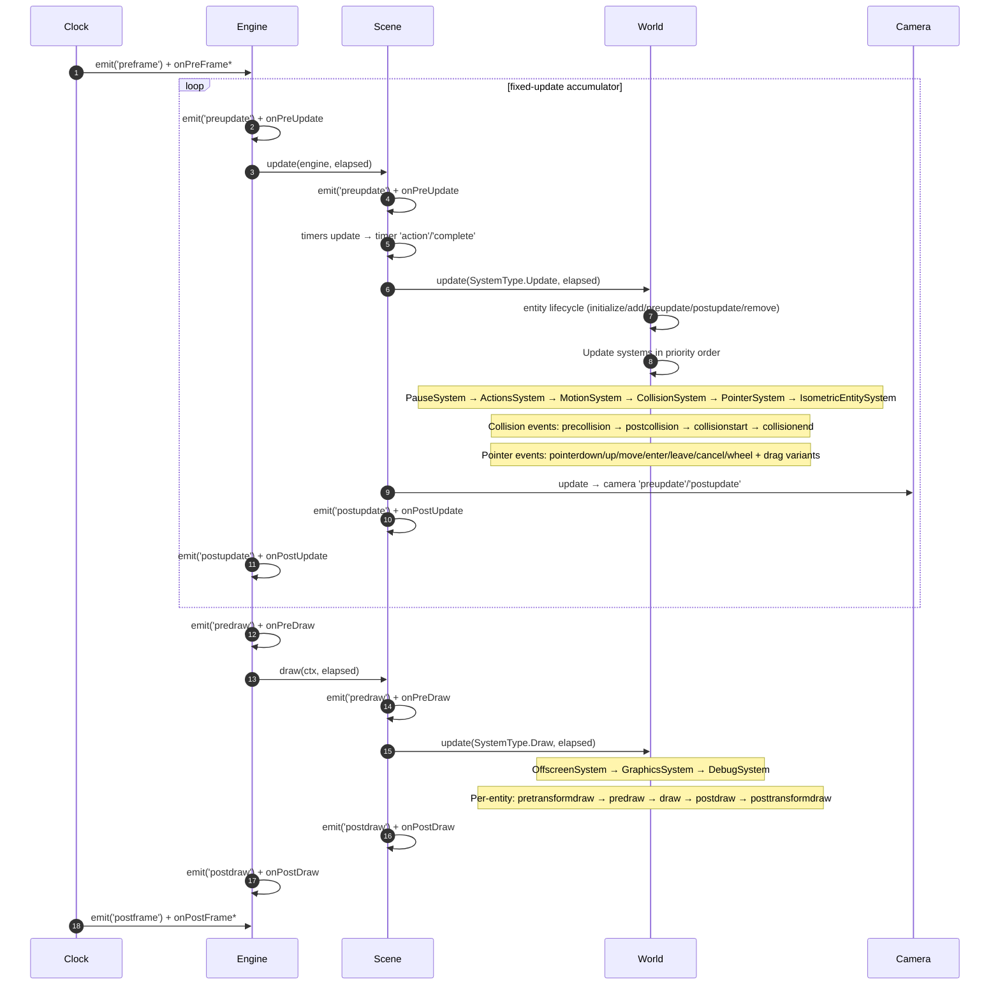
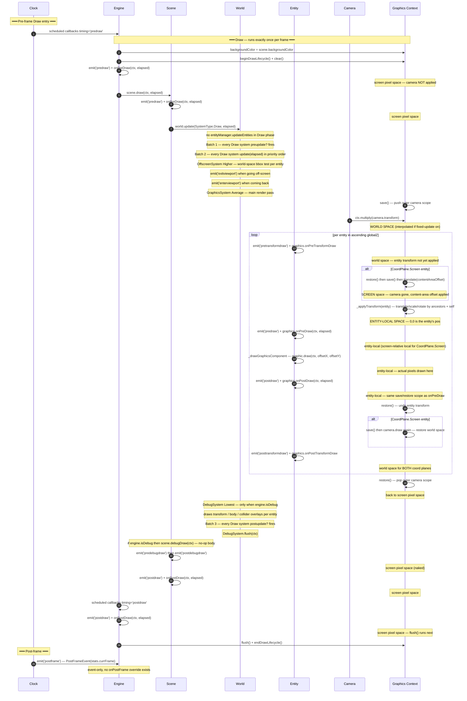

```twoslash include ex
// @module: esnext
// @allowUmdGlobalAccess
/// <reference path="../src/engine/excalibur.d.ts" />
```

Excalibur exposes two parallel mechanisms for hooking into the engine's lifecycle:

1. **Override hooks** — `public onPreUpdate(...)` methods you override on a subclass of [[Engine]], [[Scene]],
   [[Actor]]/[[Entity]], [[Camera]], etc. These are the recommended, type-safe, code-completion-friendly way
   to add per-frame logic to your own classes.
2. **Event subscriptions** — `engine.on('preupdate', (evt) => ...)` or `actor.events.on('collisionstart',
   (evt) => ...)`. Same instances fire the matching `onX` hook *and* the named event, so pick whichever
   style fits — override when you own the class, subscribe when you don't.

This page enumerates every override hook and every event subscription name with its trigger phase, payload,
and (for draw-phase hooks) the graphics-context coordinate space at the moment your handler runs.

## Per-frame timeline

A single frame runs this sequence. The Update section repeats 0..N times per frame when
[[EngineOptions.fixedUpdateTimestep|fixed-update]] is enabled; otherwise it runs exactly once. The Draw
section always runs exactly once.



`onPreFrame*` / `onPostFrame*` have **no override hook** — they are event-only. Use
[[Engine.on|`engine.on('preframe', ...)`]] / [[Engine.on|`engine.on('postframe', ...)`]] to subscribe.

If [[Engine]] is loading, the entire Update section is skipped and only [[DefaultLoader.onUpdate|loader's
`onUpdate`]] runs; in Draw, the loader canvas is rendered instead of the scene.

## Detailed timing diagrams

The end-to-end frame is split into two diagrams — one for the **Update** phase (which may repeat N times per
frame when [[EngineOptions.fixedUpdateTimestep|fixed-update]] is on) and one for the **Draw** phase (which
runs exactly once per frame). Each arrow is an emit/Hook firing in source order; `Note` rows flesh out the
per-system work and the coordinate space of the active `ExcaliburGraphicsContext`.

### Update timing

```mermaid mermaid
sequenceDiagram
    autonumber
    participant Clock
    participant Engine
    participant Scene
    participant World
    participant Entity
    participant Camera

    Note over Clock: ━━━ Pre-frame ━━━
    Clock->>Engine: emit('preframe') — PreFrameEvent(stats.prevFrame)
    Note over Engine: event-only, no onPreFrame override exists

    Note over Engine,World: ━━━ Update — repeats N times inside fixed-update loop ━━━

    Clock->>Engine: scheduled callbacks timing='preupdate'
    Engine->>Engine: emit('preupdate') + onPreUpdate(engine, elapsed)
    Engine->>Scene: scene.update(engine, elapsed)
    Scene->>Scene: emit('preupdate') + onPreUpdate(engine, elapsed)
    Scene->>Scene: timers.update() then emit('action') each tick
    Scene->>Scene: timers emit('complete') on finish
    Scene->>World: world.update(SystemType.Update, elapsed)

    Note over World,Entity: Entity lifecycle pass EntityManager.updateEntities
    loop every active entity
        Entity->>Entity: _initialize then emit('initialize') + onInitialize once
        Entity->>Entity: _add then emit('add') + onAdd once
        Entity->>Entity: emit('preupdate') + onPreUpdate
        Note over Entity: Entity recurses children before _postupdate
        Note over Entity: Actor does not recurse — children tracked by manager
        Entity->>Entity: emit('postupdate') + onPostUpdate
        Entity->>Entity: if killed then queued for deferred removal
    end

    Note over World: Batch 1 — every Update system preupdate? fires
    Note over World: Batch 2 — every Update system update(elapsed) in priority order
    Note over World:  PauseSystem Highest — toggle PauseComponentTag
    Note over World:  ActionsSystem Higher — action queue tick
    Note over World:    entity emit('actionstart' / 'actioncomplete')
    Note over World:  MotionSystem Higher — Euler integration + gravity
    Note over World:    world space, captures _oldPos for interpolation
    Note over World:  CollisionSystem Higher — broadphase then narrowphase then solve
    Note over World:    per physics.config.substep default 1
    Note over World:    preSolve then collider emit('precollision')
    Note over World:    Realistic only: collider emit('beforecollisionresolve')
    Note over World:    actor.onPreCollisionResolve(self, other, side, contact)
    Note over World:    solveVelocity / solvePosition (no events)
    Note over World:    postSolve then collider emit('postcollision')
    Note over World:    Realistic only: collider emit('aftercollisionresolve')
    Note over World:    actor.onPostCollisionResolve(self, other, side, contact)
    Note over World:    after all substeps
    Note over World:    new contacts then collider emit('collisionstart' / 'contactstart')
    Note over World:    actor.onCollisionStart(self, other, side, contact)
    Note over World:    ended contacts then collider emit('collisionend' / 'contactend')
    Note over World:    actor.onCollisionEnd(self, other, side, lastContact)
    Note over World:  PointerSystem Higher — picks via collider or graphics bounds
    Note over World:    processPointerToObject then dispatchEvents per object in z-order
    loop per entity under pointer, top-z first
        Entity->>Entity: emit('pointerdown' / 'pointerup' / 'pointermove')
        Entity->>Entity: emit('pointerenter' / 'pointerleave' / 'pointercancel' / 'pointerwheel')
        Entity->>Entity: emit('pointerdragstart' / 'pointerdragend' / 'pointerdragmove')
        Entity->>Entity: emit('pointerdragenter' / 'pointerdragleave')
        Note over Entity: call pe.cancel() here to skip lower-z targets
    end
    Note over World:    receivers.update() then receiver emit('down'/'up'/'move'/'cancel'/'wheel')
    Note over World:    primary pointer also emits 'pointerdown' / 'pointerwheel' / 'wheel'
    Note over World:  IsometricEntitySystem Lower — set z from elevation + pos.y

    Note over World: Batch 3 — every Update system postupdate? fires
    Note over World: Deferred removals — processComponentRemovals()
    Note over World:   component.onRemove(prevOwner)
    Note over World: processEntityRemovals() then entity._remove(engine)
    Note over World:   entity emit('remove') + onRemove

    Scene->>Camera: camera.update(engine, elapsed) — runs AFTER world.update
    Camera->>Camera: _initialize then emit('initialize') + onInitialize once
    Camera->>Camera: emit('preupdate') + onPreUpdate(engine, elapsed)
    Note over Camera: Euler integration, zoom/move lerp, shake, strategies
    Note over Camera: CAUTION: fires after systems despite the "Pre" name
    Camera->>Camera: emit('postupdate') + onPostUpdate(engine, elapsed)
    Scene->>Scene: emit('postupdate') + onPostUpdate(engine, elapsed)
    Scene->>Scene: scene.input.update()
    Engine->>Engine: graphicsContext.updatePostProcessors(elapsed)
    Clock->>Engine: scheduled callbacks timing='postupdate'
    Engine->>Engine: emit('postupdate') + onPostUpdate(engine, elapsed)
    Engine->>Engine: engine.input.update()
```



### Draw timing



Legend:
- **Override hook** — `onX` methods shown alongside their matching event emit.
- **Coordinate space** annotations describe the active transform on the `ExcaliburGraphicsContext` at the moment the adjacent hook/event fires.
- **`onPreFrame` / `onPostFrame`** have no override — they are event-only.
- The Camera column runs **after** the world update despite its `onPreUpdate` name — see [Common gotchas](#common-gotchas) below.

## Lifecycle override hooks

### `Engine`

Override these on a subclass of [[Engine]]:

| Hook | Signature | Fires |
|---|---|---|
| [[Engine.onInitialize]] | `(engine: Engine) => void` | once, after `start()` completes loading and before the first frame |
| [[Engine.onPreUpdate]] | `(engine, elapsed: number) => void` | start of each Update, before `Scene.update` |
| [[Engine.onPostUpdate]] | `(engine, elapsed: number) => void` | end of each Update, after `Scene.update` and post-processors |
| [[Engine.onPreDraw]] | `(ctx, elapsed: number) => void` | start of each Draw, before `Scene.draw` |
| [[Engine.onPostDraw]] | `(ctx, elapsed: number) => void` | end of each Draw, after `Scene.draw` and before `flush()` |

### `Scene`

Override these on a subclass of [[Scene]]:

| Hook | Signature | Fires |
|---|---|---|
| [[Scene.onPreLoad]] | `(loader: DefaultLoader) => void` | once, when the scene is first navigated to, before loading resources |
| [[Scene.onInitialize]] | `(engine) => void` | once, when the scene is first activated, after `onPreLoad` |
| [[Scene.onActivate]] | `(ctx: SceneActivationContext) => void` | every time the scene is switched to via `goToScene` |
| [[Scene.onDeactivate]] | `(ctx) => void \| any` | every time the scene is switched away from; the returned data is forwarded to the next scene's `onActivate` as `previousSceneData` |
| [[Scene.onTransition]] | `(direction: 'in' \| 'out') => Transition \| undefined` | when a scene transition is requested |
| [[Scene.onPreUpdate]] | `(engine, elapsed) => void` | start of scene update, before timers/world/camera |
| [[Scene.onPostUpdate]] | `(engine, elapsed) => void` | end of scene update, after the world & camera processed |
| [[Scene.onPreDraw]] | `(ctx, elapsed) => void` | start of scene draw, before the world draw systems |
| [[Scene.onPostDraw]] | `(ctx, elapsed) => void` | end of scene draw, after the world draw systems & debug draw |

### `Entity` and `Actor`

Override these on a subclass of [[Entity]] or [[Actor]]:

| Hook | Signature | Fires |
|---|---|---|
| [[Entity.onInitialize]] | `(engine) => void` | once, on the entity's first update tick (before its first `onPreUpdate`) |
| [[Entity.onAdd]] | `(engine) => void` | once, when the entity becomes active in a scene |
| [[Entity.onRemove]] | `(engine) => void` | once, when the entity is removed; fires either inside the deferred-removal pass at the end of `World.update(Update)`, or earlier in the entity's own `update()` if the entity was already inactive by then |
| [[Entity.onPreUpdate]] | `(engine, elapsed) => void` | per-frame, before children update |
| [[Entity.onPostUpdate]] | `(engine, elapsed) => void` | per-frame, after children update |

[[Actor]] adds:

| Hook | Signature | Fires |
|---|---|---|
| [[Actor.onPreKill]] | `(scene) => void` | synchronously by `kill()`, just before `super.kill()` flips `isActive = false` |
| [[Actor.onPostKill]] | `(scene) => void` | synchronously by `kill()`, immediately after `super.kill()` |
| [[Actor.onPreCollisionResolve]] | `(self, other: Collider, side: Side, contact: CollisionContact) => void` | per-contact, during solver `preSolve` (before resolution). Wired by [[ColliderComponent]] |
| [[Actor.onPostCollisionResolve]] | `(self, other, side, contact) => void` | per-contact, during solver `postSolve` (after resolution) |
| [[Actor.onCollisionStart]] | `(self, other, side, contact) => void` | once, when two colliders first touch |
| [[Actor.onCollisionEnd]] | `(self, other, side, lastContact) => void` | once, when two colliders separate |

:::note
Actor overrides update and does **not** recurse into children between `_preupdate` and `_postupdate`. Child
entities are tracked and updated independently by the [[EntityManager]] loop. Override [[Entity.update]]
directly if you need control over that recursion.
:::

### Graphics-component draw hooks

[[GraphicsComponent]] exposes optional **function-property** draw hooks — assign them rather than override:

```ts twoslash
// @include: ex
// ---cut---
class Player extends ex.Actor {
  public onInitialize() {
    this.graphics.onPreDraw = (ctx: ex.ExcaliburGraphicsContext, elapsed: number) => {
      // custom drawing — see coordinate-space table below
    };
  }
}
```

| Hook | When it fires | Coordinate space |
|---|---|---|
| `graphics.onPreTransformDraw` | Before the entity transform is applied | World space (camera already applied) |
| `graphics.onPreDraw` | After the entity transform is applied, before the graphic is drawn | **Entity-local space** (origin = the entity's world position) |
| `graphics.onPostDraw` | After the graphic is drawn, inside the same save/restore scope as `onPreDraw` | **Entity-local space** |
| `graphics.onPostTransformDraw` | After the entity transform is restored | World space (camera re-applied for `CoordPlane.Screen` entities too) |

For [[CoordPlane.Screen]] entities (e.g., [[ScreenElement]]), "entity-local space" is **screen-relative
local** — the camera is dropped and the safe-content-area offset is applied, so `(0,0)` is the entity's
position relative to the top-left of the safe content area.

### `Camera`

Override on a subclass of [[Camera]]:

| Hook | Signature | Fires |
|---|---|---|
| [[Camera.onInitialize]] | `(engine) => void` | once, during [[Scene]] initialization |
| [[Camera.onPreUpdate]] | `(engine, elapsed) => void` | per-frame, near the **end** of the Update phase (after the world; see Gotchas) |
| [[Camera.onPostUpdate]] | `(engine, elapsed) => void` | per-frame, after camera integration & strategies |

:::warning
The [[Camera]] is updated at the **end** of [[Scene.update]], *after* `world.update(SystemType.Update)`. So
`Camera.onPreUpdate` fires **after** all Update-phase systems (Motion/Collision/Pointer/etc.) have finished
for that frame, not before them. Read its name as "before this camera's internal integration", not "before
the scene updates".
:::

### `DefaultLoader`

Override on a subclass of [[DefaultLoader]]:

| Hook | Signature | Fires |
|---|---|---|
| [[DefaultLoader.onInitialize]] | `(engine) => void` | once, when load begins |
| [[DefaultLoader.onUserAction]] | `() => Promise<void>` | when the user is expected to interact (usually a click); needed to unlock the audio context |
| [[DefaultLoader.onBeforeLoad]] | `() => Promise<void>` | once, before resources are fetched |
| [[DefaultLoader.onAfterLoad]] | `() => Promise<void>` | once, after resources are fetched and audio unlocked |
| [[DefaultLoader.onUpdate]] | `(engine, elapsed) => void` | per-frame **while loading** (this replaces the entire scene update during loading) |
| [[DefaultLoader.onDraw]] | `(ctx: CanvasRenderingContext2D) => void` | per-frame **while loading**, on the loader's 2D canvas |

### `Transition`

Override on a subclass of [[Transition]] (e.g., custom scene transitions):

| Hook | Signature | Fires |
|---|---|---|
| [[Transition.onStart]] | `(progress: number) => void` | once, at the beginning of the transition |
| [[Transition.onUpdate]] | `(progress: number) => void` | per-frame during the transition |
| [[Transition.onEnd]] | `(progress: number) => void` | once, when the transition finishes |
| [[Transition.onReset]] | `() => void` | when the transition instance is reset for reuse |

### `System` (advanced ECS)

[[System|Systems]] use lowercase method names rather than `onX`:

| Hook | Signature | Fires |
|---|---|---|
| `initialize?(world, scene)` | `(world: World, scene: Scene) => void` | once, when added to an initialized scene |
| `preupdate?(scene, elapsed)` | `(scene, elapsed) => void` | per-frame, in a **batch pass** before any Update-phase system's `update` body runs |
| `update(elapsed)` | `(elapsed: number) => void` | per-frame, the system's main work |
| `postupdate?(scene, elapsed)` | `(scene, elapsed) => void` | per-frame, in a **batch pass** after all Update-phase systems' `update` bodies |

:::note
The SystemManager runs these in three full passes across systems of the same type:
**all `preupdate`s → all `update`s → all `postupdate`s**, not interleaved per system. Priority sort runs
ascending: `Highest (-∞)` first, then `Higher (-5)`, `Average (0)`, `Lower (+5)`, `Lowest (+∞)` last.
:::

## Event subscription reference

Each class exposes an [[EventEmitter]] (`engine.events`, `scene.events`, `entity.events`,
`actor.events`, `collider.events`, `camera.events`, `tilemap.events`, `tile.events`, `animation.events`,
`keyboard`, `gamepads.at(0)`, `screen.events`, etc.). Use `.on('name', handler)` to subscribe.

### `Engine` (`engine.on('name', handler)`)

| Event name | Payload | Phase |
|---|---|---|
| `preframe` | `PreFrameEvent` | start of each frame |
| `postframe` | `PostFrameEvent` | end of each frame |
| `preupdate` | `PreUpdateEvent<Engine>` | per Update call |
| `postupdate` | `PostUpdateEvent<Engine>` | per Update call |
| `predraw` | `PreDrawEvent` | per Draw call |
| `postdraw` | `PostDrawEvent` | per Draw call |
| `initialize` | `InitializeEvent<Engine>` | once, when the engine initializes |
| `start` | `GameStartEvent` | once, when `start()` resolves |
| `stop` | `GameStopEvent` | once, when `stop()` is called |
| `visible` / `hidden` | `VisibleEvent` / `HiddenEvent` | browser `visibilitychange` events |
| `fallbackgraphicscontext` | `ExcaliburGraphicsContext2DCanvas` | if the WebGL context fails and a 2D fallback is created |
| `navigationstart` / `navigation` / `navigationend` | `DirectorNavigationEvent` | scene transitions; shared via [[Director]] |

### `Scene` (`scene.on('name', handler)`)

| Event name | Payload | Phase |
|---|---|---|
| `initialize` | `InitializeEvent<Scene>` | once, when the scene is initialized |
| `activate` | `ActivateEvent` | each time the scene becomes active |
| `deactivate` | `DeactivateEvent` | each time the scene is switched away from |
| `preload` | — | when the scene loads resources |
| `transitionstart` / `transitionend` | `Transition` | scene transitions |
| `preupdate` / `postupdate` | `PreUpdateEvent<Scene>` / `PostUpdateEvent<Scene>` | per-frame update |
| `predraw` / `postdraw` | `PreDrawEvent` / `PostDrawEvent` | per-frame draw |
| `predebugdraw` / `postdebugdraw` | `PreDebugDrawEvent` / `PostDebugDrawEvent` | when `engine.isDebug` is on |
| `pause` / `resume` | — | [[Scene.pause]] / [[Scene.resume]] |
| `entityadded` / `entityremoved` | `{ target: Entity }` | when entities are added/removed (inline, not in the const) |

### `Entity` / `Actor` (`entity.on('name', handler)`)

| Event name | Payload | Phase |
|---|---|---|
| `initialize` / `add` / `remove` | `InitializeEvent` / `AddEvent` / `RemoveEvent` | once each, in entity lifecycle |
| `preupdate` / `postupdate` | `PreUpdateEvent<Entity>` / `PostUpdateEvent<Entity>` | per-frame update |
| `kill` | `KillEvent` | on `kill()` |

[[Actor]] adds:

| Event name | Payload | Phase |
|---|---|---|
| `prekill` / `postkill` | `PreKillEvent` / `PostKillEvent` | synchronously inside `kill()` |
| `precollision` / `postcollision` | `PreCollisionEvent` / `PostCollisionEvent` | per-contact during solver `preSolve`/`postSolve` |
| `collisionstart` / `collisionend` | `CollisionStartEvent` / `CollisionEndEvent` | once per entering/exiting contact |
| `predraw` / `postdraw` | `PreDrawEvent` / `PostDrawEvent` | per-frame during [[GraphicsSystem]] iteration |
| `pretransformdraw` / `posttransformdraw` | `PreTransformDrawEvent` / `PostTransformDrawEvent` | per-frame around the entity transform |
| `predebugdraw` / `postdebugdraw` | — | during scene-level debug draw |
| `pointerdown` / `pointerup` / `pointermove` / `pointercancel` / `pointerenter` / `pointerleave` / `pointerwheel` | `PointerEvent` (or `WheelEvent` for wheel) | per-pointer-event when the pointer targets the actor |
| `pointerdragstart` / `pointerdragend` / `pointerdragmove` / `pointerdragenter` / `pointerdragleave` | `PointerEvent` | drag variants of the above |
| `enterviewport` / `exitviewport` | `EnterViewPortEvent` / `ExitViewPortEvent` | when the [[OffscreenSystem]] detects the actor crossed the screen bounds |
| `actionstart` / `actioncomplete` | `ActionStartEvent` / `ActionCompleteEvent` | when an action starts or completes |

[[Collider]]-only events (subscribed via `actor.body.collider.events.on(...)`; **not** re-emitted on the
actor):

| Event name | Payload |
|---|---|
| `contactstart` / `contactend` | `ContactStartEvent` / `ContactEndEvent` |
| `beforecollisionresolve` / `aftercollisionresolve` | `CollisionPreSolveEvent` / `CollisionPostSolveEvent` (Realistic solver only) |

### `Camera` (`camera.on('name', handler)`)

| Event name | Payload | Phase |
|---|---|---|
| `initialize` | `InitializeEvent<Camera>` | once |
| `preupdate` / `postupdate` | `PreUpdateEvent<Camera>` / `PostUpdateEvent<Camera>` | per-frame end of scene update |

### `TileMap` / `Tile`

[[TileMap]] inherits the [[Entity]] events above *plus* `predraw` / `postdraw` / the entity `pointer*
events`. Each individual [[Tile]] has `tile.on('pointerenter' | 'pointerleave' | 'pointerdown' |
'pointerup' | 'pointermove' | 'pointercancel', ...)`. See [Per-Tile Pointer Events](/docs/tilemap#per-tile-pointer-events).

### Trigger, Timer, Animation, Keyboard, Gamepad, Screen, Loader, ...

| Class | Events |
|---|---|
| [[Trigger]] | `enter`, `exit` |
| [[Timer]] | `start`, `stop`, `pause`, `resume`, `cancel`, `action` (each tick), `complete` |
| [[Animation]] | `frame`, `loop`, `end` |
| [[Keyboard]] | `press`, `hold`, `release` |
| [[Gamepad]] | `connect`, `disconnect`, `button`, `buttondown`, `buttonup`, `axis` |
| [[Screen]] | `resize`, `pixelratio`, `fullscreen` |
| [[DefaultLoader]] | `beforeload`, `loadresourcestart`, `loadresourceend`, `useraction`, `afterload` |
| [[Resource]] | `complete`, `load`, `loadstart`, `progress`, `error` |
| [[Sound]] | `volumechange`, `processed`, `pause`, `stop`, `resume`, `playbackstart`, `playbackend` |
| [[EventEmitter]] (custom) | whatever you define — see [Events guide](/docs/events) |

## Draw-phase coordinate spaces

The draw phase has nested `save()`/`restore()` scopes per the [[GraphicsSystem]] iteration. Your handler's
coordinate space depends on which scope it fires in:

| Hook / event | Coordinate space at the moment the handler runs |
|---|---|
| `Engine.onPreDraw` / `engine.on('predraw')` | **Screen pixels** — raw resolution frame, camera not applied |
| `Scene.onPreDraw` / `scene.on('predraw')` | **Screen pixels** — `Scene.draw` runs `world.update(Draw)` next, so the camera hasn't been applied yet |
| `graphics.onPreTransformDraw` / `entity.on('pretransformdraw')` | **World space** — camera applied, entity transform not yet applied (works for `CoordPlane.Screen` too; the screen-plane swap happens after this fires) |
| `graphics.onPreDraw` / `entity.on('predraw')` | **Entity-local space** — camera + entity (and ancestor) transforms all applied; `(0,0)` is the entity's world position. For `CoordPlane.Screen` entities, this is **screen-relative local** (`contentAreaOffset` + entity transform, no camera). |
| (graphic drawn) | **Entity-local space** (same scope as `onPreDraw`) |
| `graphics.onPostDraw` / `entity.on('postdraw')` | **Entity-local space** — same save/restore scope as `onPreDraw` |
| `graphics.onPostTransformDraw` / `entity.on('posttransformdraw')` | **World space** — entity transform restored. For `CoordPlane.Screen` entities the camera is re-applied before this fires so it's also **world space**. |
| `Scene.onPostDraw` / `scene.on('postdraw')` | **Screen pixels** — `world.update(Draw)` completed; outer camera `restore()` done |
| `Engine.onPostDraw` / `engine.on('postdraw')` | **Screen pixels** — same as above, scene draw finished; `flush()` runs next |
| `scene.on('predebugdraw')` | **Screen pixels** — debug scene-level events are naked |
| `scene.on('postdebugdraw')` | **Screen pixels** — same as above, fired end of debug draw |

:::warning
If you mutate the context inside any draw handler, balance your own `ctx.save()` / `ctx.restore()`.
Excalibur guarantees the right transform only when the handler is *entered*; anything you push on top
without popping leaks into sibling entities or the post-frame phase.
:::

## Substepping & repeated Events

If [[PhysicsConfig.substep|`physics.config.substep`]] is greater than 1, `precollision`, `postcollision`,
`beforecollisionresolve`, `aftercollisionresolve`, and the motion integration step run **once per
substep** in the same frame. `collisionstart` / `collisionend` / `contactstart` / `contactend` run **once
per frame** after all substeps complete (they're keyed against the previous frame's contact map).

In [[EngineOptions.fixedUpdateTimestep|fixed-update]] mode, the entire Update section (including all
collision and pointer events) runs N times per frame to consume accumulated lag, while the Draw section
runs exactly once with interpolated positions.

## Common gotchas

- **`Camera.onPreUpdate` runs late**, not at the start of the scene update. The camera is updated at the
  **end** of `Scene.update` so that renders stay smooth (entities have already moved). It runs after
  `world.update(SystemType.Update)`, not before it.
- **`Entity.onAdd` / `onRemove` fire from the world update**, not synchronously from `scene.add` /
  `scene.remove`. They fire on the entity's first/last valid `update` tick.
- **Deferred entity removal**: [[Entity.kill|`entity.kill()`]] sets `isActive = false`; the actual array
  splice happens in `processEntityRemovals` at the **end** of `World.update(Update)`. `onRemove` is invoked
  during that splice — or earlier, inside the entity's own `update()` at `entity.ts:677`, if the entity was
  already inactive by then (e.g. a self-kill from `onPreUpdate`/`onPostUpdate`, or a kill by an earlier
  entity's update). Either way, killing mid-update is safe — see
  [Removing Entities from a Scene](/docs/scenes#removing-entities-from-a-scene).
- **Coroutines default to `'preframe'`** and don't stop on entity death — see
  [Coroutines](/docs/coroutines#coroutine-timing--lifecycle).
- **Pointer events fire in z-order**: when an event targets overlapping actors, higher-z actors get it
  first. Call [[Input.PointerEvent.cancel|`event.cancel()`]] in a handler to make lower-z actors skip the
  event — see [Propagation and Cancelling Pointer Events](/docs/pointers#propagation-and-cancelling-pointer-events).
- **`pointerdraw` does not exist** — if you want cursor visuals, draw them from inside a
  `graphics.onPostDraw` or as a screen-space overlay.