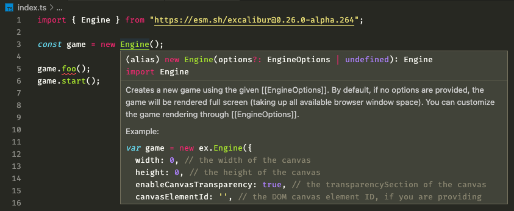

To get started, first install Excalibur through npm (TypeScript typings are best supported in npm):

    npm install excalibur

### TypeScript Configuration

In a TypeScript project, you can reference Excalibur with the ES6 import style syntax:

```js
// Excalibur is loaded into the ex global namespace
import * as ex from 'excalibur'
```

or

```js
// Excalibur is loaded into the ex global namespace
import { Actor, Engine } from 'excalibur'
```

#### TSConfig

We have a base recommended tsconfig.json that the TypeScript compiler uses as configuration. In this example we assume all the source is in a `./src/` directory.

```json
{
  "include": ["src/**/*"],
  "compilerOptions": {
    /* Basic Options */
    "target": "es2015" /* Specify ECMAScript target version: 'ES3' (default), 'ES5', 'ES2015', 'ES2016', 'ES2017', 'ES2018', 'ES2019', 'ES2020', or 'ESNEXT'. */,
    "module": "es2015" /* Specify module code generation: 'none', 'commonjs', 'amd', 'system', 'umd', 'es2015', 'es2020', or 'ESNext'. */,
    /* Specify library files to be included in the compilation. */
    "lib": [
      "dom",
      "es5",
      "es2015.Proxy",
      "es2015.promise",
      "es2015.collection",
      "es2015.iterable",
      "es2015"
    ],

    /* Strict Type-Checking Options */
    "strict": true /* Enable all strict type-checking options. */,

    /* Module Resolution Options */
    "moduleResolution": "node" /* Specify module resolution strategy: 'node' (Node.js) or 'classic' (TypeScript pre-1.6). */,
    "baseUrl": "./src" /* Base directory to resolve non-absolute module names. */,
    "esModuleInterop": true /* Enables emit interoperability between CommonJS and ES Modules via creation of namespace objects for all imports. Implies 'allowSyntheticDefaultImports'. */,

    /* Advanced Options */
    "forceConsistentCasingInFileNames": true /* Disallow inconsistently-cased references to the same file. */
  }
}
```

In a module loader system, such as Webpack or Parcel, it will automatically bundle Excalibur. See the [webpack example repo](https://github.com/excaliburjs/template-ts-webpack) or [parcel repo](https://github.com/excaliburjs/template-ts-parcel)

To support tree-shaking, you should use _named imports_:

```js
import { Actor } from 'excalibur'
```

<Note variant="warning">

Excalibur doesn't do the best optimization to support tree-shaking--likely
you'll end up importing everything at the moment but this is slowly getting better.

</Note>

### Parcel

Parcel is by far the easiest way to get a bundler up and running with excalibur. We recommend looking at the [template](https://github.com/excaliburjs/template-ts-parcel).

<Note variant="warning">

Adding an `import "regenerator-runtime/runtime";` in your entry file is needed to force parcel to understand async/await inside excalibur

</Note>

Using npm to install parcel, excalibur, and typescript

    npm install parcel-bundler excalibur typescript

Configure you tsconfig.json

    tsc --init

Build your game script

```typescript
// ./src/index.ts
const game = new Engine({
  width: 600,
  height: 400,
})

game.start()
```

Include the **typescript** file in your html

```html
<html>
  <head></head>
  <body>
    <script src="./src/index.ts" />
  </body>
</html>
```

Build and run with parcel!

    parcel index.html --no-autoinstall

### Webpack

Webpack is the battleship solution, and if you need a lot of control over your build process, this might be the way to go.

<Note variant="warning">

Configuring webpack is not for the faint of heart, we recommend thoroughly reading webpack's documentation on how to understand and configure webpack.

[Our template](https://github.com/excaliburjs/template-ts-webpack) is a good starting point.

</Note>

### Deno

[Deno](https://deno.land/) is a runtime for JavaScript and TypeScript and much more than a bundler, but we put this section here since you'll be doing a lot of bundling :).

For Excalibur to work in a Deno environment, use a Content Delivery Network for making Node.js packages compatible with Deno: two popular ones are [esm.sh](https://esm.sh/) and [skypack.dev](https://www.skypack.dev/).

To keep it simple, we use `esm.sh` in the following examples, but feel free to make your own choice - at the time of writing the procedure for `esm.sh` and `skypack.dev` is nearly identical (for a difference, see the section [Types and IntelliSense](#types-and-intellisense)).

#### Importing within an HTML file

Sometimes, you just want to start hacking. You can do so by using Deno to get a bundled version of Excalibur and directly applying the module to your HTML.

Either [esm.sh](https://esm.sh/excalibur) or [skypack.dev](https://www.skypack.dev/view/excalibur) should generate a bundle that works:

```bash
deno bundle https://esm.sh/excalibur excalibur.bundle.js
```

<Note>

Learn more about the `deno bundle` command in the [official docs](https://deno.land/manual/tools/bundler#bundling).

</Note>

Using as a native module works in Chrome without any extras:

```html
<!-- index.html -->

<script type="module">
  import ex from './excalibur.bundle.js'

  const game = new ex.Engine()
  game.start()
</script>
```

The drawback to this method is that it doesn't give you type annotations in your IDE, like [the following method](#importing-into-a-javascript-or-typescript-file).

<Note>

Learn more about the `type="module"` attribute [on MDN](https://developer.mozilla.org/en-US/docs/Web/JavaScript/Guide/Modules).

</Note>

#### Importing into a JavaScript or TypeScript File

<Note>

We have tested the following examples with version 0.26.0-alpha.264 of the excalibur package. We recommend you run at least that version for this to work. You can get [the latest excalibur version on npm](https://www.npmjs.com/package/excalibur).

</Note>

More likely, you will want to import Excalibur into a JavaScript or TypeScript file.

Since it goes very well with Deno, we use TypeScript in the following examples. We will have to set up our TypeScript compiler and pick our import syntax before we can make our bundle.

A custom `tsconfig.json` has to be used with `strict` turned off and a few DOM libraries added:

```json
// tsconfig.json

{
  "compilerOptions": {
    "strict": false,
    "lib": ["dom", "dom.iterable", "dom.asynciterable", "Deno.ns"]
  }
}
```

Then Excalibur can be imported. This can be done in two ways:

**Recommended: Named Import**

```typescript
// index.ts

import { Engine } from 'https://esm.sh/excalibur@0.26.0-alpha.264'

const game = new Engine()
game.start()
```

**Alternative: Namespace Import **

```typescript
// index.ts

import * as ex from 'https://esm.sh/excalibur@0.26.0-alpha.264'

const game = new ex.Engine()
game.start()
```

##### Aside - Why do we recommend named imports over namespace imports?

There are two main reasons:

- We find named imports more [expressive](https://stackoverflow.com/questions/42051588/wildcard-or-asterisk-vs-named-or-selective-import-es6-javascript) and [explicit](https://javascript.info/import-export#import) than the wildcard `*` syntax. It's easier for you and your collaborators to see what parts of the module are actually being used if they are all listed in the import statement.

- They can help with _tree shaking_, as explained in [this relatively beginner-friendly developers.google tutorial](https://developers.google.com/web/fundamentals/performance/optimizing-javascript/tree-shaking/#finding_opportunities_to_shake_a_tree).

<Note>

_Tree shaking_ means dropping unused code, reducing the size of your bundle so that your app can load faster for the end-user. This can be done by build tools such as [Rollup](https://rollupjs.org/guide/en/#tree-shaking) and [Webpack](https://webpack.js.org/guides/tree-shaking/).

</Note>

Both approaches work. you might have your reasons for using namespace imports. We encourage you to do your own research!

<Note>

The official MDN documentation is a great place to start learning about [modules](https://developer.mozilla.org/en-US/docs/Web/JavaScript/Guide/Modules) and [imports](https://developer.mozilla.org/en-US/docs/Web/JavaScript/Reference/Statements/import).

</Note>

#### Bundling and Applying

Set up your `tsconfig.json` and your `index.ts` as described in [the section above]((#importing-into-a-javascript-or-typescript-file). Then Deno should successfully bundle:

```bash
deno bundle index.ts game.bundle.js --config tsconfig.json
```

<Note>

Learn more about the `deno bundle` command in the official [Deno docs](https://deno.land/manual/tools/bundler#bundling).

</Note>

And you can apply it in your `index.html` with a regular script tag:

```html
<script src="game.bundle.js"></script>
```

#### Types and IntelliSense



To enable type annotations and IntelliSense in a Deno environment, you might need to install a special extension in your IDE, like this one for VSCode: [Deno extension by denoland](https://marketplace.visualstudio.com/items?itemName=denoland.vscode-deno).

Make sure to read the instructions of the extension. you might also need to install the Deno CLI and later initialize the extension in your IDE workspace.

<Note variant="warning">

It might also take a few seconds until the IntelliSense starts working. Deno is resolving the import URLs and downloading the necessary files in the background.

</Note>

**If you're using skypack.dev**, you might also need to add the `?dts` query parameter to the package name. your import should read something like this:

```typescript
import { Engine } from "https://cdn.skypack.dev/excalibur?dts
```

Or, if you want to use a specific version:

```typescript
import { Engine } from "https://cdn.skypack.dev/excalibur@0.26.0-alpha.264?dts
```

<Note>

Read more about TypeScript declarations in the official [skypack.dev docs](https://docs.skypack.dev/skypack-cdn/api-reference/lookup-urls#typescript-declarations).

</Note>
