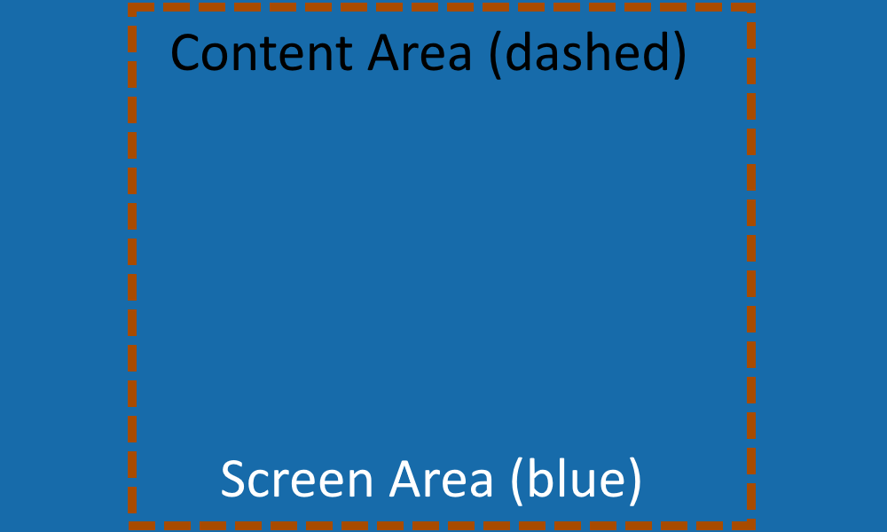

Excalibur can render the screen in various different display modes by default.

## Managing display modes

Excalibur supports multiple display modes for a game. Pass in a [[EngineOptions.displayMode|displayMode]]
option when creating a game to customize the viewport.

### Fixed Display Mode

[[DisplayMode.Fixed]] is the default, use a specified resolution for the game. Like 600x400 pixels for example.

<div class="snippet-resizer snippet-border" alt="Resize me!">

<IFrameEmbed className="snippet-resized" src="https://excaliburjs.com/excalibur-snippets/displaymode/fixed/" />

</div>

Click and drag right corner to resize!

`embed:excalibur-snippets/src/displaymode/fixed/main.ts{snippet: "displaymode.fixed"}`

### Fit Screen Display Mode

[[DisplayMode.FitScreen]] Fit to screen using as much space as possible while maintaining aspect ratio and resolution.

This is not the same as [[Screen.goFullScreen]], which uses the fullscreen api, but behaves in a similar way maintaining aspect ratio.

You may want to center your game and fit to the screen here is an example:

{/_ embed:excalibur-snippets/src/displaymode/fitscreen/main.ts{snippet: "displaymode.fitscreen.css"}` _/}

<div class="snippet-resizer snippet-border" alt="Resize me!">

<IFrameEmbed className="snippet-resized" src="https://excaliburjs.com/excalibur-snippets/displaymode/fitscreen/" />

</div>

Click and drag right corner to resize!

`embed:excalibur-snippets/src/displaymode/fitscreen/main.ts{snippet: "displaymode.fitscreen"}`

### Fill Screen Display Mode

[[DisplayMode.FillScreen]] Fill the entire screen's css width/height for the game resolution dynamically. This means the resolution of the game will change dynamically as the window is resized. This is not the same as [[Screen.goFullScreen]]

<div class="snippet-resizer snippet-border" alt="Resize me!">

<IFrameEmbed className="snippet-resized" src="https://excaliburjs.com/excalibur-snippets/displaymode/fillscreen/" />

</div>

Click and drag right corner to resize!

`embed:excalibur-snippets/src/displaymode/fillscreen/main.ts{snippet: "displaymode.fillscreen"}`

### Fit Container Display Mode

[[DisplayMode.FitContainer]] Fit to parent element width/height using as much space as possible while maintaining aspect ratio and resolution.

<div class="snippet-resizer snippet-border" alt="Resize me!">

<IFrameEmbed className="snippet-resized" src="https://excaliburjs.com/excalibur-snippets/displaymode/fitcontainer/" />

</div>

Click and drag right corner to resize!

`embed:excalibur-snippets/src/displaymode/fitcontainer/index.html{snippet: "container-css"}`

`embed:excalibur-snippets/src/displaymode/fitcontainer/index.html{snippet: "container-html"}`

`embed:excalibur-snippets/src/displaymode/fitcontainer/main.ts{snippet: "displaymode.fitcontainer"}`

### Fill Container Display Mode

[[DisplayMode.FillContainer]] will fill the entire screen's css width/height for the game resolution dynamically. This means the resolution of the game will change dynamically as the window is resized. This is not the same as [[Screen.goFullScreen]]

<div class="snippet-resizer snippet-border" alt="Resize me!">

<IFrameEmbed className="snippet-resized" src="https://excaliburjs.com/excalibur-snippets/displaymode/fillcontainer/" />

</div>

Click and drag right corner to resize!

`embed:excalibur-snippets/src/displaymode/fillcontainer/index.html{snippet: "container-css"}`

`embed:excalibur-snippets/src/displaymode/fillcontainer/index.html{snippet: "container-html"}`

`embed:excalibur-snippets/src/displaymode/fillcontainer/main.ts{snippet: "displaymode.fillcontainer"}`

### Fit Screen And Fill Display Mode

[[DisplayMode.FitScreenAndFill]] is similar to [[DisplayMode.FitScreen]] and will fit the game in the screen while preserving the original aspect ratio, but allow the excess gaps to be drawn to drawn to. This ensures there is no "letterboxing" and the entire screen is covered by canvas. You can use the [[Screen.contentArea]] to return a screen space bounding box of area of the screen guaranteed to be visible to the user.



<div class="snippet-resizer snippet-border" alt="Resize me!">

<IFrameEmbed className="snippet-resized" src="https://excaliburjs.com/excalibur-snippets/displaymode/fitscreenandfill/" />

</div>

Click and drag right corner to resize!

### Fit Container And Fill Display Mode

[[DisplayMode.FitContainerAndFill]] is similar to [[DisplayMode.FitCOntainer]] and will fit the game to the the current container preserving the original aspect ratio, but allow the excess gaps in the container to be drawn to. You can use the [[Screen.contentArea]] to return a screen space bounding box of area of the screen guaranteed to be visible to the user.


<div class="snippet-resizer snippet-border" alt="Resize me!">

<IFrameEmbed className="snippet-resized" src="https://excaliburjs.com/excalibur-snippets/displaymode/fitcontainerandfill/" />

</div>

Click and drag right corner to resize!

## Fullscreen API

The screen abstraction now supports the [browser fullscreen api](https://developer.mozilla.org/en-US/docs/Web/API/Fullscreen_API). This will cause the game to be displayed fullscreen until the user exits (usually with the escape key or by gesturing to the exit button at the top of the browser window).

<div class="snippet-resizer snippet-border" alt="Resize me!">

<IFrameEmbed className="snippet-resized" src="https://excaliburjs.com/excalibur-snippets/fullscreen/" />

</div>

Click and drag right corner to resize!

<Note>

This requires an explicit user gesture due to browser security, so wiring it into a native HTML button click is the easiest way to do this.

</Note>

`embed:excalibur-snippets/src/fullscreen/main.ts{snippet: "fullscreen"}`

```typescript
await game.screen.goFullScreen();

await game.screen.exitFullScreen();
```

By default `goFullScreen()` will use the canvas element as the root of full screen mode. If your game uses [HTML based UI](/docs/ui#html-based-ui), the HTML UI will not be included because it is not a child of the canvas element.

To include both the HTML based game UI as well as the game canvas, pass an id of an element that is the parent of both the canvas and UI. For example `goFullScreen('root')`
