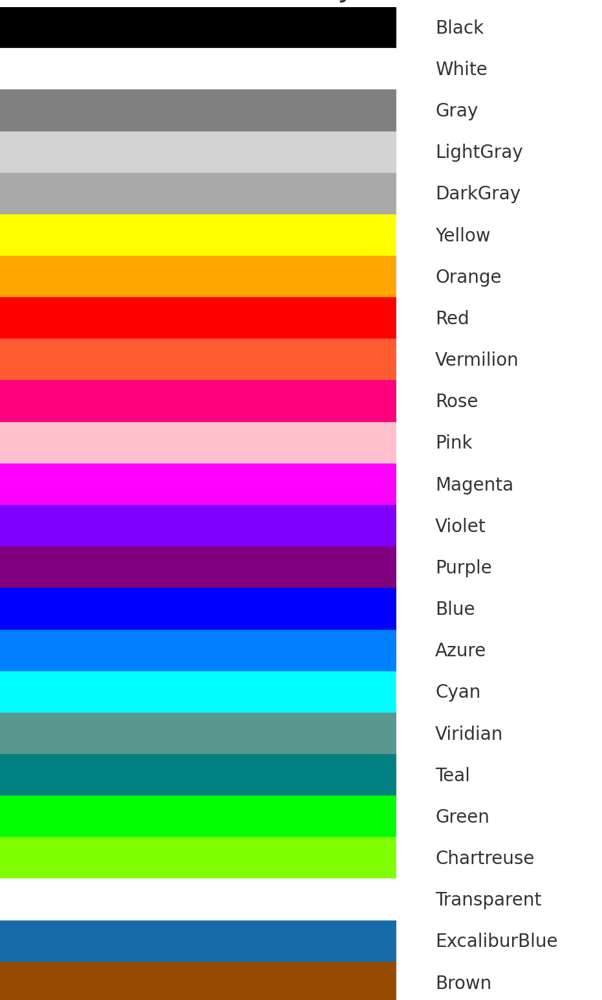
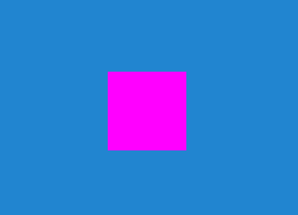

```twoslash include ex
// @module: esnext
// @allowUmdGlobalAccess
/// <reference path="../src/engine/excalibur.d.ts" />
```

## Colors

Excalibur provides some color static helpers you can use to work with Hex, RGBA and HSL colors. Colors expose different operations that allow you to change them such as lighten and darken.

### Creating colors


```ts twoslash
// @include: ex
 const r = 255;
 const g = 255;
 const b = 255;
 const a = 1.0;
 const h = 10;
 const s = 10;
 const l = 10;
 let myColor = new ex.Color(r,g,b,a)
// ---cut---
// RGBA
new ex.Color(r, g, b, a)
ex.Color.fromRGB(r, g, b, a)

// HSLA
ex.Color.fromHSL(h, s, l, a)
// Hex, alpha optional
ex.Color.fromHex('#000000')
ex.Color.fromHex('#000000FF')

// String representation of a color with rgb as default
// Options include rgb,hsl,hex
myColor.toString("rgb")
```

## Working with colors

Since Javascript does not support structs, if you change a color "constant" like [[Color.Black]]
it will change it across the entire game. You can safely use the color operations
like [[Color.lighten]] and [[Color.darken]] because they `clone` the color to
return a new color. However, be aware that this can use up memory if used excessively.

Just be aware that if you directly alter properties (i.e. [[Color.r]], etc.) , this will change it
for all the code that uses that instance of Color.

## Default Colors

Here are some of the default colors and examples of what they look like.




## Random Colors

There is a static method on the color class that allows for a random color to be provided

```ts twoslash
// @include: ex
const rndmColor = ex.Color.random();
```

## Lerping Colors

The [[Color.lerp]] static method linearly interpolates between two colors.  

The interpolation is performed in **HSL color space** for smooth hue transitions, then converted back to RGB.

- `start` — The starting `Color`
- `end` — The target `Color`
- `t` — The interpolation factor, between `0` (start) and `1` (end)

**Returns:** A new `Color` representing the interpolated result.

**Example:**

```ts twoslash
// @include: ex
// ---cut---
const mid = ex.Color.lerp(ex.Color.Red, ex.Color.Blue, 0.5); // A smooth purple blend
```


