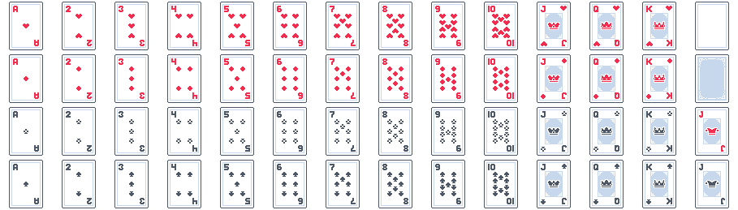

SpriteSheet is really an ordered collection of sprites from the same base image.

```typescript
const spriteSheet = new ex.SpriteSheet({
  image: imageRun,
  sprites: [...]
})
```

## Uniform Grid Based Spritesheet

If you spritesheet is a neat grid there is a static builder for you to slice up that image source. Most sprite sheets are tightly packed like so.

Some source spritesheets may have margin between sprites and an offset, like these [playing cards from Kenny.nl](https://www.kenney.nl/assets/playing-cards-pack)



```typescript

const kennyCardsImage = new ex.ImageSource(kennyCardsImageSrc);

const spriteSheet = ex.SpriteSheet.fromImageSource({
    image: kennyCardsImage,
    grid: {
        rows: 4,
        columns: 14,
        spriteWidth: 42,
        spriteHeight: 60
    },
    spacing: {
        // Optionally specify the offset from the top left of sheet to start parsing
        originOffset: { x: 11, y: 2 },  // you can now also use a Vector here i.e. vec(11,2), or new Vector(11,2),
        // Optionally specify the margin between each sprite
        margin: { x: 23, y: 5}  // you can now also use a Vector here i.e. vec(23,5), or new Vector(23,5),
    }
});
```

<IFrameEmbed src="https://excaliburjs.com/excalibur-snippets/spritesheet/" />

## Sparse Spritesheet

You can also build a spritesheet from a list of different sized source views using [[SpriteSheet.fromImageSourceWithSourceViews]] method

```typescript
const ss = ex.SpriteSheet.fromImageSourceWithSourceViews({
  image,
  sourceViews: [
    { x: 0, y: 0, width: 20, height: 30 },
    { x: 20, y: 0, width: 40, height: 50 },
  ],
})
```

## Parsing Out Discrete Images

If you pass a large sheet image into a SpriteSheet then use a Sprite via `getSprite()`, Excalibur draws a window into that larger sheet.
But what if you want a completely isolated Sprite parsed out of the host image?
What if you wanted to use that Sprite in an HTML image for UI? 
We got convenience methods to help with that.  They work exactly like `getSprite()` but they return NEW and unique Sprites and ImageElements.

```ts
const myNewSprite = ss.getSpriteAsStandalone(x,y); // new Sprite
```

or

```ts
const myNewImage = getSpriteAsImage(x,y); // new HTMLImageElement
```


