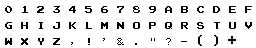

import FontQuality from '!!raw-loader!./examples/font-quality.ts';
import FontLabel from '!!raw-loader!./examples/font.ts';

You may want to display [[Text]] in your game, this can be achieved with the [[Text]], [[Font]], and [[SpriteFont]].

## Text

Text is a [raster](#raster) [graphic](#graphic) that can be used to draw text to the screen, all of the normal things that can be done with [rasters](#raster) and [graphics](#graphic) can be done with text.

Text supports both normal OS/web fonts and Sprite fonts.

Example

```typescript
var text = new ex.Text({
  text: 'This is raster text ❤️',
  font: new ex.Font({ size: 30 }),
})
```

[[Text]] is a prebuilt [[Graphic]] that can be used to draw text to the screen. Multiple lines of text are supported.

```typescript
const game = new ex.Engine({...});
const text = new ex.Text({
    text: 'Some Text Drawn Here\nNext line'
});

const actor = new ex.Actor({
    pos: ex.vec(100, 100)
});
actor.graphics.use(text);

game.currentScene.add(actor);
```

## Labels

[[Label|Labels]] are a batteries included [[Actor|Actors]] with [[Text]] built and font built in.

```typescript
const label = new ex.Label({
    text: 'Some text',
    pos: ex.vec(100, 100),
    font: new ex.Font({
        family: 'impact',
        size: 24,
        unit: ex.FontUnit.Px
    })
});
```


## Font

A [[Font]] is a traditional system or loaded web font.

Possible font options

```typescript
export interface FontOptions {
  size?: number
  unit?: FontUnit
  family?: string
  style?: FontStyle
  bold?: boolean
  textAlign?: TextAlign
  baseAlign?: BaseAlign
  direction?: Direction
  shadow?: {
    blur?: number
    offset?: Vector
    color?: Color
  }
}
```

```typescript
var text = new ex.Text({
  text: 'This is raster text ❤️',
  font: new ex.Font({
    size: 30,
    unit: FontUnit.Px,
    family: 'sans-serif',
    style: FontStyle.Normal,
    bold: false,
    textAlign: TextAlign.Left,
    baseAlign: BaseAlign.Alphabetic,
    direction: Direction.LeftToRight,
    shadow: {
      blur: 2,
      offset: ex.Vec(2, 2),
      color: ex.Color.Black,
    };
  })
});
```

<PlaygroundEmbed
  title="Font"
  code={FontLabel}
/>

### Loading External Fonts


It is recommended you load any font important to your game and not rely on any pre-installed system fonts, those will be different from computer to computer.

```typescript
const fontSource = new ex.FontSource('./Gorgeous Pixel.ttf', 'Gorgeous Pixel');

// load the font in ex.Loader or directly with .load()
await fontSource.load();

const font = fontSource.toFont({
  family: 'Gorgeous Pixel',
  color: ex.Color.White,
  size: 30,
  shadow: {
    blur: 15,
    color: ex.Color.Black
  }
});

```

It is also possible to use the [google fonts](https://fonts.google.com/) loader to do this.

```html
<link rel="preconnect" href="https://fonts.googleapis.com" />
<link rel="preconnect" href="https://fonts.gstatic.com" crossorigin />
<link
  href="https://fonts.googleapis.com/css2?family=Roboto:wght@100&display=swap"
  rel="stylesheet"
/>
```

```typescript
const font = new ex.Font({
  family: 'Roboto',
  size: 24,
  unit: ex.FontUnit.Px,
})
```

One potential issue with using web fonts from google is they won't render correctly until loaded see [article for details](https://erikonarheim.com/posts/dont-test-fonts/).

```typescript
async function waitForFontLoad(font, timeout = 2000, interval = 100) {
  return new Promise((resolve, reject) => {
    // repeatedly poll check
    const poller = setInterval(async () => {
      try {
        await document.fonts.load(font);
      } catch (err) {
        reject(err);
      }
      if (document.fonts.check(font)) {
        clearInterval(poller);
        resolve(true);
      }
    }, interval);
    setTimeout(() => clearInterval(poller), timeout);
  });
}

// Load font before game start
await waitForFontLoad('24px Roboto');

const game = new ex.Engine({...})
await game.start();
```

## Text Quality

Depending on your game you may run into a situation where you have blurry looking text, this can be caused by a few reasons and fixed by adjusting a few settings.

Most of the strategies involve artificially giving the text more pixels to work with to render a more crisp result.

1. Increase the `quality` (default 2), this works by upscaling the bitmap the text is drawn to internally, more pixels can yield higher fidelity.
2. Increase the "resolution" of your game using the `pixelRatio`, this is especially necessary if you have a very low resolutions (less than 500x500).
3. If you cannot upscale (or don't want to) you need to line up your font glyphs to align with pixels in the canvas.
4. Reach for a sprite font tailored for the resolution you're working in (often this is useful in low res situations)>


<PlaygroundEmbed
  title="FontQuality"
  code={FontQuality}
/>


## SpriteFont

Sometimes you want to use a custom font based on your [spritesheet](#spritesheet) of character glyphs

Example `sprite-font.png` file:



```typescript
const spriteFontImage = new ex.ImageSource('./path/to/sprite-font.png')

const spriteFontSheet = ex.SpriteSheet.fromImageSource({
  image: spriteFontImage,
  grid: {
    rows: 3,
    columns: 16,
    spriteWidth: 16,
    spriteHeight: 16
  }
});
const spriteFont = new ex.SpriteFont({
    alphabet: '0123456789abcdefghijklmnopqrstuvwxyz,!\'&."?- ',
    caseInsensitive: true,
    spriteSheet: spriteFontSheet
  });
});
const text = new ex.Text({
  text: 'This is sprite font text!!',
  font: spriteFont
});
```
