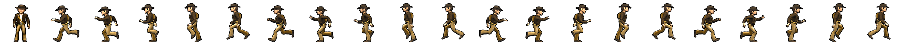

import AnimationExample from '!!raw-loader!./examples/animation.ts'
import AnimationExample2 from '!!raw-loader!./examples/animation-coords.ts'
import playerRun from './examples/player-run.png'

# Animation

[[Animation|Animations]] are a series of graphics that take a specific duration in milliseconds. Each of these units is called a "Frame". There are a few playing strategies as well to consider

```twoslash include ex
/// <reference path="../src/engine/excalibur.d.ts" />

const newSprite = new ex.Sprite({
  image: new ex.ImageSource('./player-run.png'),
  width: 96,
  height: 96,
});
const circle = new ex.Circle({
  radius: 50,
  color: ex.Color.Red,
});
const rect = new ex.Rectangle({
  width: 50,
  height: 50,
  color: ex.Color.Red,
});
const triangle = new ex.Polygon({
  points: [ex.vec(10 * 5, 0), ex.vec(0, 20 * 5), ex.vec(20 * 5, 20 * 5)],
  color: ex.Color.Yellow
});
```

```twoslash include animation
const animation = new ex.Animation({
  frames: [
    {
      graphic: newSprite,
      duration: 500,
    },
    {
      graphic: circle,
      duration: 1000,
    },
    {
      graphic: rect,
      duration: 1500,
    },
    {
      graphic: triangle,
      duration: 2000,
    },
  ],
});
```

```ts
export enum AnimationStrategy {
  /**
   * Animation ends without displaying anything
   */
  End = 'end',
  /**
   * Animation loops to the first frame after the last frame
   */
  Loop = 'loop',
  /**
   * Animation plays to the last frame, then backwards to the first frame, then repeats
   */
  PingPong = 'pingpong',

  /**
   * Animation ends stopping on the last frame
   */
  Freeze = 'freeze',
}
```


```ts twoslash
// @include: ex
// ---cut---
// @include: animation
```

## Animation From SpriteSheet

Animations can also be constructed quickly from [`ex.SpriteSheets`](#SpriteSheet).

Animation frames can be created by hand in the following example by specifying the sprite sheet indices from the top left, top to bottom (row major order).



<PlaygroundEmbed code={AnimationExample} />

Additionally you can specify the (x, y) positions of sprites in the SpriteSheet of each frame, for example (0, 0) is the the top left sprite, (0, 1) is the sprite directly below that, and so on.

<PlaygroundEmbed code={AnimationExample2} />

## Events

Animations also emit events per frame, per loop, and per end (if it completes).

```ts twoslash
// @include: ex
// @include: animation
// ---cut---
animation.events.on('loop', (a) => {
  console.log('loop')
})
animation.events.on('frame', (f) => {
  console.log('frame')
})
animation.events.on('end', (a) => {
  console.log('ended')
})
```
