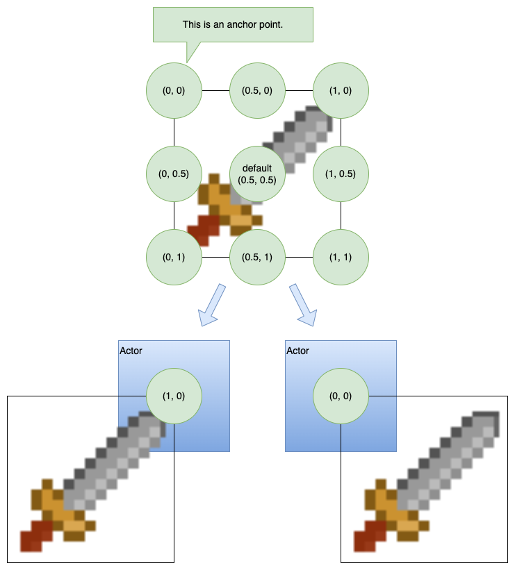

There is a new component, `ex.GraphicsComponent` to work with these graphics with `ex.Actor`'s and other `ex.Entity`'s

The `ex.GraphicsComponent` allows users to manage graphics with Actors and Entities in an easy way

## How to use the Graphics Component

1. Graphics using [[ImageSource|images]] (and any [[Resource]]) must be [loaded](assets) before use
2. Graphics like [[Sprite|Sprites]] are like a window into an [[ImageSource|image]]
3. Graphics like [[Canvas]] produce internal bitmap's which are large in memory and should be used sparingly or cached
4. Graphics can be added to the [[GraphicsComponent]] on an [[Actor]] or [[Entity]]
5. Direct access to the [[ExcaliburGraphicsContext]]

For most games, you will be using the graphics component off of [[Actor|Actors]] or plain [[Entity|Entities]].

```typescript
const image = new ex.ImageSource('./path/to/my/image.png')
await game.start()

const actor = new Actor({
  x: 100,
  y: 100,
  anchor: ex.vec(0.5, 1), // Optional value that controls the position of the image.
})

actor.graphics.use(image.toSprite())
```

### Adding/Showing graphics

The graphics component allows developers to save named graphics to avoid passing around graphic object references if desired. These can be used to show specific graphics.

```typescript
actor.graphics.add('jump', jumpAnimation)
actor.graphics.show('jump') // display the graphic
// equivalent to
actor.graphics.show(jumpAnimation) // display the graphic
actor.graphics.hide() // hide the graphic
```

If no name is specified when added to the graphics component it is considered the 'default' graphic and is shown automatically.

```typescript
// graphic considered 'default' and displayed automatically
actor.graphics.add(jumpAnimation)
```

### Component Specific Overrides

- `visible: boolean`

  - Shows or hides the all the graphics for this component

- `opacity: number`

  - Applies an opacity to all the graphics shown for this component

- `offset: Vector`

  - Offset in pixels to shift the graphics for this component

- `anchor: Vector`

  - Anchor to apply to all drawings in this component if set, if null the drawing's anchor is respected by default (.5, .5) which centers the drawing.

    

### Accessing the Graphics context

The graphics component allows access to the underlying graphics context.

```typescript
const actor = new ex.Actor({...});
actor.graphics.onPostDraw = (ctx: ex.ExcaliburGraphicsContext) => {
  ctx.save();
  ctx.z = 99;
  ctx.drawLine(ex.vec(0, 0), ex.vec(200, 200), ex.Color.Green, 10);
  ctx.restore();
}
```

### Multiple Graphics at Once

Sometimes you want to draw multiple pieces of graphics at once! There are two recommended ways to accomplish this!

#### GraphicsGroup

[[GraphicsGroup|Graphics groups]] allow you to compose multiple graphics together into 1. This can be useful if you have multi layered or complex graphics requirements. One limitation however is you can only influence the relative offset from you Actor.

```typescript
const healthBarActor = new ex.Actor({...})

const healthBarRectangle = new ex.Rectangle({
  width: 140,
  height: 5,
  color: new ex.Color(0, 255, 0)
});

const healthBarText = new ex.Text({
  text: 'A long piece of text is long',
  font: new ex.Font({
    size: 20,
    family: 'Times New Roman'
  })
});

const group = new ex.GraphicsGroup({
  members: [
    { graphic: healthbarRectangle, pos: ex.vec(0, -70)},
    { graphic: healthBarText, pos: ex.vec(0, -70)}
  ]
});

healthBarActor.graphics.use(group);
```

#### Child Actor or Entity

If you need independent articulation and a lot of control over positioning, rotation, and scale this is this strategy to reach for. One example is you might have a main actor, and a child actor for every limb of a paper doll.

```typescript

import { Resources } from './Resources';

class PaperDoll extends ex.Actor {
  this.leftArm = new ex.Actor({
    pos: ex.vec(-10, 10)
  });
  this.rightArm = new ex.Actor({
    pos: ex.vec(10, 10)
  });
  this.head = new ex.Actor({
    pos: ex.vec(0, -10)
  });
  this.body = new ex.Actor({
    pos: ex.vec(0, 20)
  });
  this.leftLeg = new ex.Actor({
    pos: ex.vec(-10, 30)
  });
  this.rightLeg = new ex.Actor({
    pos: ex.vec(10, 30)
  });

  constructor() {
    this.leftArm.graphics.use(Resources.LeftArm);
    this.rightArm.graphics.use(Resources.RightArm);

    this.head.graphics.use(Resources.Head);
    this.body.graphics.use(Resources.Body);

    this.leftLeg.graphics.use(Resources.LeftLeg);
    this.rightLeg.graphics.use(Resources.RightLeg);
  }
}
```
