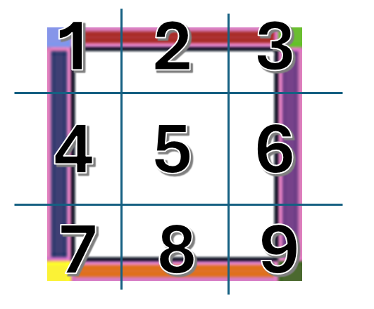

## Overview

The NineSlice is a Graphic which uses a 2D technique allowing for reuse of an image at various sizes without needing to prepare multiple assets. It involves splitting the image into nine portions, so that when you re-size the Sprite, the different portions scale or tile (that is, repeat in a grid formation) in different ways to keep the Sprite in proportion. This is useful when creating patterns or Textures, such as walls or floors in a 2D environment.

For example: let's say this is your source texture sprite.


The nine slice Graphic will break that texture up into 9 seperate parts.



Then based on your output parameters specified it will 'redraw' this texture to whatever specified output graphic you want.

You can set parameters under `sourceConfig` properties to control the margins. This lets you dial in where the module 'slices' your texture up. For example, with the example 64 pixel x 64 pixel sprite, we can set the top/bottom margins to 5 pixels, and the left/right margins to 6 pixels to get this slicing.


## Configuration

```typescript
export type NineSliceConfig = GraphicOptions & {
  /*
  overwrites the GraphicOptions width/height param, as it is required for this module
  */
  width: number;
  height: number;

  /*
  source is the loaded ImageSource, which you can load manually or through a loader  
  */
  source: ImageSource;

  /*
  sourceConfig has all the parameters necessary to cut up the input texture properly, width and height are the overall pixel dimensions of the texture and the margins define the overall cutting boundaries in pixels
  */

  sourceConfig: {
    width: number;
    height: number;
    topMargin: number;
    leftMargin: number;
    bottomMargin: number;
    rightMargin: number;
  };

  /*
  destination configuration specifies if you want center piece drawn, the '5' frame, and how you want the algorithm to manipulate the frame textures horizontally and vertically
  */
  destinationConfig: {
    drawCenter: boolean;
    stretchH: NineSliceStretch; //exported enum
    stretchV: NineSliceStretch; //exported enum
  };
};
```

## Usage

This is a Graphic object so it can be used on either an Actor or ScreenElement entity as a primary graphic, or as a part of a graphic group.

```ts
export class Player extends Actor {
  private mynineslice: NineSlice;
  constructor() {
    super({ name: 'player', width: 300, height: 128, pos: new Vector(100, 100) });
    const myninesliceconfig: NineSliceConfig = {
      width: 300,
      height: 128,
      source: Resources.myImage,
      sourceConfig: {
        width: 64,
        height: 64,
        topMargin: 5,
        leftMargin: 6,
        bottomMargin: 5,
        rightMargin: 6
      },
      destinationConfig: {
        drawCenter: true,
        stretchH: NineSliceStretch.TileFit,
        stretchV: NineSliceStretch.TileFit
      }
    };

    this.mynineslice = new NineSlice(myninesliceconfig);
    this.graphics.use(this.mynineslice);
  }
}
```

## Stretch Options

There are two parameters in the configuration that need to be set to dictate the behavior of the drawing desitnation graphic, `stretchH` and `stretchV`. They are of type `NineSliceStretch`. The `stretchH` parameter will dictate the behavior of tile slices 2,5, and 8, as these frames can stretch horizontally. The `stretchV` parameter dictates how tile slices 4,5,6 behave, as they can stretch vertically.

The class includes some exported enumerated options:

```ts
export enum NineSliceStretch {
  Stretch,
  Tile,
  TileFit
}
```

### Stretch


The stretch setting takes input slice and paints in across the entirety of the output dimensions, causing a stretching of the texture as its redrawn, but this is gauranteed to fit the designated area, just with some potential image distortion.

### Tile


The tile setting takes input slice and paints in across the entirety of the output dimensions in a repeating texture fashion that will not distort the source image at all, but may not fit properly in the destination space, leaving a potentially partial drawing of the texture remaining.

### TileFit


The tile fit setting takes the input slice and paints it across the entirety of the output dimensions in a repeating texture, but it 'resizes' the output tiling to create a 'best fit' of the texture, which is calculated to fit properly, but may have some squished and distorted texture.

## Draw Center

```ts
destinationConfig: {
    drawCenter: boolean;  //<------------ this property
    ...
  };
```

The boolean flag `drawCenter` under `destinationConfig` tells the module if the section 5, middle section should be drawn or not, if this is set to `false` then it gets skipped in its draw routine, and remains 'transparent' so that the NineSlice is more of a border or frame Graphic.


Look, Ma! No Center!

## Changing the Graphic

At this point, if you modify the graphic details, it is recommended to recreate a new instance of the graphic and update your Actor or Screen Element if it needs changed. The existing instance will not dynmically update itself.
