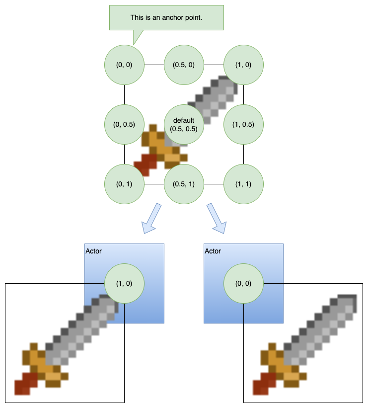

There is a new component, `ex.GraphicsComponent` to work with these graphics with `ex.Actor`'s and other `ex.Entity`'s

The `ex.GraphicsComponent` allows users to manage graphics with Actors and Entities in an easy way

## How to use the Graphics Component

1. Graphics using [[ImageSource|images]] (and any [[Resource]]) must be [loaded](assets) before use
2. Graphics like [[Sprite|Sprites]] are like a window into an [[ImageSource|image]]
3. Graphics like [[Canvas]] produce internal bitmap's which are large in memory and should be used sparingly or cached
4. Graphics can be added to the [[GraphicsComponent]] on an [[Actor]] or [[Entity]]
5. Direct access to the [[ExcaliburGraphicsContext]]

For most games, you will be using the graphics component off of [[Actor|Actors]] or plain [[Entity|Entities]].

```typescript
const image = new ex.ImageSource('./path/to/my/image.png')
await game.start()

const actor = new Actor({
  x: 100,
  y: 100,
  anchor: ex.vec(0.5, 1), // Optional value that controls the position of the image.
})

actor.graphics.use(image.toSprite())
```

### Adding/Showing graphics

The graphics component allows developers to save named graphics to avoid passing around graphic object references if desired. These can be used to show specific graphics.

```typescript
actor.graphics.add('jump', jumpAnimation)
actor.graphics.show('jump') // display the graphic
// equivalent to
actor.graphics.show(jumpAnimation) // display the graphic
actor.graphics.hide() // hide the graphic
```

If no name is specified when added to the graphics component it is considered the 'default' graphic and is shown automatically.

```typescript
// graphic considered 'default' and displayed automatically
actor.graphics.add(jumpAnimation)
```

### Component Specific Overrides

- `visible: boolean`

  - Shows or hides the all the graphics for this component

- `opacity: number`

  - Applies an opacity to all the graphics shown for this component

- `offset: Vector`

  - Offset in pixels to shift the graphics for this component

- `anchor: Vector`

  - Anchor to apply to all drawings in this component if set, if null the drawing's anchor is respected by default (.5, .5) which centers the drawing.

    

### Accessing the Graphics context

The graphics component allows access to the underlying graphics context.

```typescript
const actor = new ex.Actor({...});
actor.graphics.onPostDraw = (ctx: ex.ExcaliburGraphicsContext) => {
  ctx.save();
  ctx.z = 99;
  ctx.drawLine(ex.vec(0, 0), ex.vec(200, 200), ex.Color.Green, 10);
  ctx.restore();
}
```

### Layers

The layer's component adds a way for multiple [graphics](#graphics) to be on top or behind each other for a certain actor or entity.

Layers can be ordered numerically, larger negative layers behind, and positive layers in front.

```typescript
actor.graphics.layers.create({ name: 'background', order: -1 })
actor.graphics.layers.create({ name: 'foreground', order: 1 })

actor.graphics.layers.get('background').show(myBackground)
actor.graphics.layers.get('foreground').show(myForeground)

// no longer display the background
actor.graphics.layers.get('background').hide()
```

There is always a layer named `'default'` at `order: 0`

```typescript
actor.graphics.show(myAnimation)
// is equivalent to
actor.graphics.layers.get('default').show(myAnimation)
```
