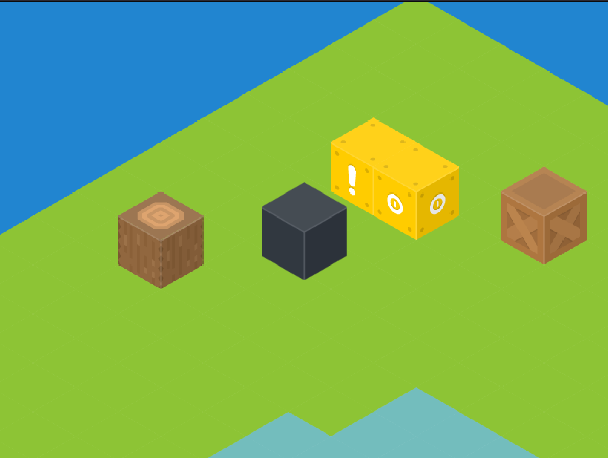
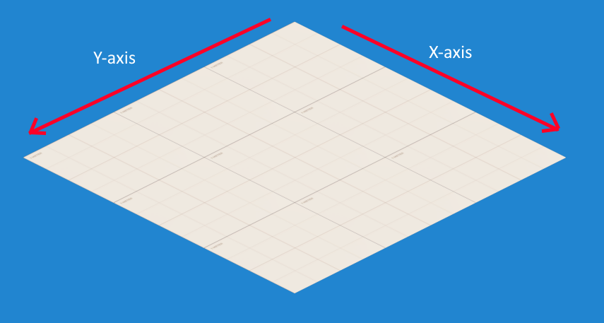
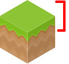
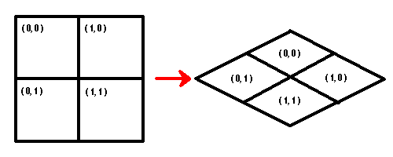
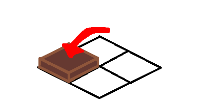
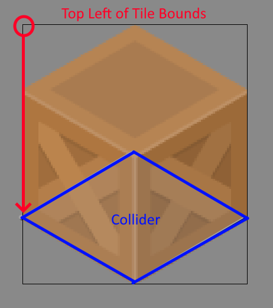
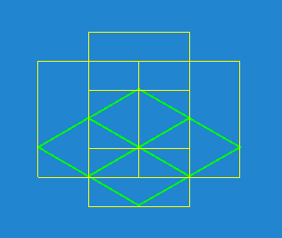

Excalibur can produce isometric style tile maps! Isometric tilemaps, also known as 2.5D, provide a way to draw maps from a simulated 45 degree camera view.



In Excalibur the x-axis moves down the top right edge, and the y-axis moves down the top left edge.



## Isometric Map Usage

Use the excalibur type [[IsometricMap]] for drawing isometric grids! (They also support custom colliders via the same mechanism as `ex.TileMap`)

```typescript
const game = new ex.Engine({...});

const isoMap = new ex.IsometricMap({
    pos: ex.vec(250, 10),
    tileWidth: 32,
    tileHeight: 16,
    columns: 15,
    rows: 15
});

game.currentScene.add(isoMap);

```

The tilemap is composed of [[IsometricTile]]'s which are [[Entity|Entities]] with a [[IsometricEntityComponent]]. The [[IsometricEntityComponent]] can be applied to any entity that needs to be correctly sorted in the drawing order to preserve the isometric illusion, this is useful if you have players or game objects that move around the map.

The [[IsometricEntitySystem]] generates a new z-index based on the `elevation` and [[y position|TransformComponent]] of an entity with [[IsometricEntityComponent]].

## Selecting an appropriate Tile Height

When defining the `tileHeight` there are a few considerations you should make relative to your asset. Usually the `tileHeight` is half your graphics total height. With other art assets the `tileHeight` can be different, in this case roughly half the height of the asset. This height will depend on your art assets.



## Converting Coordinates to Tile Coordinates

World space coordinates can be converted to the tile x/y coordinate

```typescript
const isoMap = new ex.IsometricMap({...});

let tileCoord = ex.vec(0, 0);
game.input.pointers.on('move', evt => {
  // Convert world position coordinates to tile x/y
  tileCoord = isoMap.worldToTile(evt.worldPos);
});

```

You can also get the top/left world space coordinate given a tile coordinate.

```typescript
const isoMap = new ex.IsometricMap({...});

const tileCoord = ex.vec(0, 0);

const worldSpaceCoord = isoMap.tileToWorld(tileCoord);
```



## Adding Graphics to IsometricTiles

Graphics can be added to an [[IsometricTile]], graphics are drawn differently from other parts of excalibur. They are drawn from the bottom left, this is done to help preserve the illusion of placing tiles on top of a grid.



```typescript
const isoMap = new ex.IsometricMap({...});

const image = new ex.ImageSource('./path/to/image.png');
await image.load();

const sprite = image.toSprite();

for (let tile of isoMap.tiles) {
    tile.addGraphic(sprite);
}
```

To switch the default behavior and render graphics from the top of a tile, add `renderFromTopOfGraphic` to the constructor. This can be useful if your Isometric tiles are conceptually "flat" without any perceived height.

```typescript
const isoMap = new ex.IsometricMap({
    ...
    renderFromTopOfGraphic: true;
});
```

## Adding Colliders to IsometricTiles

Colliders can be added to tiles, colliders are positioned relative to the top left of the tile's asset bounds. You can calculate this by looking at your rectangular tile asset and counting the pixels down from the top left.



In this example the tile art asset has a width of 111 pixels and a height of 128 pixels.

:::warning

IsometricTile's need to be set to `solid = true` for them to act as `CollisionType.Fixed` colliders.

:::

```typescript
const isoMap = new ex.IsometricMap({
  tileWidth: 111,
  tileHeight: 64, // note the tileHeight is half the asset height
  columns: 2,
  rows: 2
});

for (let tile of isoMap.tiles) {
  tile.solid = true;
  tile.addCollider(ex.Shape.Polygon([ex.vec(0, 95), ex.vec(55, -32 + 95), ex.vec(111, 95), ex.vec(55, 32 + 95)]));
}
```

The geometry is shown here in green and the asset graphics bounds are shown in yellow.


