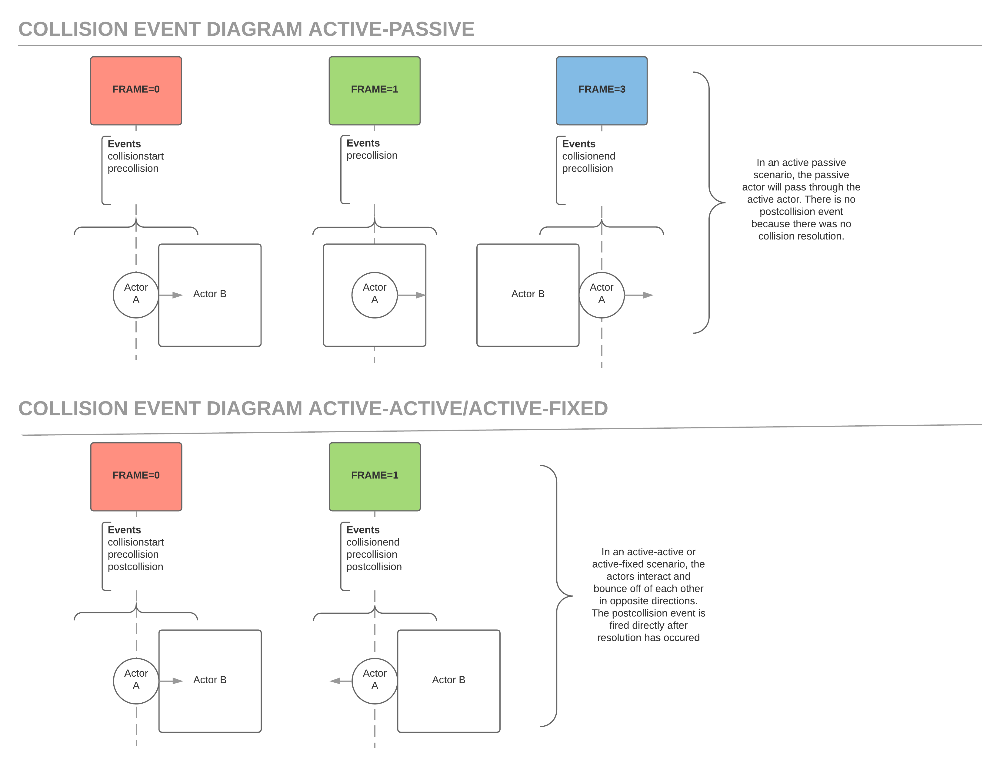

## Collision Event Lifecycle



### Collision Start "collisionstart"

The **collisionstart** event is fired when a [[Body|physics body]], usually attached to an actor, first starts colliding with another [[Body|body]], and will not fire again while in contact until the the pair separates and collides again.

Use cases for the **collisionstart** event may be detecting when an actor has touch a surface (like landing) or if a item has been touched and needs to be picked up.

```typescript
actor.on('collisionstart', () => {...})
// or
actor.body.collider.on('collisionstart', () => {...})
```

### Collision End "collisionend"

The **collisionend** event is fired when two [[Body|physics bodies]] are no longer in contact. This event will not fire again until another collision and separation.

Use cases for the **collisionend** event might be to detect when an actor has left a surface (like jumping) or has left an area.

```typescript
actor.on('collisionend', () => {...})
// or
actor.body.collider.on('collisionend', () => {...})
```

### Pre Collision "precollision"

The **precollision** event is fired **every frame** where a collision pair is found and two bodies are intersecting.

This event is useful for building in custom collision resolution logic in Passive-Passive or Active-Passive scenarios. For example in a breakout game you may want to tweak the angle of ricochet of the ball depending on which side of the paddle you hit.

```typescript
actor.on('precollision', () => {...})
// or
actor.body.collider.on('precollision', () => {...})
```

### Post Collision "postcollision"

The **postcollision** event is fired for **every frame** where collision resolution was performed. Collision resolution is when two bodies influence each other and cause a response like bouncing off one another. It is only possible to have _postcollision_ event in Active-Active and Active-Fixed type collision pairs.

Post collision would be useful if you need to know that collision resolution is happening or need to tweak the default resolution.

```typescript
actor.on('postcollision', () => {...})
// or
actor.body.collider.on('postcollision', () => {...})
```
