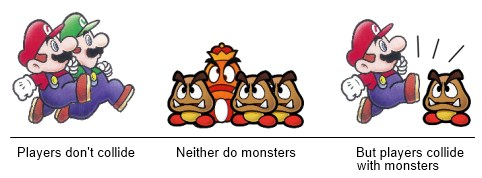

Collision groups are useful when you want to filter the collision that are possible between colliders
on a granular level above and beyond collision type. This idea is also known as collision layers, collision filters, or collision filtering.

Collision groups provide an efficient way optimized in Excalibur to sort colliders into possible colliders without needed custom logic in collision event handlers.

## Motivating example

To help demonstrate how collision groups work to filter collisions, let's consider a simple platformer that has players, enemies, and floors.

The rules of our game:

1. Players do not collide with each other, but players do collide with enemies and the floor.
2. Enemies do not collide with each other, but they collide with players and the floor.



Additional info: see Box2D [collision filtering tutorial](https://www.iforce2d.net/b2dtut/collision-filtering), this is modeled after their approach. See Box2D [filter reference](https://box2d.org/documentation/structb2_filter.html)

## How Collision Groups Work

:::note

By default in Excalibur, collision groups created with [[CollisionGroupManager.create]] do not collide with themselves. Except for the special default group `CollisionGroup.All`

This default behavior can by altered by providing the `category` and `mask` to the the `new CollisionGroup(...)` constructor or by using the `CollisionGroup.collidesWith` helper.

:::

Think about collision groups is as different "categories" (other engines like Unity call collision groups "layers"). Each group is represented by a unique 32 bit integer represented by a power of 2. [[CollisionGroupManager.create]] works by assigning a unique power of 2 to each group (meaning only 32 groups are possible).

So the group bit categories in our example are

```typescript
playersGroupCategory = 0b0001
enemyGroupCategory = 0b0010
floorGroupCategory = 0b0100
```

Each group also contains a `mask`, this mask has the bit position of the groups it can collided with set to 1. The player group category is the least significant bit (furthest right), if a collision group mask has that bit set to 1 it means it collides with the player group.

By default the mask for a collision group is set to collide with every group apart from itself.

```typescript
playersGroupMask = 0b11111111_11111111_11111111_11111110
enemyGroupMask = 0b11111111_11111111_11111111_11111101
floorGroupMask = 0b11111111_11111111_11111111_11111011
```

In Excalibur, the `CollisionGroup.canCollide` logic works by performing a bitwise `AND` between the current group `category` and the target groups's `mask`

```typescript
// Create a group for each distinct category of "collidable" in your game
const playerGroup = ex.CollisionGroupManager.create('player')
const enemyGroup = ex.CollisionGroupManager.create('enemyGroup')
const floorGroup = ex.CollisionGroupManager.create('floorGroup')

// 0b0001 & 0b11111111_11111111_11111111_11111110 = 0
// the mask is set to collide with all groups except player
playerGroup.canCollide(playerGroup) // false

// 0b0001 & 0b11111111_11111111_11111111_11111101 = 1
// the enemy mask has the player bit and floor bit set, so enemy and player can collide
playerGroup.canCollide(enemyGroup) // true

// 0b0001 & 0b11111111_11111111_11111111_11111011 = 1
// the floor mask has the player bit and enemy bit set, so player and floor can collide
playerGroup.canCollide(floorGroup) // true
```

## Using Collision Groups

Collision groups can be supplied at constructor time when building an actor. Here is a pattern you can follow

```typescript
// player.ts

// Export the collision group, useful for referencing in other actors
export const PlayerCollisionGroup = CollisionGroupManager.create('player')

export class Player extends Actor {
  constructor() {
    super({
      name: 'player',
      pos: vec(200, 200),
      collisionType: CollisionType.Active,
      collisionGroup: PlayerCollisionGroup,
    })
  }
}
```

## CollidesWith Helper

The collides with helper can assist in crafting groups that collide with other groups without needing to provide bitmasks.

To make sense of this helper let's take a look at the new group `playersCanCollideWith`.

In the example below here are the collision group category bits.

```typescript
playersGroup = 0b0001
npcGroup = 0b0010
floorGroup = 0b0100
enemyGroup = 0b1000
```

And the masks

```typescript
playersGroupMask = 0b11111111_11111111_11111111_11111110
npcGroupMask = 0b11111111_11111111_11111111_11111101
floorGroupMask = 0b11111111_11111111_11111111_11111011
enemyGroupMask = 0b11111111_11111111_11111111_11110111
```

The `CollisionGroup.collidesWith(...)` helper makes a new group that is all of the categories OR'd together then inverted. So in the example below creating the const playersCanCollideWith = CollisionGroup.collidesWith([ playersGroup, floorGroup, enemyGroup,]) group.

Working out how the helper works

```typescript
playersCanCollideWith = ~(0b0001 | 0b0100 | 0b1000) = 0b0010
playersCanCollideWithMask = ~(0b0010) = 0b11111111_11111111_11111111_11111101
```

Note the group 'playersCanCollideWith' is equivalent to the npc group. playersCanCollideWith collides with playersGroup, floorGroup, and enemyGroup

```typescript
// Create a group for each distinct category of "collidable" in your game

const playerGroup = ex.CollisionGroupManager.create('player')
const npcGroup = ex.CollisionGroupManager.create('npcGroup')
const floorGroup = ex.CollisionGroupManager.create('floorGroup')
const enemyGroup = ex.CollisionGroupManager.create('enemyGroup')

// Define your rules
// playersCanCollideWith = ~(0b0001 | 0b0100 | 0b1000) = 0b0010
// playersCanCollideWithMask = ~(0b0010) = 0b11111111_11111111_11111111_11111101
// Note the group 'playersCanCollideWith' is equivalent to the npc group. playersCanCollideWith collides with playersGroup, floorGroup, and enemyGroup
const playersCanCollideWith = ex.CollisionGroup.collidesWith([
  playersGroup, // collide with other players
  floorGroup, // collide with the floor
  enemyGroup, // collide with enemies
])

const enemiesCanCollideWith = ex.CollisionGroup.collidesWith([
  playerGroup, // collide with players
  floorGroup, // collide with the floor
])

const npcGroupCanCollideWith = ex.CollisionGroup.collidesWith([
  floorGroup, // only collides with the floor
])

const player = new ex.Actor({
  collisionGroup: playersCanCollideWith,
})

const npc = new ex.Actor({
  collisionGroup: npcGroupCanCollideWith,
})

const enemy = new ex.Actor({
  collisionGroup: enemiesCanCollideWith,
})

const floor = new ex.Actor({
  pos: ex.vec(100, 400),
  width: 100,
  height: 20,
  collisionType: ex.CollisionType.Fixed
  collisionGroup: floorGroup,
})
```
