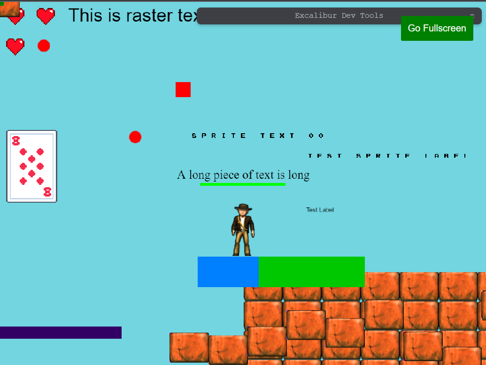
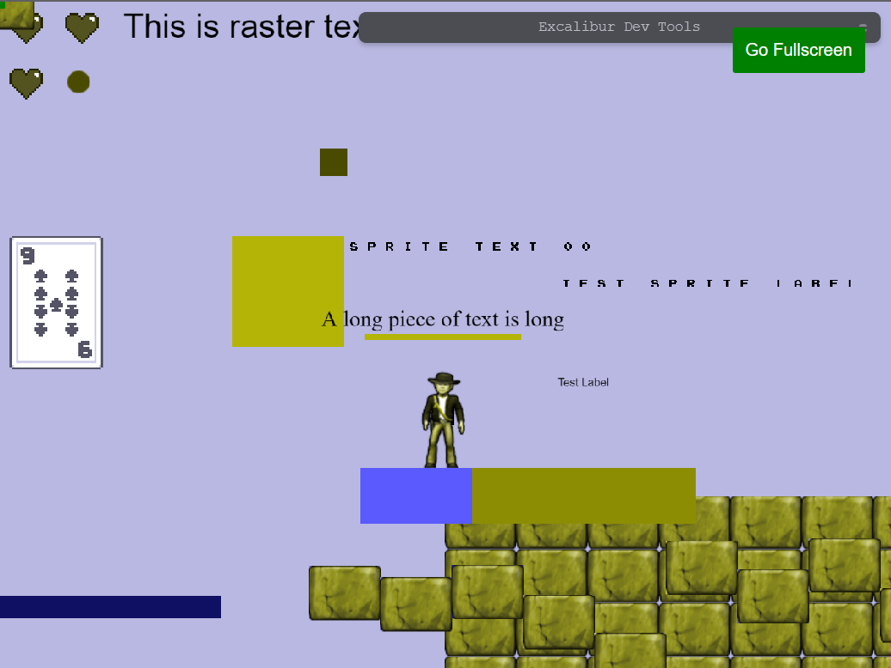
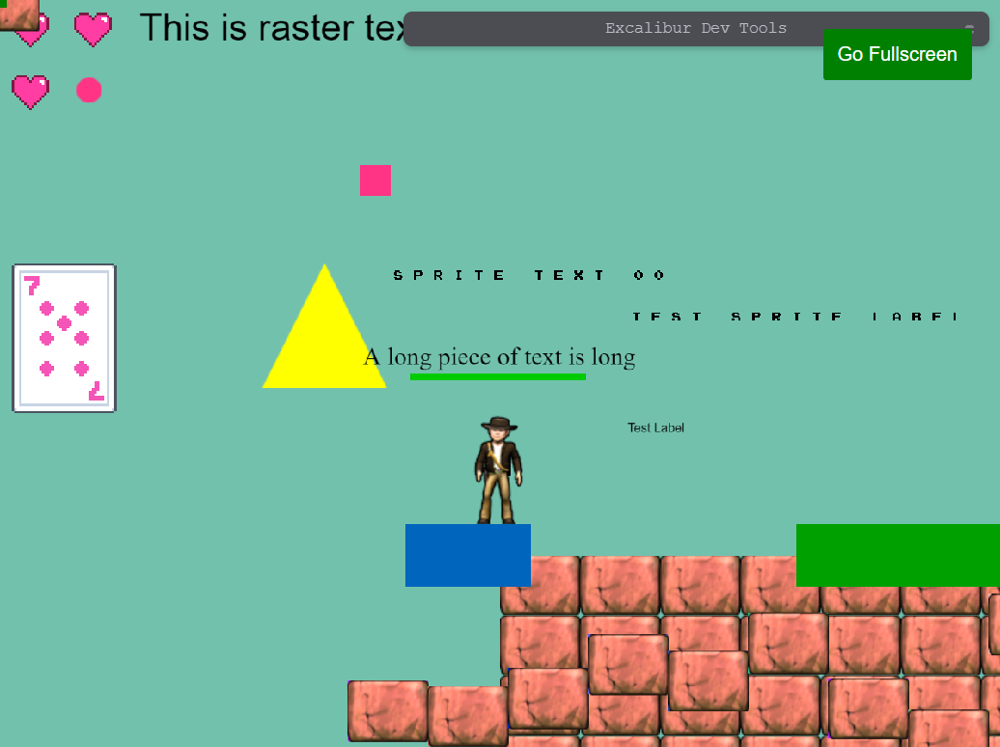
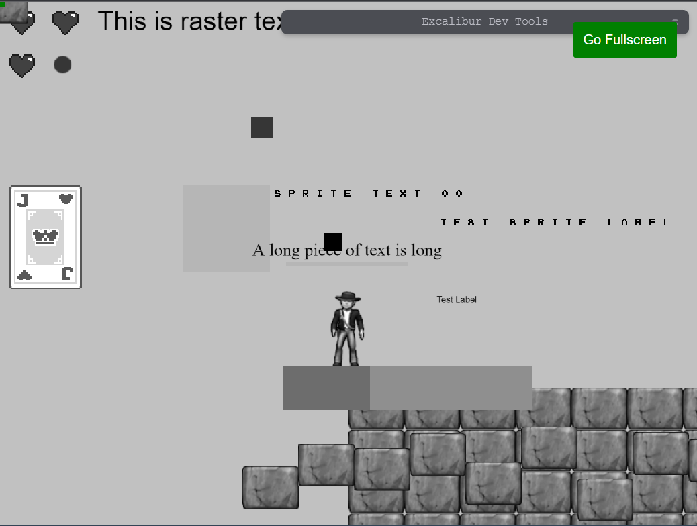

[[PostProcessor|PostProcessors]] are a way to quickly modify every pixel on the screen with WebGL fragment shaders. This can be useful to give your game a certain aesthetic or effect.

## Color Blindness

Choosing colors that are friendly to players with color blindness is an important consideration when making a game.

There is a significant portion of the population that has some form of color blindness,
and choosing bad colors can make your game unplayable.

The three most common forms of [color blindness](https://en.wikipedia.org/wiki/Color_blindness) can be simulated or corrected. By default the [[ColorBlindnessPostProcessor]] corrects. The algorithm is originally sourced from http://www.daltonize.org/.

- [[ColorBlindnessMode.Protanope|Protanope]]
- [[ColorBlindnessMode.Deuteranope|Deuteranope]]
- [[ColorBlindnessMode.Tritanope|Tritanope]]

<Note>

The color blindness correction is only an attempt to bump the colors into differentiable range. It is still best when designing to pick color blind friendly colors and to not use color to communicate information in your games without something else like a glyph. Remember, the best practice is to design with color blindness in mind.

</Note>

### Original

Here is the original game with no postprocessing applied.



### Simulation

```typescript
const game = new ex.Engine({...});

// simulate deuteranope
const colorblind = new ex.ColorBlindnessPostProcessor(ex.ColorBlindnessMode.Deuteranope, true);

game.graphicsContext.addPostProcessor(colorblind);

```



### Correction

```typescript
const game = new ex.Engine({...});

// correct deuteranope
const colorblind = new ex.ColorBlindnessPostProcessor(ex.ColorBlindnessMode.Deuteranope);

game.graphicsContext.addPostProcessor(colorblind);

```



## Custom Shader based Post Processors

Post processors can also be use to produce some interesting custom effects.

There is a helper class [[ScreenShader]] to help build shaders for post processing. The only things that come predefined are the:

1.  `v_texcoord` representing the current UV from [0, 1]
2.  `u_texture` which is the texture representing the screen pixels

In this example we can make the entire game gray scale:

```typescript
class GrayScalePostProcessor implements ex.PostProcessor {
  private _shader: ex.ScreenShader
  initialize(gl: WebGLRenderingContext): void {
    this._shader = new ex.ScreenShader(
      `#version 300 es
    precision mediump float;

    // our texture
    uniform sampler2D u_image;

    // the texCoords passed in from the vertex shader.
    in vec2 v_texcoord;

    out vec4 fragColor;

    void main() {
      vec4 tex = texture(u_image, v_texcoord);
      float avg = 0.2126 * tex.r + 0.7152 * tex.g + 0.0722 * tex.b;
      fragColor = vec4(avg, avg, avg, 1.0);
    }`
    )
  }

  getLayout(): ex.VertexLayout {
    return this._shader.getLayout()
  }

  getShader(): ex.Shader {
    return this._shader.getShader()
  }
}
```


