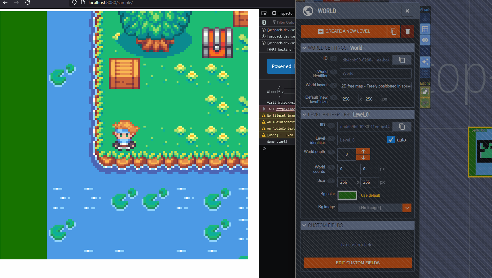
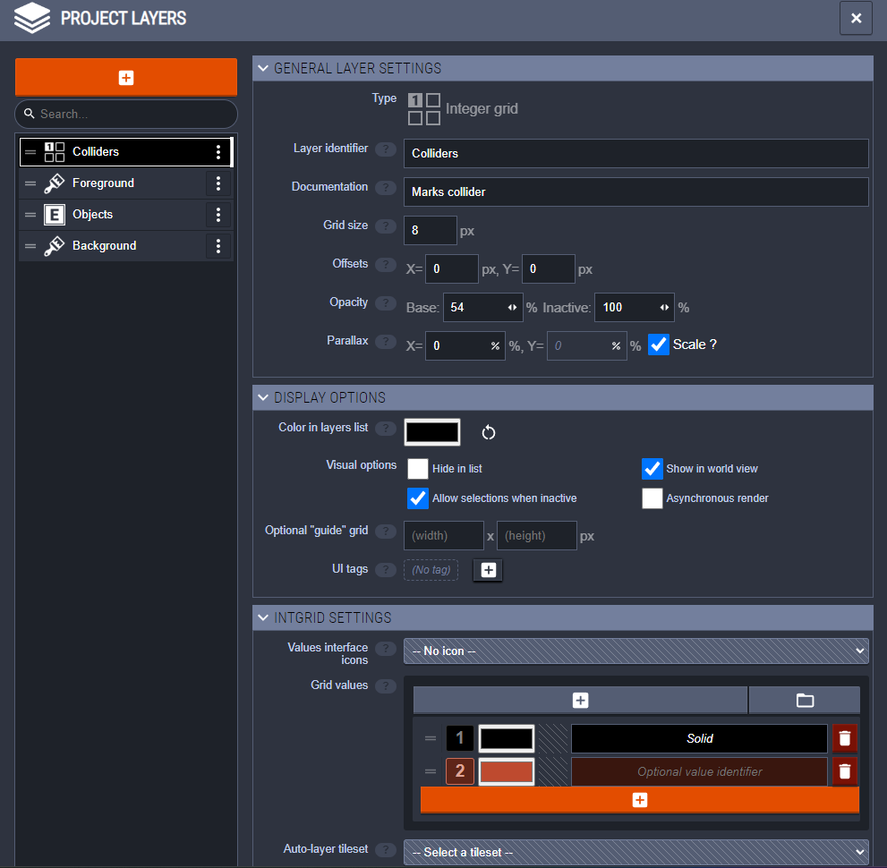
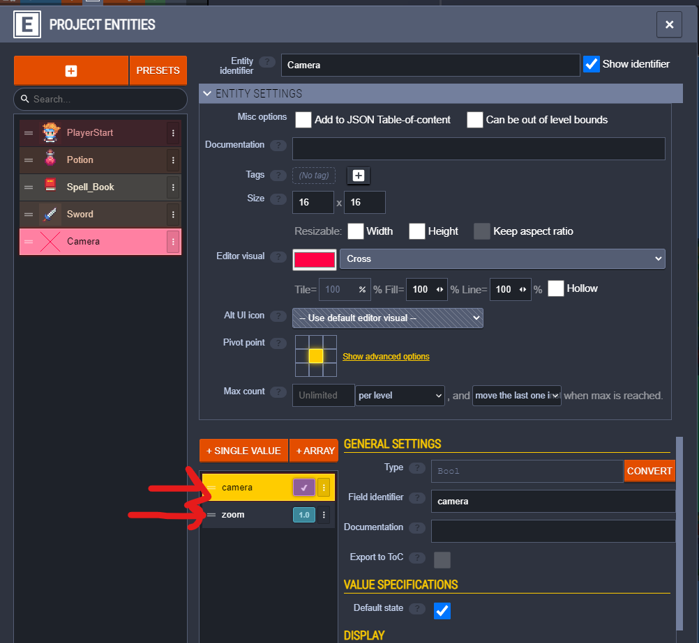
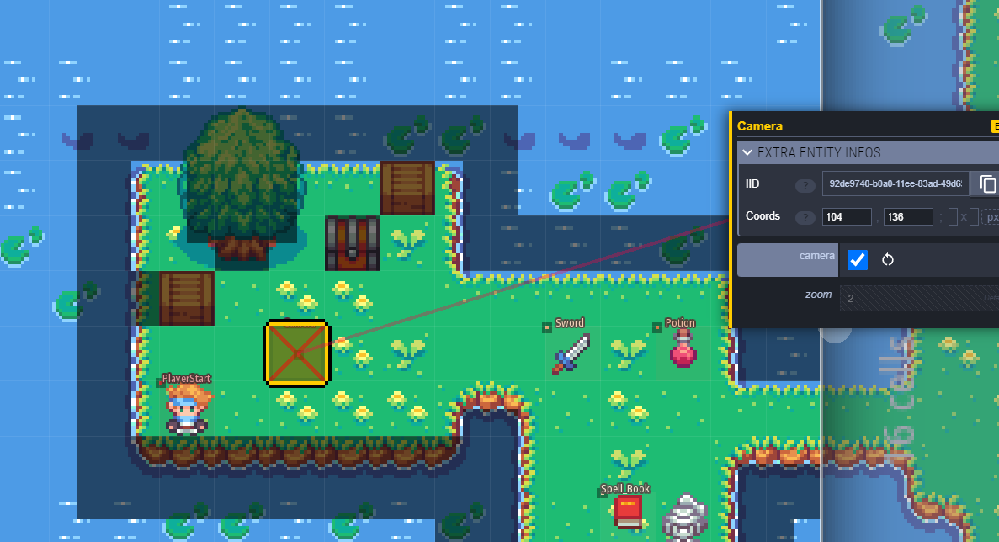
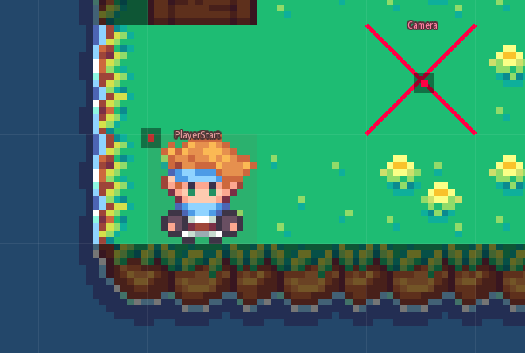

[LDtk (level design toolkit)](https://ldtk.io/) is a free, open source, and super useful level design tool from the create of Dead Cells. It's goal is to be super user friendly and full featured. Currently only supports 2D tile maps.

The current Excalibur plugin is designed to parse all data provided by the `.ldtk` format and make it available to users. Not all features may be supported directly in Excalibur but the majority are.

The plugin officially supports the latest version of LDtk that has been published and will warn if you are using an older version. This is because there have been many breaking changes to the LDtk map format over time that are difficult to reconcile.

## Installation


```sh
npm install @excaliburjs/plugin-ldtk
```

Create your resource, load it, then add it to your scene!

```typescript

const game = new ex.Engine({...});

const ldtkMap = new LdtkResource('./path/to/my/cool-map.ldtk');

const loader = new ex.Loader([ldtkMap]);

game.start(loader).then(() => {
    ldtkMap.addToScene(game.currentScene);
});
```

## Plugin Philosophy

* The plugin **STRICTLY** interprets the LDtk format by default, meaning if the plugin thinks the LDtk source files are corrupted/invalid it will throw while loading them. If this doesn't work for you you can set `strict: false` in the `LDtkResource` constructor, the plugin will do it's best with the data provided but there may be unexpected behavior.

```typescript
const tiledMap = new LdtkResource('./path/to/my/cool-map.ldtk', {
   strict: false
});
```

* The plugin roughly has 2 data structures for each LDtk primitive.

    * First it dutifully recreates the types using the LDtk JSON as the source of truth. These types are prefixed with `ldtk` so for example `LdtkEntityInstance` or `LdtkLayerInstance` are the "raw" Ldtk representation matching casing and data as close as possible.

    * Second the built in `Tiled` prefixed types are often unfriendly, so the plugin provides it's own friendly abstraction over them that works nicely with Excalibur. Whenever the plugin provides a friendly abstraction, it also provides the underlying Tiled prefix types just in case you need that data.

* Everything is lowercase/case-insensitive! When the plugin is searching for strings either as props keys or values, they are treated as lowercase/case-insensitive.

* Certain Excalibur interpretations of Tiled features are guarded behind the constructor param `useExcaliburWiring`. By default this is `true`, but if you find this is unacceptable you can toggle it off.

```typescript
const ldtkMap = new LdtkResource('./path/to/my/cool-map.ldtk', {
   useExcaliburWiring: false
});
```

## Map Features

To add a loaded `LdtkResource` map to a scene

```typescript
const ldtkMap = new LdtkResource(...);

// Load tiledMap here

ldtkMap.addToScene(game.currentScene);

// Optionally specify a position
ldtkMap.addToScene(game.currentScene, {pos: ex.vec(100, 100)});

// Optionally list specific ldtk levels to add
ldtkMap.addToScene(game.currentScene, {levelFilter: ['level1']});

// Optionally disable level offsets, levels are by default spatially positioned in ldtk this can be useful with the level filtering
ldtkMap.addToScene(game.currentScene, {useLevelOffsets: false});

```

### Background Color

The plugin supports pulling the `Background Color` from the LDtk level. Configure the `useMapBackgroundColor` in your constructor. Note it will use the background color from the first level in your LDtk world.

```typescript
const tiledMap = new TiledResource('./isometric.tmx', {
   useMapBackgroundColor: true
});
```




### Solid Layers

In LDtk we use IntGrid layers to indicate whether a tile is solid or not. 

:::note
You can set IntGrid layer grid size to whatever you want to achieve half tile collisions.
:::

By default the int value = 1 is treated as solid, otherwise you can give a number a name of "solid" and that will be a solid layer.



Then paint your solid layer tiles


### Camera Positioning

You can use an LDtk entity to position the excalibur camera. Specify 2 special custom properties to influence Excalibur's camera.

* `camera = true` (Warning excalibur will use the first object it finds with this, so be sure to only tag one as a camera)
* `zoom = 5.0` Optionally specify a camera zoom level, only takes effect if `camera = true` is set on the entity



Position your camera like so



### Entity Factories

Sometimes it is useful to supply a custom type to have the plugin construct when it runs across a particular entity, this might be the player, a collectable, or an enemy.

Given an entity identifier, in this case "PlayerStart"



You can specify a factory to run and create your preferred type, once you've returned the [[Entity]] out of the factory it will automatically be added to the [[Scene]]. This is also a useful time to run any other custom code you want per [[Entity]].

```typescript
game.start(loader).then(() => {
    console.log('Game start!');

    ldtkResource.registerEntityIdentifierFactory('PlayerStart', (props) => {
        const player = new Player({
            name: 'player',
            anchor: ex.vec(props.entity.__pivot[0],props.entity.__pivot[1]),
            width: props.entity.width,
            height: props.entity.height,
            pos: props.worldPos,
            z: props.layer.order
        });
        // Also run custom code
        game.currentScene.camera.strategy.lockToActor(player);
        return player;
    });

});

```


## Bundlers

Excalibur provides a lot of samples to get you started with various bundlers

* Vite https://github.com/excaliburjs/sample-tiled-vite
* Parcel https://github.com/excaliburjs/sample-tiled-parcel
* Webpack https://github.com/excaliburjs/sample-tiled-webpack


LDtk uses a lot of static assets and refers to them inside different LDtk source files, and often bundlers like to rearrange static assets in a final build. To work around this paths mapping issue, the plugin provides a `pathMap` to test file paths and redirect to whatever location your assets are stored.

```typescript
const ldtkMap = new LdtkResource('./example-city.ldtk', {
    pathMap: [
       // If the "path" is included in the source path, the output will be used
       { path: 'someimage.png', output: '/static/assets/someimage.png' },
       // Regex matching with special [match] in output string that is replaced with the first match from the regex
       { path: /(.*\..*$)/, output: '/static/assets/[match]'}
    ]
})
```

### Currently Unsupported

PRs welcome!

* Level Background Image
* Auto Tile Layers - these must be baked into normal tile layers for the plugin to support them