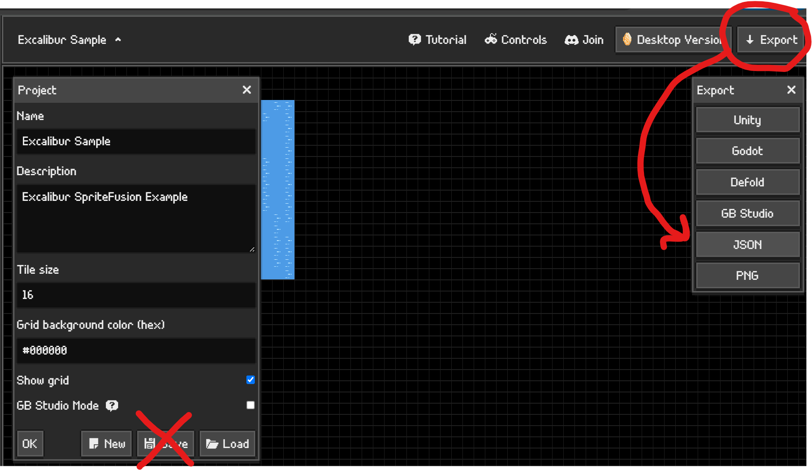
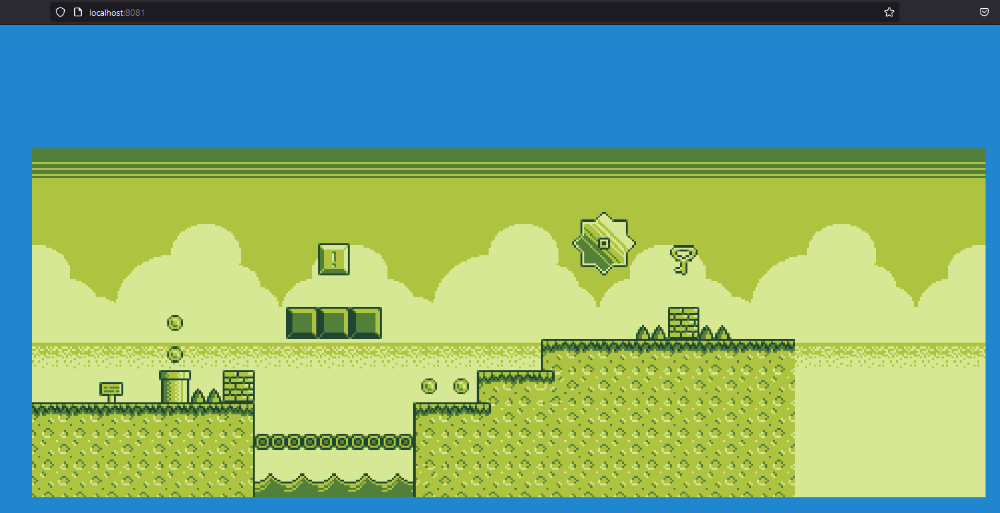
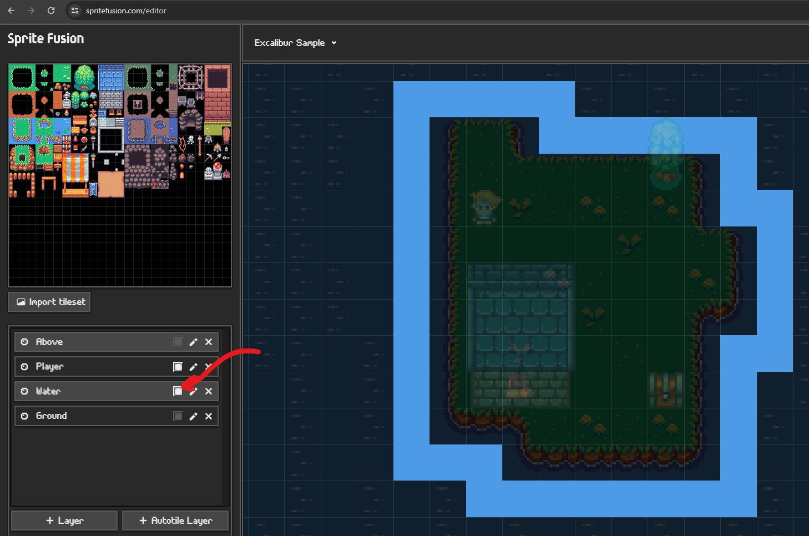
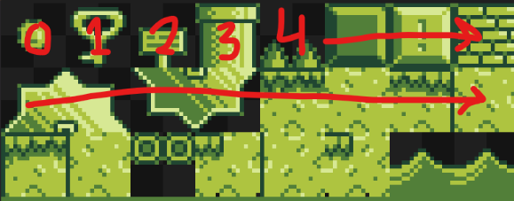
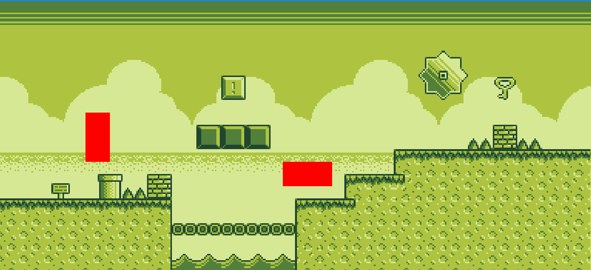
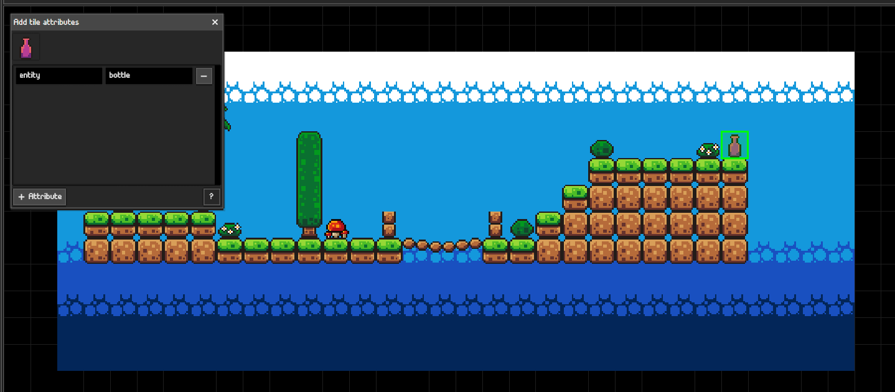

[Sprite Fusion](https://www.spritefusion.com/) is a new, exiting, and easy to use tile map editor based on the web! It's goal is to be lightweight and easy to use.

The current Excalibur plugin is designed to parse all data provided by the Sprite Fusion JSON export format and make it available to users. Not all features may be supported directly in Excalibur but the majority are.



:::warning

Export your map as JSON, IMPORTANT Do not use the "save" option in the current version of the plugin.

:::

The plugin officially supports the latest version of Sprite Fusion that has been published and will warn if you are using an older version.

## Installation 

```sh
npm install @excaliburjs/plugin-spritefusion
```

Create your resource, load it, then add it to your scene!

```typescript
const game = new ex.Engine({...});

const spriteFusionMap = new SpriteFusionResource({
    mapPath: './map/map.json',
    spritesheetPath: './map/spritesheet.png'
});

const loader = new ex.Loader([spriteFusionMap]);

game.start(loader).then(() => {
    spriteFusionMap.addToScene(game.currentScene);
});
```



## Solid Layers

In order to create solid layers in Excalibur, use the Sprite Fusion collision layer check box. Any tiles in this layer will be treated as solid by Excalibur.




## Entity Factories

Sometimes it is useful to supply a custom type to have the plugin construct when it runs across a particular entity, this might be the player, a collectable, or an enemy.

You can specify a factory to run and create your preferred type, once you've returned the [[Entity]] out of the factory it will automatically be added to the [[Scene]]. This is also a useful time to run any other custom code you want per [[Entity]].

```typescript

const spriteFusionMap = new SpriteFusionResource({
    mapPath: './map/map.json',
    spritesheetPath: './map/spritesheet.png',
    entityTileIdFactories: {
        0 : (props) => {
            return new ex.Actor({
                pos: props.worldPos,
                width: 16,
                height: 16,
                color: ex.Color.Red,
                z: props.layer.order + 1
            });
        }
    }
});

```

Currently you need to count the sprite id from the exported spritesheet.png.



For example, now tile id `0` is replaced with a custom implementation that shows a red box.



## New API methods

```ts
    getSpriteById(tileId: string): Sprite | undefined
    getTileMap(layername: string): TileMap | undefined
```

- `getSpriteId`

  Using the string tileId from the SF json output, one can easiely extract the tile sprite from the resource

- `getTileMap`

  Using the layername string from the SF json output, one can get the Excalibur TileMap object from the resource

## NEW FEATURE - Sprite Fusion Tile Attributes!

Now in SpriteFusion (as of 10/20/2025), custom tile data is now available!

### Tile Attributes!



When you use SF you can add json data to a tile's location, and it shows up like this when the JSON is exported:

```json
{
  "tileSize": 16,
  "mapWidth": 30,
  "mapHeight": 12,
  "layers": [
    {
      "name": "ObjectLayer",
      "tiles": [
        { "id": "0", "x": 25, "y": 3, "attributes": { "entity": "bottle" } },
        { "id": "1", "x": 10, "y": 6, "attributes": { "entity": "mushroom" } },
        { "id": "5", "x": 4, "y": 4, "attributes": { "entity": "knight" } }
      ],
      "collider": false
    },
...
```

### How the plugin manages this

To leverage this, there are a couple new interface properties available in the API

```ts
    ...
    // in SpriteFusionResourceOptions interface
    /**
     * Callback to run when attributes are encountered
     */
    tileAttributeFactory?: (attData: AttributeData) => void;
    /**
     * List of layer names to treat as object layers
     *
     */
    objectLayers?: string[];
```

and some new interfaces:

```ts
export interface TileData {
  /**
   * SpriteFusion Tile Id
   */
  id: number;
  /**
   * The x and y position of the tile
   */
  x: number;
  y: number;
  /**
   * The optional attributes of the tile
   * */
  attributes: any;
}

export interface TileAttributeData {
  tileData: TileData;
  mapData: SpriteFusionMapData;
}

//Have FactoryProps extends TileData now
export interface FactoryProps extends TileData {
  /**
   * Excalibur world position
   * */
  worldPos: Vector;
  /**
   * Layer that this object is part of
   * */
  layer: Layer;
}

```

### tileAttributeFactory Callback

This property allows you to pass into the plugin a callback that let's you manually manage how you want the attribute data to be
handled.

In this example, i'm passing this function into the setup:

```ts
export const attributeCallback = (attData: TileAttributeData) => {
  const { tileData, mapData } = attData;
  const { attributes, x, y, id } = tileData;

  // do whatever you want with the data!!!!
};

const spriteFusionMap = new SpriteFusionResource({
  mapPath: "./src/SFmapData/map.json",
  spritesheetPath: "./src/SFmapData/spritesheet.png",
  tileAttributeFactory: attributeCallback,
});
```

This can make using the attribute data easier. I've used it to create entities based off the tilemap data, and it can then be added to
the scene.

### Object Layers

When you are creating a SF map project, you might want to create a layer that has data embedded into it, but you don't want things
'drawn' as a tilemap layer by Excalibur.

Now you can add layernames into this array field, and the layer attributes gets parsed and the tileAttributeFactory callback gets called, but
nothing gets drawn to a layer.

Example:

```ts
const spriteFusionMap = new SpriteFusionResource({
  mapPath: "./src/SFmapData/map.json",
  spritesheetPath: "./src/SFmapData/spritesheet.png",
  tileAttributeFactory: attributeCallback,
  objectLayers: ["ObjectLayer"],
});
```

```json
{
  "tileSize": 16,
  "mapWidth": 30,
  "mapHeight": 12,
  "layers": [
    {
      "name": "ObjectLayer",
      "tiles": [
        { "id": "0", "x": 25, "y": 3, "attributes": { "entity": "bottle" } },
        { "id": "1", "x": 10, "y": 6, "attributes": { "entity": "mushroom" } },
        { "id": "5", "x": 4, "y": 4, "attributes": { "entity": "knight" } }
      ],
      "collider": false
    },
```

None of the `ObjectLayer` gets drawn to a tilemap, but the information gets passed to the tileAttributeFactory Callback.

## Documentation

For more information visit https://excaliburjs.com
