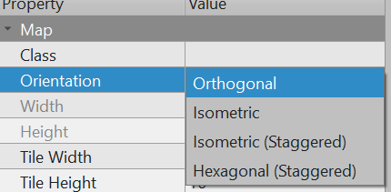

[Tiled is a super useful tool](https://www.mapeditor.org/) for building game levels across the industry. The Tiled plugin for Excalibur offers support for both Orthogonal and Isometric maps!

The current [Tiled plugin](https://github.com/excaliburjs/excalibur-tiled) aims to support *parsing all data* in the Map (`.tmx`,`.tmj`), Tileset (`.tsx`, `.tsj`) and Template files (`.tx`, `tj`). The plugin however does not support rendering all map types, currently hexagons and isometric staggered are not supported.

The plugin officially supports the latest version of Tiled that has been published and will warn if you are using an older version. This is because there have been many breaking changes to the Tiled map format over time that are difficult to reconcile.

## Installation

```sh
npm install --save-exact @excaliburjs/plugin-tiled
```

Create your resource, load it, then add it to your scene!

```typescript
const game = new ex.Engine({...});

const tiledMap = new TiledResource('./path/to/map.tmx');

const loader = new ex.Loader([tiledMap]);

game.start(loader).then(() => {
    tiledMap.addToScene(game.currentScene);
});

```

## Plugin Philosophy

* The plugin **STRICTLY** interprets the Tiled format by default, meaning if the plugin thinks the Tiled source files are corrupted/invalid it will throw while loading them. If this doesn't work for you you can set `strict: false` in the `TiledResource` constructor, the plugin will do it's best with the data provided but there may be unexpected behavior.

```typescript
const tiledMap = new TiledResource('./isometric.tmx', {
   strict: false
});
```

* The plugin roughly has 2 data structures for each Tiled primitive.

    * First it dutifully recreates the types using the Tiled JSON as the source of truth. These types are prefixed with `Tiled` so for example `TiledObject` or `TiledMap` are the "raw" Tiled representation matching casing and data as close as possible.

    * Second the built in `Tiled` prefixed types are often unfriendly, so the plugin provides it's own friendly abstraction over them that works nicely with Excalibur. Whenever the plugin provides a friendly abstraction, it also provides the underlying Tiled prefix types just in case you need that data.

* Everything is lowercase/case-insensitive! When the plugin is searching for strings either as props keys or values, they are treated as lowercase/case-insensitive.

* Certain Excalibur interpretations of Tiled features are guarded behind the constructor param `useExcaliburWiring`. By default this is `true`, but if you find this is unacceptable you can toggle it off.

```typescript
const tiledMap = new TiledResource('./isometric.tmx', {
   useExcaliburWiring: false
});
```

## Map Features

To add a loaded `TiledResouce` map to a scene

```typescript
const tiledMap = new TiledResource(...);

// Load tiledMap here

tiledMap.addToScene(game.currentScene);

// Optionally specify a position
tiledMap.addToScene(game.currentScene, {pos: ex.vec(100, 100)});
```

### Orientation

Currently the plugin supports rendering both the Orthogonal and Isometric orientations! (PRs welcome if you'd like to implement Isometric Staggered or Hexagon Staggered). The data formats are still parsed in the plugin for the unsupported rendering types, but will not be rendered properly.



### Background Color

The plugin supports pulling the `Background Color` from the Tiled map. Configure the `useMapBackgroundColor` in your constructor

```typescript
const tiledMap = new TiledResource('./isometric.tmx', {
   useMapBackgroundColor: true
});
```


### Tile Layer Format

All layer formats are supported apart from Tiled deprecated XML. Selecting a compressed format can be useful when shipping to production, it drastically reduces the size of your asset files.


## Tile Layers to Excalibur

The way that the plugin represents multiple tile layers in Tiled is by creating an excalibur [[TileMap]] for each. A default `z` is given to the each [[TileMap]] based on it's order in the original Tiled files. This can be overridden with a special custom float property `zindex = 42` on the layer.

### Solid Layers

You can mark a layer solid by setting the special custom boolean property `solid = true` on the tile layer. This will indicate to the plugin that any space with a non-zero Tile gid should be treated as a solid rectangle.

However sometimes you need more than just solid rectangles, so the plugin also supports custom colliders setup on tiles in tilesets (read more about tilesets below).

:::note

The layer MUST be set to `solid = true` in order to use custom tile colliders.

:::


### Retrieving Tiles at a Location

Both the Excalibur Tile and the Tiled Tile metadata can be retrieved by world position coordinate or integer tile coordinates. This can be useful if you have special Tile qualities you want to surface in your game.

```typescript
const tiledMap = new TiledResource(...);

// Load tiled map here

// Specify a layer and world position
const tile: TileInfo = tiledMap.getTileByPoint('ground', ex.vec(200, 100));

// Specify an integer coordinate
const tile: TileInfo = tiledMap.getTileByCoordinate('ground', 0, 2);

console.log(tile.tiledTile); // Tiled information for the tile
console.log(tile.exTile); // Excalibur Tile object

```

### Parallax

Parallax values can be set in Tiled and they will be respected in Excalibur!


### Infinite Tile maps

Tiled allows Infinite Tile Maps, these allow you to build tile maps without width/height constraints in tiled. This is supported in the plugin, it will generate 1 Excalibur Tilemap that includes all the chunks for a layer.


## Tilesets

The plugin supports every type of tilesets in Tiled, embedded, external, collection of images, etc.

Given a Tiled gid (global tile id), you can retrieve the tileset

```typescript
const tiledMap = new TiledResource(...);

// Load tiled map here

const tileset: Tileset = tiledMap.getTilesetForTileGid(123);
```

With a Tileset you can grab custom tile properties, colliders, sprites, and animations.


```typescript

const tile = tileset.getTileByGid(123);
const tiles = tileset.getTilesByClassName('grass');
const tilesWithProp = tileset.getTilesByProperty('damage', 10);

// Excalibur sprite
const sprite = tileset.getSpriteForGid(123);

// Excalibur animation
const animation = tileset.getAnimationForGid(123);

// Excalibur colliders
const colliders = tileset.getCollidersForGid(123);


```

### Custom Colliders

All shapes and sizes are supported for custom colliders apart from non-circle ellipses. In fact you can have multiple geometries specified per Tile!

Custom colliders can be used in Tile layers, Inserted Tile objects and Templates!

:::note

PRs welcome! Excalibur currently doesn't support colliding with ellipses!

:::


## Object Layers to Excalibur

All object layers are available on the resource type. This provides a friendly object layer abstraction over the Tiled type. The original Tiled order is preserved in the `.order` property.

```typescript
const tiledMap = new TiledResource(...);

// load resource here

const objectLayers = tiledMap.getObjectLayers();
```


### Querying for Objects

All objects in the plugin can be queried based on various aspects about them, either their name, class, or potentially a property name/value! You can retrieve the Tiled object and/or the Actor produced by the plugin!

```typescript

const tiledMap = new TiledResource(...);

// load resource here

// Search all object layers
let objects: PluginObjects[] = [];
objects = tiledMap.getObjectsByClassName('coin');
objects = tiledMap.getObjectsByName('Player');
objects = tiledMap.getEntitiesByProperty('credits', 10);

// Get excalibur entity/actor by plugin object
let entity = tiledMap.getEntityByObject(objects[0]);

// Search a specific layer
let layer = tiledMap.getObjectLayers('enemies')[0];
let enemies: PluginObjects[] = [];
enemies = layer.getObjectsByClassName('skeleton');
enemies = layer.getObjectsByName('Boss');
enemies = layer.getEntitiesByProperty('hitPoints', 100);

// Get excalibur entity/actor by plugin object
let enemyEntity = layer.getEntityByObject(enemies[0]);

```

### Entity Factories!

The plugin provides a way to insert your own custom built Entity or Actor implementation based on the Tiled Class property. The plugin will pass a `FactoryProps` type which is everything that the plugin knows about that object

```typescript
export interface FactoryProps {
   /**
    * Excalibur world position
    */
   worldPos: Vector;
   /**
    * Tiled name in UI
    */
   name?: string;
   /**
    * Tiled class in UI (internally in Tiled is represented as the string 'type')
    */
   class: string;
   /**
    * Layer (either TileLayer or ObjectLayer) that this object is part of
    */
   layer: Layer;
   /**
    * If using an object layer or a tile object property, the object will be passed.
    */
   object?: PluginObject;
   /**
    * Tiled properties, these are all converted to lowercase keys, and lowercase if the value is a string
    */
   properties: Record<string, any>;
}
```

In this example we are registering based on the name `player-start` to produce a new custom type `Player` that extends from [[Actor]]. This returned custom type will automatically be added to the current Excalibur [[Scene]]!

```typescript
const tiledMap = new TiledResource('./orthogonal.tmx', {
   entityClassNameFactories: {
      'player-start': (props: FactoryProps) => {
         return new Player({
            pos: props.worldPos,
            width: 16,
            height: 16,
            color: ex.Color.Blue,
            collisionType: ex.CollisionType.Active
         });
      }
   }
});
```


### Cameras

When using an object type (usually the point type is used) you can specify 2 special custom properties to influence Excalibur's camera.

* `camera = true` (Warning excalibur will use the first object it finds with this, so be sure to only tag one as a camera)
* `zoom = 5.0` Specify a camera zoom level


### Inserted Tiles

Inserted Tiles are a way to quickly add an Excalibur [[Actor]] with a [[Sprite]] or [[Animation]] [[Graphic]] in your game. They also need not be grid aligned. Custom properties can be retrieved by querying the object layer for your entity by name, class, or property.


### Templates

Templates are a useful tool to avoid repeating yourself with Inserted Tiles, you can predefine a name, class, or a bunch of default properties that will be instanced instead of needing to key them in every time in an Inserted Tile.They can be created in by right clicking on an object, like an Inserted Tile and saving as a Template.

Templates allow all predefined aspects to be overridden as well!

In all other aspects they behave just like Inserted Tiles in the plugin.

:::note

Templates with Tiles can only use external Tilesets, this is a limitation from Tiled itself. Because of this Templates have a private copy of a the Tileset because gid's can collide with Maps.

:::

## Other Features

### Camera locked inside the Tilemap bounds

This will keep the camera from seeing the background of your Tilemap! This is off by default.

```typescript
const tiledMap = new TiledResource('./isometric.tmx', {
   useTilemapCameraStrategy: true
});
```

:::note

You must make sure the [[TileMap]] is big enough to enclose the entire viewport, either by zoom or by size. Otherwise the strategy will not know how to resolve Tilemaps smaller than the viewport and cause flickering!

:::


### Headless mode

The `TiledResource` also offers a headless mode where it will not attempt to display anything or parse any images, this is useful for folks doing server side development with Tiled. If you don't want to use the built in ajax loader you can provide your own `fileLoader` implementation.

```typescript
const tiledMap = new TiledResource('./path/to/map', {
   headless: true,
   fileLoader: async (path: string, contentType: 'json' | 'xml') => Promise<any>
});
```

## Unsupported Features

PRs welcome!

* Tiled world support - These are json configuration files that allow you to stitch multiple tile maps together into one giant world.
* Group Layers - These are automatically flattened in the plugin parser currently preserving the order of the layers within, none of the properties or metadata on group layers is supported. You can still use them for grouping layers in Tiled, but that is all the plugin currently supports.
* Non-Circle Ellipse Colliders - Excalibur currently does not support ellipse collision geometry, but if it were added we could support it!

## Bundlers

Excalibur provides a lot of samples to get you started with various bundlers

* Vite https://github.com/excaliburjs/sample-tiled-vite
* Parcel https://github.com/excaliburjs/sample-tiled-parcel
* Webpack https://github.com/excaliburjs/sample-tiled-webpack


Tiled uses a lot of static assets and refers to them inside different Tiled source files, and often bundlers like to rearrange static assets in a final build. To work around this paths mapping issue, the plugin provides a `pathMap` to test file paths and redirect to whatever location your assets are stored.

```typescript
const tiledMap = new TiledResource('./example-city.tmx', {
    pathMap: [
       // If the "path" is included in the source path, the output will be used
       { path: 'cone.tx', output: '/static/assets/cone.tx' },
       // Regex matching with special [match] in output string that is replaced with the first match from the regex
       { path: /(.*\..*$)/, output: '/static/assets/[match]'}
    ]
})
```

A note on bundlers, because of an unfortunate naming collision `.tsx` also is used for TypeScript React components. Because of this you may need to work around bundler notions of what the file is to treat it as raw xml instead of a React component.

### Vite configuration

For example, in the Vite sample, we work around the `.tsx` issue using this configuration:

```typescript
// vite.config.js
import { defineConfig } from 'vite';

const tiledPlugin = () => {
    return {
        name: 'tiled-tileset-plugin',
        resolveId: {
            order: 'pre',
            handler(sourceId, importer, options) {
                if (!sourceId.endsWith(".tsx")) return;
                return { id: 'tileset:' + sourceId, external: 'relative' }
            }
        }
    };
}

export default defineConfig({
    plugins: [tiledPlugin()], // hint vite that tiled tilesets should be treated as external
    build: {
        assetsInlineLimit: 0, // excalibur cannot handle inlined xml in prod mode
        sourcemap: true
    }
});
```


### Webpack configuration

In the Webpack sample, we work around the `.tsx` issue using this configuration:

```typescript
module: {
    rules: [
        {
            test: /\.ts?$/,
            use: 'ts-loader',
            exclude: /node_modules/
        },
        {
            test: /\.(png|jpg|bmp|wav|mp3|tmx|tsx)$/,
            loader: 'file-loader',
            options: {
                name: '[path][name].[ext]',
                context: path.resolve(__dirname)
            }
        }
    ]
}
```

:::warning

By default Bundlers will often add a hash to imported, static assets. For example: `styles.c1c53abc.css`

Under normal circumstances this is fantastic for breaking cach when assets change. However Tiled assumes its dependent files are located in the same relative directory, using the same name that was used locally.

If you receive 404 errors when the tilesets or assets are retrieved, double check the filename has not been altered by your bundler.

:::