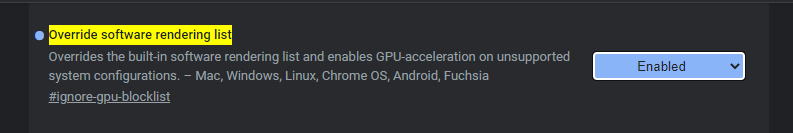
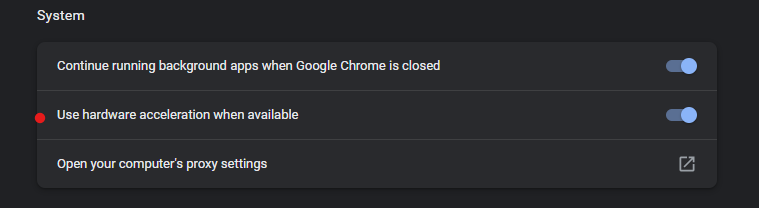
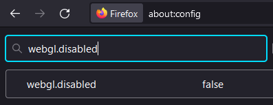

Excalibur uses the WebGL under the hood to render it's graphics, however sometimes browsers and systems may have a non standard configuration that can cause issues with WebGL.

## Browser configuration

### Chrome

Sometimes Chrome will detect an issue with hardware such as GPU drivers not being up to date, or running on a non-standard system like Linux and decide to not enable the GPU. When this happens you can override Chrome by visiting chrome://flags/#ignore-gpu-blocklist and ensuring "Override software rendering list" is "enabled".



Otherwise the hardware acceleration setting can be switched off accidentally. Visit chrome://settings/system and ensure this setting is check on.



### Firefox

Firefox unfortunately performs worse than Chrome generally, but the Excalibur team is working to improve that metric over time.

Firefox can also have hardware webgl or hardware accelerated disabled for one reason or another.

In Firefox, visit about:config

- Ensure `webgl.disabled` = false
- Ensure `webgl.force-enabled` = true
- Ensure `layers.acceleration.force-enabled` = true



## Poor Performance fallback

Excalibur will automatically fallback by default to the 2D canvas graphics context if it detects poor performance. The 2D canvas graphics usually performs better on non hardware accelerated browsers, currently postprocessing effects are unavailable in this fallback.

By default if a game is running at 20fps or lower for 100 frames or more after the game has started it will be triggered, the developer can optionally show a player message that is off by default.

```typescript
var game = new ex.Engine({
    ...
    configurePerformanceCanvas2DFallback: {
    allow: true, // opt-out of the fallback
    showPlayerMessage: true, // opt-in to a player pop-up message
    threshold: { fps: 20, numberOfFrames: 100 } // configure the threshold to trigger the fallback
    }
});
```

When the performance fallback is triggered Excalibur will raise the event `fallbackgraphicscontext` that developers can listen to for

```typescript
game.on('fallbackgraphicscontext', (ctx) => {
  console.log('fallback triggered', ctx)
})
```

## Debugging Performance Problems

If you notice lag or unstable physics you may want to look into your game performance. Installing the [DevTool](/docs/devtool) will give you a live FPS read out to help debug your game.

Firefox and Chrome have excellent performance profiling tools, if you have a section of your game that is slow activate the performance profiling tool during the slow behavior and inspect the results.

### Common sources of performance Problems

Raster type graphics are expensive to update because their textures must be re-uploaded to the GPU which is a blocking operation.

- The raster `ex.Rectangle` is the most common culprit, changing the width/height requires a new image to uploaded. Commonly this is to create a "health bar". A faster way to draw a rectangle for a healthbar may be to draw directly to the graphics context
  ```typescript
      let actor = new ex.Actor(...);
      actor.graphics.onPostDraw = (gfx: ExcaliburGraphicsContext) => {
          gfx.drawRectangle(ex.vec(0,0), 100, 20, ex.Color.Blue);
      }
  ```
- `ex.Canvas` can also be expensive if changing every frame, it is recommended only updating them when there is something new to draw. Do this by enabling caching and calling `canvas.flagDirty()` when there is something new.

  ```typescript
  let rectangleWidth = 100
  let draw = (ctx: CanvasRenderingContext2D) => {
    ctx.fillStyle = 'blue'
    ctx.fillRect(0, 0, rectangleWidth, 20)
  }

  let canvas = new Canvas({
    cache: true,
    draw: draw,
  })

  if (sizeChanged) {
    canvas.flagDirty()
  }
  ```
