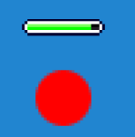

# 🩸 HealthBar Component

The `HealthBar` component provides a **visual health bar** that can be attached to any `Entity`. It automatically updates its display based on the entity’s current health.

---

## Features

- Attaches as a **component** to any `Entity`.
- Automatically updates a **child Actor** to represent health.
- **Dynamic sprite indexing** based on health ratio.
- Reusable across different actors and gameplay systems.

---

## Usage

You can download the full TypeScript module here:

[Download HealthBar.ts](./HealthBar.ts)

[LifeBar.png](./lifebar.png)

```ts
import { Actor, Engine, Scene } from 'excalibur';
import { HealthBar } from './HealthBar';
import { lifeBarSS } from './resources';

const game = new Engine({ width: 800, height: 600 });

class Player extends Actor {
  constructor() {
    super({ pos: vec(400, 300) });
    this.addComponent(new HealthBar(100));  // set's max health to 100, default position of vec(0,-25)
    // optionally this.addComponent(new HealthBar(100), vec(-10, -30)); // you can pass in custom position
  }
}

const player = new Player();
game.add(player);
```

The health bar appears above the entity.

The health and maxHealth values can be read or updated dynamically:

```ts
player.getComponent(HealthBar).health -= 10; // decrease health
player.getComponent(HealthBar).health = 50; // set health directly
```

Demo

The demo shows the health bar above a player entity, dynamically updating as health changes.



Notes & Tips

Make sure lifeBarSS is properly loaded before adding the component.

You can customize position by passing an optional vector to the component on creation.

Works for any entity in your game.